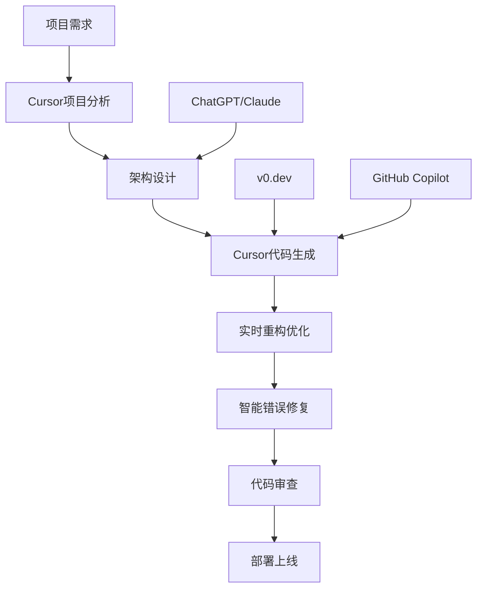

# 常用AI编程工具介绍

## 🛠️ 工具分类概览

### 代码生成类工具
- **GitHub Copilot**: 最流行的AI代码助手
- **Tabnine**: 智能代码补全工具
- **CodeWhisperer**: Amazon的AI编程助手
- **Codeium**: 免费的AI代码生成工具

### 对话式编程助手
- **ChatGPT**: 通用AI助手，编程能力强
- **Claude**: Anthropic开发的AI助手
- **Cursor**: AI原生的代码编辑器
- **Trae AI**: 专业的AI编程IDE

### 专业化工具
- **Figma AI**: 设计到代码转换
- **v0.dev**: Vercel的UI生成工具
- **Bolt.new**: 全栈应用快速生成

## 🚀 Cursor - AI原生编程利器

### 为什么选择Cursor？

Cursor是专为AI编程设计的现代化代码编辑器，它不仅仅是一个集成了AI功能的编辑器，而是从底层架构就为AI协作而优化的开发环境。

#### 核心优势
- **🧠 深度AI集成**: 原生AI架构，无缝的AI编程体验
- **🔍 全项目理解**: AI能理解整个项目的上下文和架构
- **⚡ 实时协作**: 与AI进行实时的代码对话和协作
- **🎯 精准生成**: 基于项目上下文生成高质量代码
- **🔄 智能重构**: AI辅助的代码重构和优化

### Cursor核心功能详解

#### 1. Ctrl+K - AI代码生成

这是Cursor最强大的功能之一，通过自然语言描述即可生成代码：

```javascript
// 按Ctrl+K，输入："创建一个React Hook用于管理表单状态"
// Cursor会生成：

import { useState, useCallback } from 'react';

export function useForm(initialValues = {}, validationRules = {}) {
  const [values, setValues] = useState(initialValues);
  const [errors, setErrors] = useState({});
  const [touched, setTouched] = useState({});
  const [isSubmitting, setIsSubmitting] = useState(false);

  const validateField = useCallback((name, value) => {
    const rule = validationRules[name];
    if (!rule) return '';
    
    if (rule.required && (!value || value.toString().trim() === '')) {
      return rule.message || `${name} 是必填项`;
    }
    
    if (rule.pattern && !rule.pattern.test(value)) {
      return rule.message || `${name} 格式不正确`;
    }
    
    if (rule.minLength && value.length < rule.minLength) {
      return rule.message || `${name} 最少需要 ${rule.minLength} 个字符`;
    }
    
    return '';
  }, [validationRules]);

  const handleChange = useCallback((name, value) => {
    setValues(prev => ({ ...prev, [name]: value }));
    
    if (touched[name]) {
      const error = validateField(name, value);
      setErrors(prev => ({ ...prev, [name]: error }));
    }
  }, [touched, validateField]);

  const handleBlur = useCallback((name) => {
    setTouched(prev => ({ ...prev, [name]: true }));
    const error = validateField(name, values[name]);
    setErrors(prev => ({ ...prev, [name]: error }));
  }, [values, validateField]);

  const validate = useCallback(() => {
    const newErrors = {};
    let isValid = true;
    
    Object.keys(validationRules).forEach(name => {
      const error = validateField(name, values[name]);
      if (error) {
        newErrors[name] = error;
        isValid = false;
      }
    });
    
    setErrors(newErrors);
    setTouched(Object.keys(validationRules).reduce((acc, key) => {
      acc[key] = true;
      return acc;
    }, {}));
    
    return isValid;
  }, [values, validationRules, validateField]);

  const handleSubmit = useCallback(async (onSubmit) => {
    if (isSubmitting) return;
    
    setIsSubmitting(true);
    
    if (validate()) {
      try {
        await onSubmit(values);
      } catch (error) {
        console.error('表单提交失败:', error);
      }
    }
    
    setIsSubmitting(false);
  }, [values, validate, isSubmitting]);

  const reset = useCallback(() => {
    setValues(initialValues);
    setErrors({});
    setTouched({});
    setIsSubmitting(false);
  }, [initialValues]);

  return {
    values,
    errors,
    touched,
    isSubmitting,
    handleChange,
    handleBlur,
    handleSubmit,
    validate,
    reset
  };
}
```

#### 2. Ctrl+L - AI对话模式

与AI进行自然语言对话，讨论代码问题和解决方案：

```javascript
// 选中一段代码，按Ctrl+L，然后询问：
// "这段代码有什么性能问题吗？如何优化？"

// 原始代码
function UserList({ users }) {
  return (
    <div>
      {users.map(user => (
        <div key={user.id}>
          
          <h3>{user.name}</h3>
          <p>{user.email}</p>
          <button onClick={() => handleUserClick(user)}>
            查看详情
          </button>
        </div>
      ))}
    </div>
  );
}

// AI建议优化后的代码
import React, { memo, useCallback } from 'react';

const UserItem = memo(({ user, onUserClick }) => {
  const handleClick = useCallback(() => {
    onUserClick(user);
  }, [user, onUserClick]);

  return (
    <div className="user-item">
      
      <div className="user-info">
        <h3 className="user-name">{user.name}</h3>
        <p className="user-email">{user.email}</p>
      </div>
      <button 
        onClick={handleClick}
        className="user-detail-btn"
        aria-label={`查看${user.name}的详情`}
      >
        查看详情
      </button>
    </div>
  );
});

UserItem.displayName = 'UserItem';

function UserList({ users, onUserClick }) {
  const handleUserClick = useCallback((user) => {
    onUserClick?.(user);
  }, [onUserClick]);

  return (
    <div className="user-list">
      {users.map(user => (
        <UserItem 
          key={user.id} 
          user={user} 
          onUserClick={handleUserClick}
        />
      ))}
    </div>
  );
}

export default memo(UserList);
```

#### 3. Tab键 - 智能代码补全

Cursor提供了比传统IDE更智能的代码补全：

```typescript
// 输入函数签名，Tab键自动补全实现
function calculateTotalPrice(items: CartItem[], discountCode?: string): number {
  // 按Tab，Cursor自动生成：
  let total = items.reduce((sum, item) => {
    return sum + (item.price * item.quantity);
  }, 0);

  if (discountCode) {
    const discount = getDiscountByCode(discountCode);
    if (discount) {
      total = total * (1 - discount.percentage / 100);
    }
  }

  return Math.round(total * 100) / 100; // 保留两位小数
}

// 输入类型定义，Tab键补全相关接口
interface CartItem {
  // 按Tab，自动补全：
  id: string;
  name: string;
  price: number;
  quantity: number;
  category: string;
  imageUrl?: string;
}

interface Discount {
  code: string;
  percentage: number;
  validUntil: Date;
  minAmount?: number;
}
```

#### 4. 选中代码 + Ctrl+K - 智能重构

选中代码片段，使用Ctrl+K进行智能重构：

```javascript
// 选中这段代码，按Ctrl+K，输入："重构为TypeScript并添加错误处理"

// 原始JavaScript代码
function fetchUserProfile(userId) {
  return fetch(`/api/users/${userId}`)
    .then(response => response.json())
    .then(data => {
      localStorage.setItem('userProfile', JSON.stringify(data));
      return data;
    });
}

// Cursor重构后的TypeScript代码
interface UserProfile {
  id: string;
  name: string;
  email: string;
  avatar?: string;
  createdAt: string;
  updatedAt: string;
}

interface ApiResponse<T> {
  data: T;
  message: string;
  success: boolean;
}

class UserProfileError extends Error {
  constructor(message: string, public statusCode?: number) {
    super(message);
    this.name = 'UserProfileError';
  }
}

async function fetchUserProfile(userId: string): Promise<UserProfile> {
  try {
    if (!userId || typeof userId !== 'string') {
      throw new UserProfileError('用户ID无效');
    }

    const response = await fetch(`/api/users/${userId}`, {
      method: 'GET',
      headers: {
        'Content-Type': 'application/json',
        'Authorization': `Bearer ${getAuthToken()}`
      }
    });

    if (!response.ok) {
      throw new UserProfileError(
        `获取用户信息失败: ${response.statusText}`,
        response.status
      );
    }

    const apiResponse: ApiResponse<UserProfile> = await response.json();
    
    if (!apiResponse.success) {
      throw new UserProfileError(apiResponse.message || '获取用户信息失败');
    }

    const userProfile = apiResponse.data;
    
    // 验证返回的数据结构
    if (!userProfile.id || !userProfile.name || !userProfile.email) {
      throw new UserProfileError('返回的用户数据不完整');
    }

    // 安全地存储到localStorage
    try {
      localStorage.setItem('userProfile', JSON.stringify(userProfile));
    } catch (storageError) {
      console.warn('无法保存用户信息到本地存储:', storageError);
      // 不抛出错误，因为这不是关键功能
    }

    return userProfile;
  } catch (error) {
    if (error instanceof UserProfileError) {
      throw error;
    }
    
    // 处理网络错误或其他未知错误
    throw new UserProfileError(
      `获取用户信息时发生错误: ${error.message || '未知错误'}`
    );
  }
}

// 辅助函数
function getAuthToken(): string {
  const token = localStorage.getItem('authToken');
  if (!token) {
    throw new UserProfileError('用户未登录');
  }
  return token;
}
```

### Cursor高级使用技巧

#### 5. 项目级AI理解

Cursor能够理解整个项目的架构和上下文，提供更精准的建议：

```javascript
// 在大型项目中，Cursor能理解项目结构并生成符合项目规范的代码
// 例如：在一个使用Redux Toolkit的项目中

// 按Ctrl+K，输入："创建一个用户管理的slice"
// Cursor会根据项目中已有的slice模式生成：

import { createSlice, createAsyncThunk, PayloadAction } from '@reduxjs/toolkit';
import { userApi } from '../api/userApi';
import type { User, UserState, CreateUserRequest, UpdateUserRequest } from '../types/user';

// 异步thunk
export const fetchUsers = createAsyncThunk(
  'users/fetchUsers',
  async (params: { page?: number; limit?: number; search?: string } = {}) => {
    const response = await userApi.getUsers(params);
    return response.data;
  }
);

export const createUser = createAsyncThunk(
  'users/createUser',
  async (userData: CreateUserRequest) => {
    const response = await userApi.createUser(userData);
    return response.data;
  }
);

export const updateUser = createAsyncThunk(
  'users/updateUser',
  async ({ id, ...userData }: UpdateUserRequest & { id: string }) => {
    const response = await userApi.updateUser(id, userData);
    return response.data;
  }
);

export const deleteUser = createAsyncThunk(
  'users/deleteUser',
  async (userId: string) => {
    await userApi.deleteUser(userId);
    return userId;
  }
);

const initialState: UserState = {
  users: [],
  currentUser: null,
  loading: false,
  error: null,
  pagination: {
    page: 1,
    limit: 10,
    total: 0,
    totalPages: 0
  },
  filters: {
    search: '',
    status: 'all'
  }
};

const userSlice = createSlice({
  name: 'users',
  initialState,
  reducers: {
    setCurrentUser: (state, action: PayloadAction<User | null>) => {
      state.currentUser = action.payload;
    },
    updateFilters: (state, action: PayloadAction<Partial<typeof initialState.filters>>) => {
      state.filters = { ...state.filters, ...action.payload };
    },
    updatePagination: (state, action: PayloadAction<Partial<typeof initialState.pagination>>) => {
      state.pagination = { ...state.pagination, ...action.payload };
    },
    clearError: (state) => {
      state.error = null;
    }
  },
  extraReducers: (builder) => {
    builder
      // fetchUsers
      .addCase(fetchUsers.pending, (state) => {
        state.loading = true;
        state.error = null;
      })
      .addCase(fetchUsers.fulfilled, (state, action) => {
        state.loading = false;
        state.users = action.payload.users;
        state.pagination = {
          ...state.pagination,
          total: action.payload.total,
          totalPages: action.payload.totalPages
        };
      })
      .addCase(fetchUsers.rejected, (state, action) => {
        state.loading = false;
        state.error = action.error.message || '获取用户列表失败';
      })
      // createUser
      .addCase(createUser.fulfilled, (state, action) => {
        state.users.unshift(action.payload);
        state.pagination.total += 1;
      })
      // updateUser
      .addCase(updateUser.fulfilled, (state, action) => {
        const index = state.users.findIndex(user => user.id === action.payload.id);
        if (index !== -1) {
          state.users[index] = action.payload;
        }
        if (state.currentUser?.id === action.payload.id) {
          state.currentUser = action.payload;
        }
      })
      // deleteUser
      .addCase(deleteUser.fulfilled, (state, action) => {
        state.users = state.users.filter(user => user.id !== action.payload);
        state.pagination.total -= 1;
        if (state.currentUser?.id === action.payload) {
          state.currentUser = null;
        }
      });
  }
});

export const { setCurrentUser, updateFilters, updatePagination, clearError } = userSlice.actions;
export default userSlice.reducer;

// Selectors
export const selectUsers = (state: RootState) => state.users.users;
export const selectCurrentUser = (state: RootState) => state.users.currentUser;
export const selectUsersLoading = (state: RootState) => state.users.loading;
export const selectUsersError = (state: RootState) => state.users.error;
export const selectUsersPagination = (state: RootState) => state.users.pagination;
export const selectUsersFilters = (state: RootState) => state.users.filters;
```

#### 6. 智能错误修复

Cursor能够智能识别和修复代码错误：

```typescript
// 当代码出现错误时，Cursor会提供智能修复建议
// 例如：TypeScript类型错误

// 错误代码
interface User {
  id: string;
  name: string;
  email: string;
  age: number;
}

function processUser(user: User) {
  // 错误：Property 'phone' does not exist on type 'User'
  console.log(user.phone); 
  
  // 错误：Argument of type 'string' is not assignable to parameter of type 'number'
  const ageInMonths = calculateMonths(user.age.toString());
}

// Cursor智能修复后
interface User {
  id: string;
  name: string;
  email: string;
  age: number;
  phone?: string; // 添加可选属性
}

function processUser(user: User) {
  // 修复：添加可选链和默认值
  console.log(user.phone || '未提供电话号码');
  
  // 修复：正确的类型转换
  const ageInMonths = calculateMonths(Number(user.age));
}

function calculateMonths(years: number): number {
  return years * 12;
}
```

## 🔧 其他AI工具补充介绍

### GitHub Copilot
- **优势**: VS Code深度集成，代码补全体验好
- **适用场景**: 日常编码辅助，简单函数生成
- **局限性**: 对项目上下文理解有限，复杂重构能力较弱

### ChatGPT/Claude
- **优势**: 强大的解释能力，适合学习和问题解决
- **适用场景**: 代码解释、架构设计讨论、技术学习
- **使用技巧**: 提供详细的上下文信息，使用结构化的提示词

### v0.dev
- **优势**: 快速UI原型生成，现代化设计
- **适用场景**: 快速原型开发，UI组件生成
- **特点**: 基于Tailwind CSS，生成高质量的React组件

## 🎯 以Cursor为核心的AI开发工作流

### 推荐的开发流程



### 1. 项目初始化阶段

```bash
# 使用Cursor创建新项目
# 1. 打开Cursor
# 2. 按Ctrl+K，输入："创建一个React + TypeScript + Vite的项目结构"
# 3. Cursor会生成完整的项目模板

# 项目结构示例
src/
├── components/          # 组件目录
│   ├── ui/             # 基础UI组件
│   ├── forms/          # 表单组件
│   └── layout/         # 布局组件
├── hooks/              # 自定义Hook
├── services/           # API服务
├── stores/             # 状态管理
├── types/              # TypeScript类型定义
├── utils/              # 工具函数
└── styles/             # 样式文件
```

### 2. 日常开发工作流

#### 主要工具：Cursor (90%)
- **代码生成**: Ctrl+K 生成组件、函数、类型定义
- **智能重构**: 选中代码 + Ctrl+K 进行重构
- **错误修复**: 自动识别并修复TypeScript错误
- **代码优化**: AI建议性能优化方案
- **测试生成**: 自动生成单元测试和集成测试

#### 辅助工具：ChatGPT/Claude (10%)
- **架构讨论**: 复杂架构设计的讨论和验证
- **技术学习**: 新技术和最佳实践的学习
- **问题解决**: 复杂问题的分析和解决方案

### 3. 具体使用场景

#### 场景1：创建新组件
```typescript
// 在Cursor中按Ctrl+K，输入：
// "创建一个可复用的数据表格组件，支持排序、分页、搜索"

import React, { useState, useMemo, useCallback } from 'react';
import { ChevronUpIcon, ChevronDownIcon } from '@heroicons/react/24/outline';

interface Column<T> {
  key: keyof T;
  title: string;
  sortable?: boolean;
  render?: (value: any, record: T) => React.ReactNode;
}

interface DataTableProps<T> {
  data: T[];
  columns: Column<T>[];
  pageSize?: number;
  searchable?: boolean;
  loading?: boolean;
}

export function DataTable<T extends Record<string, any>>({
  data,
  columns,
  pageSize = 10,
  searchable = true,
  loading = false
}: DataTableProps<T>) {
  const [currentPage, setCurrentPage] = useState(1);
  const [sortConfig, setSortConfig] = useState<{
    key: keyof T | null;
    direction: 'asc' | 'desc';
  }>({ key: null, direction: 'asc' });
  const [searchTerm, setSearchTerm] = useState('');

  // 搜索过滤
  const filteredData = useMemo(() => {
    if (!searchTerm) return data;
    
    return data.filter(item =>
      Object.values(item).some(value =>
        String(value).toLowerCase().includes(searchTerm.toLowerCase())
      )
    );
  }, [data, searchTerm]);

  // 排序
  const sortedData = useMemo(() => {
    if (!sortConfig.key) return filteredData;

    return [...filteredData].sort((a, b) => {
      const aValue = a[sortConfig.key!];
      const bValue = b[sortConfig.key!];

      if (aValue < bValue) {
        return sortConfig.direction === 'asc' ? -1 : 1;
      }
      if (aValue > bValue) {
        return sortConfig.direction === 'asc' ? 1 : -1;
      }
      return 0;
    });
  }, [filteredData, sortConfig]);

  // 分页
  const paginatedData = useMemo(() => {
    const startIndex = (currentPage - 1) * pageSize;
    return sortedData.slice(startIndex, startIndex + pageSize);
  }, [sortedData, currentPage, pageSize]);

  const totalPages = Math.ceil(sortedData.length / pageSize);

  const handleSort = useCallback((key: keyof T) => {
    setSortConfig(prev => ({
      key,
      direction: prev.key === key && prev.direction === 'asc' ? 'desc' : 'asc'
    }));
  }, []);

  if (loading) {
    return (
      <div className="flex justify-center items-center h-64">
        <div className="animate-spin rounded-full h-8 w-8 border-b-2 border-blue-600"></div>
      </div>
    );
  }

  return (
    <div className="w-full">
      {searchable && (
        <div className="mb-4">
          <input
            type="text"
            placeholder="搜索..."
            value={searchTerm}
            onChange={(e) => setSearchTerm(e.target.value)}
            className="px-3 py-2 border border-gray-300 rounded-md focus:outline-none focus:ring-2 focus:ring-blue-500"
          />
        </div>
      )}

      <div className="overflow-x-auto">
        <table className="min-w-full bg-white border border-gray-200">
          <thead className="bg-gray-50">
            <tr>
              {columns.map((column) => (
                <th
                  key={String(column.key)}
                  className={`px-6 py-3 text-left text-xs font-medium text-gray-500 uppercase tracking-wider ${
                    column.sortable ? 'cursor-pointer hover:bg-gray-100' : ''
                  }`}
                  onClick={() => column.sortable && handleSort(column.key)}
                >
                  <div className="flex items-center space-x-1">
                    <span>{column.title}</span>
                    {column.sortable && (
                      <div className="flex flex-col">
                        <ChevronUpIcon
                          className={`h-3 w-3 ${
                            sortConfig.key === column.key && sortConfig.direction === 'asc'
                              ? 'text-blue-600'
                              : 'text-gray-400'
                          }`}
                        />
                        <ChevronDownIcon
                          className={`h-3 w-3 ${
                            sortConfig.key === column.key && sortConfig.direction === 'desc'
                              ? 'text-blue-600'
                              : 'text-gray-400'
                          }`}
                        />
                      </div>
                    )}
                  </div>
                </th>
              ))}
            </tr>
          </thead>
          <tbody className="bg-white divide-y divide-gray-200">
            {paginatedData.map((item, index) => (
              <tr key={index} className="hover:bg-gray-50">
                {columns.map((column) => (
                  <td key={String(column.key)} className="px-6 py-4 whitespace-nowrap text-sm text-gray-900">
                    {column.render ? column.render(item[column.key], item) : String(item[column.key])}
                  </td>
                ))}
              </tr>
            ))}
          </tbody>
        </table>
      </div>

      {totalPages > 1 && (
        <div className="flex justify-between items-center mt-4">
          <div className="text-sm text-gray-700">
            显示 {(currentPage - 1) * pageSize + 1} 到{' '}
            {Math.min(currentPage * pageSize, sortedData.length)} 条，共 {sortedData.length} 条
          </div>
          <div className="flex space-x-2">
            <button
              onClick={() => setCurrentPage(prev => Math.max(prev - 1, 1))}
              disabled={currentPage === 1}
              className="px-3 py-1 border border-gray-300 rounded-md disabled:opacity-50 disabled:cursor-not-allowed hover:bg-gray-50"
            >
              上一页
            </button>
            <span className="px-3 py-1 text-sm text-gray-700">
              {currentPage} / {totalPages}
            </span>
            <button
              onClick={() => setCurrentPage(prev => Math.min(prev + 1, totalPages))}
              disabled={currentPage === totalPages}
              className="px-3 py-1 border border-gray-300 rounded-md disabled:opacity-50 disabled:cursor-not-allowed hover:bg-gray-50"
            >
              下一页
            </button>
          </div>
        </div>
      )}
    </div>
  );
}
```

#### 场景2：性能优化
```typescript
// 选中需要优化的组件，按Ctrl+L，询问：
// "这个组件有什么性能问题？如何优化？"

// Cursor会分析并提供优化建议：
// 1. 使用React.memo减少不必要的重渲染
// 2. 使用useMemo缓存计算结果
// 3. 使用useCallback缓存函数引用
// 4. 虚拟化长列表
// 5. 懒加载图片和组件
```

## 💡 Cursor使用最佳实践

### 1. 提示词技巧
- **具体明确**: "创建一个支持拖拽排序的任务列表组件"
- **包含上下文**: "基于现有的Button组件样式，创建一个Loading按钮"
- **指定技术栈**: "使用React Hook Form和Zod创建表单验证"

### 2. 项目配置优化
```json
// .cursor-settings.json
{
  "ai.model": "claude-3.5-sonnet",
  "ai.contextLength": 200000,
  "ai.enableAutoComplete": true,
  "ai.enableInlineChat": true,
  "typescript.preferences.includePackageJsonAutoImports": "on"
}
```

### 3. 质量控制
- **代码审查**: 始终审查AI生成的代码
- **测试验证**: 运行测试确保功能正确
- **性能监控**: 关注性能指标
- **安全检查**: 检查潜在的安全问题

### 4. 团队协作
- **统一配置**: 团队使用相同的Cursor配置
- **提示词库**: 建立团队共享的提示词库
- **代码规范**: 让AI遵循团队的代码规范
- **知识分享**: 定期分享AI使用技巧和最佳实践

---

**下一步**: 学习[提示词工程基础](./提示词工程.md)，掌握与AI有效沟通的技巧。