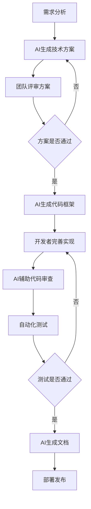

# AI编程团队协作

## 🤝 团队协作的重要性

### 1. AI编程时代的团队协作挑战
- **工具统一**: 不同团队成员使用不同AI工具导致的不一致
- **知识共享**: AI生成的代码和解决方案如何在团队中传播
- **质量控制**: 如何确保AI生成代码的质量和一致性
- **学习曲线**: 团队成员AI工具使用水平不一致

### 2. AI协作的优势
- **效率提升**: 团队整体开发效率显著提高
- **知识传递**: AI帮助快速传播最佳实践
- **代码一致性**: 统一的AI提示词确保代码风格一致
- **学习加速**: 新成员通过AI快速上手项目

## 🛠️ 团队AI工具标准化

### 1. 工具选择标准

```markdown
# 团队AI工具评估标准

## 📋 评估维度

### 功能性评估
- [ ] 代码生成质量
- [ ] 支持的编程语言和框架
- [ ] 代码补全准确性
- [ ] 重构和优化能力
- [ ] 调试和问题解决能力

### 集成性评估
- [ ] IDE集成程度
- [ ] 版本控制系统集成
- [ ] CI/CD流程集成
- [ ] 项目管理工具集成
- [ ] 团队沟通工具集成

### 成本效益评估
- [ ] 许可证成本
- [ ] 培训成本
- [ ] 维护成本
- [ ] ROI预期
- [ ] 扩展性考虑

### 安全性评估
- [ ] 数据隐私保护
- [ ] 代码安全性
- [ ] 访问控制
- [ ] 审计日志
- [ ] 合规性要求
```

### 2. 推荐工具组合

```typescript
// 团队AI工具配置
interface TeamAIToolsConfig {
  // 主要开发工具
  primaryIDE: {
    name: 'VS Code' | 'WebStorm' | 'Cursor'
    aiExtensions: string[]
    settings: Record<string, any>
  }
  
  // AI编程助手
  codingAssistants: {
    primary: 'GitHub Copilot' | 'Codeium' | 'Tabnine'
    secondary?: string[]
    configuration: Record<string, any>
  }
  
  // 对话式AI
  conversationalAI: {
    primary: 'ChatGPT' | 'Claude' | 'Gemini'
    teamAccount: boolean
    sharedPrompts: boolean
  }
  
  // 专业化工具
  specializedTools: {
    design: 'v0.dev' | 'Figma AI' | 'Framer AI'
    testing: 'Testim' | 'Applitools'
    documentation: 'GitBook AI' | 'Notion AI'
  }
}

// 推荐配置
const recommendedConfig: TeamAIToolsConfig = {
  primaryIDE: {
    name: 'VS Code',
    aiExtensions: [
      'GitHub.copilot',
      'GitHub.copilot-chat',
      'ms-vscode.vscode-typescript-next'
    ],
    settings: {
      'github.copilot.enable': {
        '*': true,
        'yaml': false,
        'plaintext': false
      },
      'github.copilot.advanced': {
        'secret_scanning': true,
        'length': 500
      }
    }
  },
  
  codingAssistants: {
    primary: 'GitHub Copilot',
    configuration: {
      suggestions: 'auto',
      inlineSuggest: true,
      enableAutoCompletions: true
    }
  },
  
  conversationalAI: {
    primary: 'ChatGPT',
    teamAccount: true,
    sharedPrompts: true
  },
  
  specializedTools: {
    design: 'v0.dev',
    testing: 'Testim',
    documentation: 'GitBook AI'
  }
}
```

## 📚 共享知识库建设

### 1. 提示词库管理

```typescript
// 团队提示词库结构
interface PromptLibrary {
  categories: {
    [category: string]: {
      description: string
      prompts: Prompt[]
    }
  }
  tags: string[]
  contributors: string[]
  lastUpdated: Date
}

interface Prompt {
  id: string
  title: string
  description: string
  category: string
  tags: string[]
  content: string
  examples: PromptExample[]
  author: string
  createdAt: Date
  updatedAt: Date
  usage: {
    count: number
    rating: number
    feedback: string[]
  }
}

interface PromptExample {
  input: string
  output: string
  context?: string
}

// 提示词库实现
class TeamPromptLibrary {
  private prompts: Map<string, Prompt> = new Map()
  private categories: Map<string, string> = new Map()
  
  constructor() {
    this.initializeCategories()
    this.loadPrompts()
  }
  
  private initializeCategories(): void {
    this.categories.set('component', 'React组件开发')
    this.categories.set('hook', '自定义Hook开发')
    this.categories.set('api', 'API集成开发')
    this.categories.set('testing', '测试代码生成')
    this.categories.set('optimization', '性能优化')
    this.categories.set('debugging', '问题调试')
    this.categories.set('refactoring', '代码重构')
    this.categories.set('documentation', '文档生成')
  }
  
  addPrompt(prompt: Omit<Prompt, 'id' | 'createdAt' | 'updatedAt' | 'usage'>): string {
    const id = this.generateId()
    const newPrompt: Prompt = {
      ...prompt,
      id,
      createdAt: new Date(),
      updatedAt: new Date(),
      usage: {
        count: 0,
        rating: 0,
        feedback: []
      }
    }
    
    this.prompts.set(id, newPrompt)
    this.saveToStorage()
    return id
  }
  
  getPrompt(id: string): Prompt | undefined {
    const prompt = this.prompts.get(id)
    if (prompt) {
      // 记录使用次数
      prompt.usage.count++
      this.saveToStorage()
    }
    return prompt
  }
  
  searchPrompts(query: string, category?: string, tags?: string[]): Prompt[] {
    const results: Prompt[] = []
    
    for (const prompt of this.prompts.values()) {
      // 分类过滤
      if (category && prompt.category !== category) continue
      
      // 标签过滤
      if (tags && !tags.some(tag => prompt.tags.includes(tag))) continue
      
      // 关键词搜索
      if (query) {
        const searchText = `${prompt.title} ${prompt.description} ${prompt.content}`.toLowerCase()
        if (!searchText.includes(query.toLowerCase())) continue
      }
      
      results.push(prompt)
    }
    
    // 按使用频率和评分排序
    return results.sort((a, b) => {
      const scoreA = a.usage.count * 0.3 + a.usage.rating * 0.7
      const scoreB = b.usage.count * 0.3 + b.usage.rating * 0.7
      return scoreB - scoreA
    })
  }
  
  ratePrompt(id: string, rating: number, feedback?: string): void {
    const prompt = this.prompts.get(id)
    if (!prompt) return
    
    // 更新评分（加权平均）
    const totalRatings = prompt.usage.feedback.length + 1
    prompt.usage.rating = (prompt.usage.rating * (totalRatings - 1) + rating) / totalRatings
    
    if (feedback) {
      prompt.usage.feedback.push(feedback)
    }
    
    prompt.updatedAt = new Date()
    this.saveToStorage()
  }
  
  exportLibrary(): PromptLibrary {
    const categories: { [key: string]: { description: string; prompts: Prompt[] } } = {}
    
    for (const [key, description] of this.categories) {
      categories[key] = {
        description,
        prompts: Array.from(this.prompts.values()).filter(p => p.category === key)
      }
    }
    
    return {
      categories,
      tags: this.getAllTags(),
      contributors: this.getAllContributors(),
      lastUpdated: new Date()
    }
  }
  
  private generateId(): string {
    return `prompt_${Date.now()}_${Math.random().toString(36).substr(2, 9)}`
  }
  
  private getAllTags(): string[] {
    const tags = new Set<string>()
    for (const prompt of this.prompts.values()) {
      prompt.tags.forEach(tag => tags.add(tag))
    }
    return Array.from(tags).sort()
  }
  
  private getAllContributors(): string[] {
    const contributors = new Set<string>()
    for (const prompt of this.prompts.values()) {
      contributors.add(prompt.author)
    }
    return Array.from(contributors).sort()
  }
  
  private saveToStorage(): void {
    // 实际项目中可以保存到数据库或文件系统
    const data = JSON.stringify(Array.from(this.prompts.entries()))
    localStorage.setItem('team_prompt_library', data)
  }
  
  private loadPrompts(): void {
    // 从存储中加载提示词
    const data = localStorage.getItem('team_prompt_library')
    if (data) {
      const entries = JSON.parse(data)
      this.prompts = new Map(entries)
    }
  }
}
```

### 2. 最佳实践文档

```markdown
# 团队AI编程最佳实践

## 🎯 代码生成最佳实践

### 1. 提示词编写规范

#### 结构化提示词模板
```markdown
**角色**: 你是一位资深的[技术栈]开发专家
**任务**: [具体任务描述]
**要求**: 
- [技术要求1]
- [技术要求2]
- [质量要求]
**输出**: [期望的输出格式]
**示例**: [相关示例或参考]
```

#### 提示词优化技巧
1. **明确性**: 使用具体、明确的描述
2. **上下文**: 提供足够的项目背景信息
3. **约束**: 明确技术栈、版本、规范要求
4. **示例**: 提供期望输出的示例
5. **迭代**: 根据输出结果不断优化提示词

### 2. 代码审查流程

#### AI生成代码审查清单
- [ ] 代码符合项目规范
- [ ] 类型定义完整准确
- [ ] 性能考虑合理
- [ ] 安全性检查通过
- [ ] 测试覆盖充分
- [ ] 文档注释完整

#### 审查工具集成
```yaml
# .github/workflows/ai-code-review.yml
name: AI Code Review

on:
  pull_request:
    types: [opened, synchronize]

jobs:
  ai-review:
    runs-on: ubuntu-latest
    steps:
      - uses: actions/checkout@v3
      
      - name: AI Code Quality Check
        uses: ./actions/ai-quality-check
        with:
          openai-api-key: ${{ secrets.OPENAI_API_KEY }}
          review-prompt: |
            请审查以下代码变更，重点关注：
            1. 代码质量和规范性
            2. 潜在的bug和安全问题
            3. 性能优化建议
            4. 可维护性评估
            
      - name: Comment PR
        uses: actions/github-script@v6
        with:
          script: |
            const review = require('./ai-review-result.json')
            github.rest.issues.createComment({
              issue_number: context.issue.number,
              owner: context.repo.owner,
              repo: context.repo.repo,
              body: review.summary
            })
```

## 🔄 协作工作流程

### 1. AI辅助开发流程



### 2. 分支管理策略

```typescript
// Git分支命名规范
interface BranchNamingConvention {
  feature: 'feature/ai-[feature-name]'
  bugfix: 'bugfix/ai-[bug-description]'
  refactor: 'refactor/ai-[component-name]'
  experiment: 'experiment/ai-[experiment-name]'
}

// 提交信息规范
interface CommitMessageConvention {
  format: '[type](scope): description [ai-assisted]'
  types: [
    'feat',     // 新功能
    'fix',      // 修复
    'refactor', // 重构
    'docs',     // 文档
    'test',     // 测试
    'style',    // 样式
    'perf',     // 性能优化
    'ai'        // AI生成的代码
  ]
  examples: [
    'feat(user): add user profile component [ai-assisted]',
    'fix(api): resolve authentication issue [ai-assisted]',
    'ai(components): generate button component variants'
  ]
}
```

### 3. 代码合并策略

```yaml
# .github/branch-protection.yml
protection_rules:
  main:
    required_status_checks:
      - ai-code-review
      - automated-tests
      - security-scan
    required_reviews:
      count: 2
      dismiss_stale: true
      require_code_owner_reviews: true
    restrictions:
      users: []
      teams: ['senior-developers']
    
  develop:
    required_status_checks:
      - ai-code-review
      - automated-tests
    required_reviews:
      count: 1
```

## 📊 团队效率监控

### 1. AI使用效率指标

```typescript
// AI使用效率监控
interface AIUsageMetrics {
  // 代码生成指标
  codeGeneration: {
    totalRequests: number
    successfulGenerations: number
    averageGenerationTime: number
    codeAcceptanceRate: number
  }
  
  // 开发效率指标
  productivity: {
    linesOfCodePerDay: number
    featuresCompletedPerSprint: number
    bugFixTimeReduction: number
    codeReviewTimeReduction: number
  }
  
  // 质量指标
  quality: {
    bugDensity: number
    testCoverage: number
    codeComplexity: number
    maintainabilityIndex: number
  }
  
  // 学习指标
  learning: {
    newTechnologiesAdopted: number
    knowledgeSharingEvents: number
    skillImprovementRate: number
  }
}

class AIProductivityTracker {
  private metrics: AIUsageMetrics
  
  constructor() {
    this.metrics = this.initializeMetrics()
  }
  
  trackCodeGeneration(request: {
    prompt: string
    generatedCode: string
    accepted: boolean
    generationTime: number
  }): void {
    this.metrics.codeGeneration.totalRequests++
    
    if (request.accepted) {
      this.metrics.codeGeneration.successfulGenerations++
    }
    
    // 更新平均生成时间
    const total = this.metrics.codeGeneration.totalRequests
    const currentAvg = this.metrics.codeGeneration.averageGenerationTime
    this.metrics.codeGeneration.averageGenerationTime = 
      (currentAvg * (total - 1) + request.generationTime) / total
    
    // 更新接受率
    this.metrics.codeGeneration.codeAcceptanceRate = 
      this.metrics.codeGeneration.successfulGenerations / total
  }
  
  generateProductivityReport(): string {
    const { codeGeneration, productivity, quality } = this.metrics
    
    return `
# AI编程效率报告

## 📈 代码生成效率
- 总请求数: ${codeGeneration.totalRequests}
- 成功生成: ${codeGeneration.successfulGenerations}
- 平均生成时间: ${codeGeneration.averageGenerationTime.toFixed(2)}秒
- 代码接受率: ${(codeGeneration.codeAcceptanceRate * 100).toFixed(1)}%

## 🚀 开发效率提升
- 日均代码行数: ${productivity.linesOfCodePerDay}
- 迭代完成功能数: ${productivity.featuresCompletedPerSprint}
- Bug修复时间减少: ${(productivity.bugFixTimeReduction * 100).toFixed(1)}%
- 代码审查时间减少: ${(productivity.codeReviewTimeReduction * 100).toFixed(1)}%

## 🎯 代码质量
- Bug密度: ${quality.bugDensity.toFixed(2)}/KLOC
- 测试覆盖率: ${(quality.testCoverage * 100).toFixed(1)}%
- 代码复杂度: ${quality.codeComplexity.toFixed(1)}
- 可维护性指数: ${quality.maintainabilityIndex.toFixed(1)}
    `.trim()
  }
  
  private initializeMetrics(): AIUsageMetrics {
    return {
      codeGeneration: {
        totalRequests: 0,
        successfulGenerations: 0,
        averageGenerationTime: 0,
        codeAcceptanceRate: 0
      },
      productivity: {
        linesOfCodePerDay: 0,
        featuresCompletedPerSprint: 0,
        bugFixTimeReduction: 0,
        codeReviewTimeReduction: 0
      },
      quality: {
        bugDensity: 0,
        testCoverage: 0,
        codeComplexity: 0,
        maintainabilityIndex: 0
      },
      learning: {
        newTechnologiesAdopted: 0,
        knowledgeSharingEvents: 0,
        skillImprovementRate: 0
      }
    }
  }
}
```

### 2. 团队学习计划

```typescript
// 团队AI技能提升计划
interface LearningPlan {
  phases: LearningPhase[]
  resources: LearningResource[]
  assessments: SkillAssessment[]
  mentorship: MentorshipProgram
}

interface LearningPhase {
  name: string
  duration: number // 周数
  objectives: string[]
  activities: LearningActivity[]
  deliverables: string[]
}

interface LearningActivity {
  type: 'workshop' | 'hands-on' | 'reading' | 'project'
  title: string
  description: string
  estimatedHours: number
  resources: string[]
}

// 学习计划实现
const teamLearningPlan: LearningPlan = {
  phases: [
    {
      name: 'AI工具基础',
      duration: 2,
      objectives: [
        '掌握主要AI编程工具的使用',
        '理解AI辅助编程的基本原理',
        '建立AI编程的安全意识'
      ],
      activities: [
        {
          type: 'workshop',
          title: 'GitHub Copilot实战训练',
          description: '学习如何有效使用GitHub Copilot进行代码生成',
          estimatedHours: 4,
          resources: ['官方文档', '实战案例', '最佳实践指南']
        },
        {
          type: 'hands-on',
          title: '提示词工程练习',
          description: '练习编写高质量的AI提示词',
          estimatedHours: 6,
          resources: ['提示词模板库', '练习题集']
        }
      ],
      deliverables: [
        '完成AI工具配置',
        '提交3个AI生成的代码示例',
        '编写个人AI使用心得'
      ]
    },
    {
      name: 'AI辅助开发实践',
      duration: 4,
      objectives: [
        '在实际项目中应用AI工具',
        '掌握AI代码审查技巧',
        '建立团队协作规范'
      ],
      activities: [
        {
          type: 'project',
          title: '功能模块AI开发',
          description: '使用AI工具完成一个完整的功能模块',
          estimatedHours: 20,
          resources: ['项目需求文档', 'AI工具指南']
        },
        {
          type: 'workshop',
          title: 'AI代码审查培训',
          description: '学习如何审查AI生成的代码',
          estimatedHours: 3,
          resources: ['审查清单', '案例分析']
        }
      ],
      deliverables: [
        '完成功能模块开发',
        '提交代码审查报告',
        '更新团队规范文档'
      ]
    }
  ],
  
  resources: [
    {
      type: 'documentation',
      title: 'AI编程最佳实践指南',
      url: '/docs/ai-best-practices',
      description: '团队内部AI编程规范和最佳实践'
    },
    {
      type: 'video',
      title: 'AI工具使用教程',
      url: '/videos/ai-tools-tutorial',
      description: '各种AI工具的使用教程视频'
    }
  ],
  
  assessments: [
    {
      name: '基础技能评估',
      type: 'quiz',
      questions: 20,
      passingScore: 80
    },
    {
      name: '实践项目评估',
      type: 'project',
      criteria: ['代码质量', '功能完整性', 'AI工具使用效果']
    }
  ],
  
  mentorship: {
    program: 'AI编程导师计划',
    pairings: [
      { mentor: 'senior-dev-1', mentee: 'junior-dev-1' },
      { mentor: 'senior-dev-2', mentee: 'junior-dev-2' }
    ],
    activities: ['每周一对一指导', '代码审查', '项目协作']
  }
}
```

## 🔒 安全与合规

### 1. 代码安全检查

```typescript
// AI生成代码安全检查
class AICodeSecurityChecker {
  private securityRules: SecurityRule[]
  
  constructor() {
    this.securityRules = this.initializeSecurityRules()
  }
  
  checkCode(code: string, context: CodeContext): SecurityCheckResult {
    const violations: SecurityViolation[] = []
    
    for (const rule of this.securityRules) {
      const ruleViolations = rule.check(code, context)
      violations.push(...ruleViolations)
    }
    
    return {
      passed: violations.length === 0,
      violations,
      recommendations: this.generateRecommendations(violations)
    }
  }
  
  private initializeSecurityRules(): SecurityRule[] {
    return [
      new NoHardcodedSecretsRule(),
      new SQLInjectionPreventionRule(),
      new XSSPreventionRule(),
      new InputValidationRule(),
      new AuthenticationRule(),
      new AuthorizationRule()
    ]
  }
  
  private generateRecommendations(violations: SecurityViolation[]): string[] {
    return violations.map(v => v.recommendation).filter(Boolean)
  }
}

// 安全规则示例
class NoHardcodedSecretsRule implements SecurityRule {
  check(code: string, context: CodeContext): SecurityViolation[] {
    const violations: SecurityViolation[] = []
    const secretPatterns = [
      /api[_-]?key[\s]*[:=][\s]*['"][^'"]+['"]/gi,
      /password[\s]*[:=][\s]*['"][^'"]+['"]/gi,
      /secret[\s]*[:=][\s]*['"][^'"]+['"]/gi,
      /token[\s]*[:=][\s]*['"][^'"]+['"]/gi
    ]
    
    secretPatterns.forEach(pattern => {
      const matches = code.match(pattern)
      if (matches) {
        matches.forEach(match => {
          violations.push({
            type: 'hardcoded-secret',
            severity: 'high',
            message: '检测到硬编码的敏感信息',
            line: this.getLineNumber(code, match),
            code: match,
            recommendation: '使用环境变量或配置文件存储敏感信息'
          })
        })
      }
    })
    
    return violations
  }
  
  private getLineNumber(code: string, match: string): number {
    const lines = code.substring(0, code.indexOf(match)).split('\n')
    return lines.length
  }
}
```

### 2. 合规性检查

```typescript
// 代码合规性检查
interface ComplianceRule {
  name: string
  description: string
  check(code: string, metadata: CodeMetadata): ComplianceViolation[]
}

interface ComplianceViolation {
  rule: string
  severity: 'low' | 'medium' | 'high' | 'critical'
  message: string
  suggestion: string
  line?: number
}

class ComplianceChecker {
  private rules: ComplianceRule[]
  
  constructor() {
    this.rules = [
      new LicenseComplianceRule(),
      new DataPrivacyRule(),
      new AccessibilityRule(),
      new PerformanceRule()
    ]
  }
  
  checkCompliance(code: string, metadata: CodeMetadata): ComplianceReport {
    const violations: ComplianceViolation[] = []
    
    for (const rule of this.rules) {
      const ruleViolations = rule.check(code, metadata)
      violations.push(...ruleViolations)
    }
    
    return {
      passed: violations.filter(v => v.severity === 'critical' || v.severity === 'high').length === 0,
      violations,
      summary: this.generateSummary(violations)
    }
  }
  
  private generateSummary(violations: ComplianceViolation[]): ComplianceSummary {
    return {
      total: violations.length,
      critical: violations.filter(v => v.severity === 'critical').length,
      high: violations.filter(v => v.severity === 'high').length,
      medium: violations.filter(v => v.severity === 'medium').length,
      low: violations.filter(v => v.severity === 'low').length
    }
  }
}
```

---

**下一步**: 进入[效率提升](./效率提升.md)部分，学习如何最大化AI编程的效率收益。