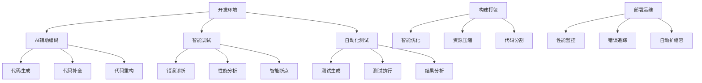

# 前端AI工具链与生态系统深度解析

## 引言

随着AI技术在前端开发中的广泛应用，一个完整的AI工具链和生态系统正在形成。从开发环境到部署运维，AI正在重塑前端开发的每一个环节。本文将深入解析前端AI工具链的构成、核心组件以及最佳实践。

## 一、前端AI工具链概览

### 1.1 工具链架构



### 1.2 核心工具分类

```javascript
// 前端AI工具生态系统
const frontendAIEcosystem = {
  // 开发环境工具
  developmentTools: {
    ides: {
      vscode: {
        extensions: [
          'GitHub Copilot',
          'Tabnine',
          'IntelliCode',
          'CodeGPT',
          'AI Code Reviewer'
        ],
        features: [
          '智能代码补全',
          'AI驱动的代码生成',
          '自动错误检测',
          '智能重构建议'
        ]
      },
      webstorm: {
        features: [
          'AI Assistant',
          '智能代码分析',
          '自动化重构',
          '智能调试'
        ]
      }
    },
    
    codeGenerators: {
      github_copilot: {
        description: 'AI配对编程助手',
        capabilities: [
          '实时代码建议',
          '函数自动完成',
          '注释生成代码',
          '测试用例生成'
        ],
        integration: `
          // GitHub Copilot 使用示例
          // 输入注释，Copilot自动生成代码
          
          // 创建一个React Hook用于管理用户状态
          function useUser() {
            const [user, setUser] = useState(null);
            const [loading, setLoading] = useState(false);
            const [error, setError] = useState(null);
            
            const fetchUser = useCallback(async (userId) => {
              setLoading(true);
              setError(null);
              try {
                const response = await fetch(\`/api/users/\${userId}\`);
                const userData = await response.json();
                setUser(userData);
              } catch (err) {
                setError(err.message);
              } finally {
                setLoading(false);
              }
            }, []);
            
            return { user, loading, error, fetchUser };
          }
        `
      },
      
      tabnine: {
        description: 'AI代码补全工具',
        capabilities: [
          '多语言支持',
          '本地模型运行',
          '团队学习',
          '企业级安全'
        ]
      },
      
      codeium: {
        description: '免费AI编程助手',
        capabilities: [
          '无限制使用',
          '多IDE支持',
          '实时建议',
          '代码解释'
        ]
      }
    }
  },
  
  // 测试工具
  testingTools: {
    testGeneration: {
      testcraft: {
        description: 'AI测试用例生成',
        features: [
          '自动生成单元测试',
          '集成测试生成',
          'E2E测试脚本',
          '测试数据生成'
        ]
      },
      
      diffblue: {
        description: 'AI单元测试生成',
        features: [
          '自动化测试创建',
          '代码覆盖率优化',
          '回归测试生成'
        ]
      }
    },
    
    testExecution: {
      playwright_ai: {
        description: 'AI增强的E2E测试',
        features: [
          '智能元素定位',
          '自愈测试',
          '视觉回归测试',
          '性能测试'
        ],
        example: `
          // Playwright AI 测试示例
          import { test, expect } from '@playwright/test';
          
          test('AI增强的登录测试', async ({ page }) => {
            await page.goto('/login');
            
            // AI智能定位元素
            await page.getByRole('textbox', { name: /用户名|邮箱|账号/ }).fill('user@example.com');
            await page.getByRole('textbox', { name: /密码/ }).fill('password123');
            await page.getByRole('button', { name: /登录|登陆|提交/ }).click();
            
            // AI验证登录成功
            await expect(page).toHaveURL(/dashboard|home|main/);
            await expect(page.getByText(/欢迎|welcome|hello/i)).toBeVisible();
          });
        `
      }
    }
  },
  
  // 构建优化工具
  buildTools: {
    webpack_ai: {
      description: 'AI优化的Webpack配置',
      features: [
        '智能代码分割',
        '自动化优化',
        '性能分析',
        '资源优化'
      ],
      configuration: `
        // AI优化的Webpack配置
        const AIWebpackOptimizer = require('ai-webpack-optimizer');
        
        module.exports = {
          // ... 基础配置
          
          optimization: {
            splitChunks: {
              chunks: 'all',
              cacheGroups: {
                // AI分析生成的最优分割策略
                vendor: {
                  test: /[\\\\/]node_modules[\\\\/]/,
                  name: 'vendors',
                  chunks: 'all',
                  priority: 10
                },
                common: {
                  name: 'common',
                  minChunks: 2,
                  chunks: 'all',
                  priority: 5
                }
              }
            }
          },
          
          plugins: [
            new AIWebpackOptimizer({
              // AI优化选项
              enableSmartSplitting: true,
              performanceTarget: 'web-vitals',
              optimizationLevel: 'aggressive'
            })
          ]
        };
      `
    },
    
    vite_ai: {
      description: 'AI增强的Vite构建',
      features: [
        '智能预构建',
        '动态导入优化',
        'HMR智能更新'
      ]
    }
  },
  
  // 监控分析工具
  monitoringTools: {
    performance: {
      lighthouse_ai: {
        description: 'AI增强的性能分析',
        features: [
          '智能性能建议',
          '自动化优化',
          '趋势分析',
          '预测性维护'
        ]
      },
      
      web_vitals_ai: {
        description: 'AI驱动的Web Vitals监控',
        features: [
          '实时性能监控',
          '异常检测',
          '优化建议',
          '用户体验分析'
        ]
      }
    },
    
    errorTracking: {
      sentry_ai: {
        description: 'AI增强的错误追踪',
        features: [
          '智能错误分组',
          '根因分析',
          '修复建议',
          '影响评估'
        ]
      }
    }
  }
};
```

## 二、AI辅助开发环境

### 2.1 智能IDE配置

```javascript
// 智能IDE配置管理器
class IntelligentIDEManager {
  constructor() {
    this.aiExtensions = new Map();
    this.configurationProfiles = new Map();
    this.learningData = new Map();
  }

  async initializeAIEnvironment() {
    // 检测开发环境
    const environment = await this.detectDevelopmentEnvironment();
    
    // 安装AI扩展
    await this.installAIExtensions(environment);
    
    // 配置AI工具
    await this.configureAITools(environment);
    
    // 设置学习模式
    await this.enableLearningMode();
    
    return {
      environment,
      installedExtensions: Array.from(this.aiExtensions.keys()),
      configuration: this.getActiveConfiguration()
    };
  }

  async detectDevelopmentEnvironment() {
    const environment = {
      ide: null,
      language: null,
      framework: null,
      projectType: null
    };

    // 检测IDE
    if (process.env.VSCODE_PID) {
      environment.ide = 'vscode';
    } else if (process.env.WEBSTORM_VM_OPTIONS) {
      environment.ide = 'webstorm';
    }

    // 检测项目类型
    const packageJson = await this.readPackageJson();
    if (packageJson) {
      environment.framework = this.detectFramework(packageJson);
      environment.language = this.detectLanguage(packageJson);
      environment.projectType = this.detectProjectType(packageJson);
    }

    return environment;
  }

  async installAIExtensions(environment) {
    const extensionMap = {
      vscode: [
        {
          id: 'GitHub.copilot',
          name: 'GitHub Copilot',
          config: {
            'github.copilot.enable': true,
            'github.copilot.inlineSuggest.enable': true
          }
        },
        {
          id: 'TabNine.tabnine-vscode',
          name: 'Tabnine',
          config: {
            'tabnine.experimentalAutoImports': true
          }
        },
        {
          id: 'VisualStudioExptTeam.vscodeintellicode',
          name: 'IntelliCode',
          config: {
            'vsintellicode.modify.editor.suggestSelection': 'automaticallyOverrideDefaultValue'
          }
        }
      ],
      webstorm: [
        {
          id: 'ai-assistant',
          name: 'AI Assistant',
          config: {}
        }
      ]
    };

    const extensions = extensionMap[environment.ide] || [];
    
    for (const extension of extensions) {
      await this.installExtension(extension);
      this.aiExtensions.set(extension.id, extension);
    }
  }

  async configureAITools(environment) {
    const configuration = {
      codeCompletion: {
        enabled: true,
        provider: 'copilot',
        aggressiveness: 'balanced',
        languages: [environment.language]
      },
      codeGeneration: {
        enabled: true,
        templates: await this.loadTemplates(environment.framework),
        customPrompts: await this.loadCustomPrompts()
      },
      debugging: {
        aiAssisted: true,
        autoBreakpoints: true,
        smartStepping: true
      },
      refactoring: {
        suggestions: true,
        autoApply: false,
        safetyLevel: 'conservative'
      }
    };

    await this.applyConfiguration(configuration);
    this.configurationProfiles.set('default', configuration);
  }

  async enableLearningMode() {
    // 启用代码模式学习
    await this.enableCodePatternLearning();
    
    // 启用错误模式学习
    await this.enableErrorPatternLearning();
    
    // 启用性能模式学习
    await this.enablePerformancePatternLearning();
  }

  async enableCodePatternLearning() {
    const codeAnalyzer = new CodePatternAnalyzer();
    
    // 分析现有代码库
    const patterns = await codeAnalyzer.analyzeCodebase('./src');
    
    // 存储学习数据
    this.learningData.set('codePatterns', patterns);
    
    // 配置AI工具使用这些模式
    await this.configurePatternBasedSuggestions(patterns);
  }
}

// 代码模式分析器
class CodePatternAnalyzer {
  constructor() {
    this.patterns = new Map();
    this.frequency = new Map();
  }

  async analyzeCodebase(directory) {
    const files = await this.getSourceFiles(directory);
    const patterns = {
      imports: new Map(),
      functions: new Map(),
      components: new Map(),
      hooks: new Map(),
      utilities: new Map()
    };

    for (const file of files) {
      const content = await this.readFile(file);
      const ast = await this.parseAST(content);
      
      // 分析导入模式
      this.analyzeImportPatterns(ast, patterns.imports);
      
      // 分析函数模式
      this.analyzeFunctionPatterns(ast, patterns.functions);
      
      // 分析组件模式
      this.analyzeComponentPatterns(ast, patterns.components);
      
      // 分析Hook模式
      this.analyzeHookPatterns(ast, patterns.hooks);
      
      // 分析工具函数模式
      this.analyzeUtilityPatterns(ast, patterns.utilities);
    }

    return this.rankPatternsByFrequency(patterns);
  }

  analyzeImportPatterns(ast, importPatterns) {
    const imports = this.extractImports(ast);
    
    for (const importStatement of imports) {
      const pattern = {
        source: importStatement.source,
        specifiers: importStatement.specifiers,
        type: importStatement.type // default, named, namespace
      };
      
      const key = this.generatePatternKey(pattern);
      const count = importPatterns.get(key) || 0;
      importPatterns.set(key, count + 1);
    }
  }

  analyzeComponentPatterns(ast, componentPatterns) {
    const components = this.extractComponents(ast);
    
    for (const component of components) {
      const pattern = {
        type: component.type, // functional, class
        props: component.props,
        hooks: component.hooks,
        lifecycle: component.lifecycle,
        structure: this.analyzeComponentStructure(component)
      };
      
      const key = this.generatePatternKey(pattern);
      const count = componentPatterns.get(key) || 0;
      componentPatterns.set(key, count + 1);
    }
  }

  generatePatternKey(pattern) {
    return JSON.stringify(pattern, Object.keys(pattern).sort());
  }

  rankPatternsByFrequency(patterns) {
    const ranked = {};
    
    for (const [category, patternMap] of Object.entries(patterns)) {
      ranked[category] = Array.from(patternMap.entries())
        .sort(([, a], [, b]) => b - a)
        .slice(0, 10) // 取前10个最常用的模式
        .map(([pattern, frequency]) => ({
          pattern: JSON.parse(pattern),
          frequency,
          confidence: frequency / patternMap.size
        }));
    }
    
    return ranked;
  }
}
```

### 2.2 智能代码生成工具链

```javascript
// 智能代码生成工具链
class IntelligentCodeGenerationToolchain {
  constructor() {
    this.generators = new Map();
    this.templates = new Map();
    this.contextAnalyzer = new ContextAnalyzer();
    this.qualityChecker = new CodeQualityChecker();
  }

  async initialize() {
    // 注册代码生成器
    await this.registerGenerators();
    
    // 加载模板
    await this.loadTemplates();
    
    // 初始化上下文分析器
    await this.contextAnalyzer.initialize();
    
    // 初始化质量检查器
    await this.qualityChecker.initialize();
  }

  async registerGenerators() {
    // React组件生成器
    this.generators.set('react-component', new ReactComponentGenerator());
    
    // Vue组件生成器
    this.generators.set('vue-component', new VueComponentGenerator());
    
    // Hook生成器
    this.generators.set('react-hook', new ReactHookGenerator());
    
    // 工具函数生成器
    this.generators.set('utility-function', new UtilityFunctionGenerator());
    
    // API客户端生成器
    this.generators.set('api-client', new APIClientGenerator());
    
    // 测试用例生成器
    this.generators.set('test-case', new TestCaseGenerator());
  }

  async generateCode(request) {
    try {
      // 分析请求上下文
      const context = await this.contextAnalyzer.analyze(request);
      
      // 选择合适的生成器
      const generator = this.selectGenerator(request.type, context);
      
      if (!generator) {
        throw new Error(`No generator found for type: ${request.type}`);
      }
      
      // 生成代码
      const generatedCode = await generator.generate(request, context);
      
      // 质量检查
      const qualityReport = await this.qualityChecker.check(generatedCode);
      
      // 后处理
      const processedCode = await this.postProcess(generatedCode, qualityReport);
      
      return {
        code: processedCode,
        generator: generator.name,
        context,
        qualityReport,
        suggestions: await this.generateSuggestions(processedCode, context)
      };
    } catch (error) {
      console.error('Code generation error:', error);
      throw error;
    }
  }

  selectGenerator(type, context) {
    const generator = this.generators.get(type);
    
    if (!generator) {
      // 尝试智能推断生成器类型
      const inferredType = this.inferGeneratorType(context);
      return this.generators.get(inferredType);
    }
    
    return generator;
  }

  inferGeneratorType(context) {
    // 基于上下文推断生成器类型
    if (context.framework === 'react') {
      if (context.intent.includes('component')) {
        return 'react-component';
      } else if (context.intent.includes('hook')) {
        return 'react-hook';
      }
    } else if (context.framework === 'vue') {
      return 'vue-component';
    }
    
    if (context.intent.includes('test')) {
      return 'test-case';
    }
    
    if (context.intent.includes('api') || context.intent.includes('client')) {
      return 'api-client';
    }
    
    return 'utility-function';
  }
}

// React组件生成器
class ReactComponentGenerator {
  constructor() {
    this.name = 'React Component Generator';
    this.templates = new Map();
  }

  async generate(request, context) {
    const componentSpec = this.parseComponentSpec(request);
    const template = this.selectTemplate(componentSpec, context);
    
    const code = await this.fillTemplate(template, componentSpec, context);
    
    return {
      filename: `${componentSpec.name}.jsx`,
      content: code,
      dependencies: this.extractDependencies(componentSpec),
      exports: [componentSpec.name]
    };
  }

  parseComponentSpec(request) {
    return {
      name: request.name || 'Component',
      props: request.props || [],
      state: request.state || [],
      hooks: request.hooks || [],
      methods: request.methods || [],
      styling: request.styling || 'css-modules',
      typescript: request.typescript || false
    };
  }

  selectTemplate(spec, context) {
    let templateKey = 'functional-component';
    
    if (spec.state.length > 0 || spec.hooks.length > 0) {
      templateKey = 'stateful-component';
    }
    
    if (spec.typescript) {
      templateKey += '-typescript';
    }
    
    return this.templates.get(templateKey) || this.getDefaultTemplate();
  }

  async fillTemplate(template, spec, context) {
    const templateEngine = new TemplateEngine();
    
    const templateData = {
      componentName: spec.name,
      props: this.generatePropsInterface(spec.props, spec.typescript),
      imports: this.generateImports(spec, context),
      hooks: this.generateHooks(spec.hooks),
      methods: this.generateMethods(spec.methods),
      jsx: this.generateJSX(spec, context),
      styles: this.generateStyles(spec.styling)
    };
    
    return await templateEngine.render(template, templateData);
  }

  generatePropsInterface(props, typescript) {
    if (!typescript || props.length === 0) {
      return '';
    }
    
    const propsInterface = props.map(prop => {
      const optional = prop.required ? '' : '?';
      return `  ${prop.name}${optional}: ${prop.type};`;
    }).join('\n');
    
    return `interface Props {\n${propsInterface}\n}`;
  }

  generateImports(spec, context) {
    const imports = ['import React from \'react\';'];
    
    // 添加Hook导入
    const hookImports = spec.hooks
      .filter(hook => hook.source === 'react')
      .map(hook => hook.name);
    
    if (hookImports.length > 0) {
      imports[0] = `import React, { ${hookImports.join(', ')} } from 'react';`;
    }
    
    // 添加其他依赖导入
    spec.hooks
      .filter(hook => hook.source !== 'react')
      .forEach(hook => {
        imports.push(`import { ${hook.name} } from '${hook.source}';`);
      });
    
    // 添加样式导入
    if (spec.styling === 'css-modules') {
      imports.push(`import styles from './${spec.name}.module.css';`);
    } else if (spec.styling === 'styled-components') {
      imports.push(`import styled from 'styled-components';`);
    }
    
    return imports.join('\n');
  }

  generateJSX(spec, context) {
    const className = spec.styling === 'css-modules' 
      ? `className={styles.${spec.name.toLowerCase()}}`
      : `className="${spec.name.toLowerCase()}"`;
    
    return `
  return (
    <div ${className}>
      <h1>{props.title || '${spec.name}'}</h1>
      {/* Component content */}
    </div>
  );
    `.trim();
  }

  getDefaultTemplate() {
    return `
{{imports}}

{{propsInterface}}

const {{componentName}} = ({{#if typescript}}props: Props{{else}}props{{/if}}) => {
  {{hooks}}
  
  {{methods}}
  
  {{jsx}}
};

export default {{componentName}};
    `.trim();
  }
}
```

## 三、AI驱动的测试工具链

### 3.1 智能测试生成

```javascript
// 智能测试生成器
class IntelligentTestGenerator {
  constructor() {
    this.testStrategies = new Map();
    this.coverageAnalyzer = new CoverageAnalyzer();
    this.testDataGenerator = new TestDataGenerator();
  }

  async initialize() {
    // 注册测试策略
    this.registerTestStrategies();
    
    // 初始化覆盖率分析器
    await this.coverageAnalyzer.initialize();
    
    // 初始化测试数据生成器
    await this.testDataGenerator.initialize();
  }

  registerTestStrategies() {
    // 单元测试策略
    this.testStrategies.set('unit', new UnitTestStrategy());
    
    // 集成测试策略
    this.testStrategies.set('integration', new IntegrationTestStrategy());
    
    // E2E测试策略
    this.testStrategies.set('e2e', new E2ETestStrategy());
    
    // 性能测试策略
    this.testStrategies.set('performance', new PerformanceTestStrategy());
    
    // 可访问性测试策略
    this.testStrategies.set('accessibility', new AccessibilityTestStrategy());
  }

  async generateTests(codebase, options = {}) {
    try {
      // 分析代码库
      const analysis = await this.analyzeCodebase(codebase);
      
      // 确定测试策略
      const strategies = this.selectTestStrategies(analysis, options);
      
      // 生成测试用例
      const testSuites = [];
      
      for (const strategy of strategies) {
        const tests = await strategy.generateTests(analysis);
        testSuites.push(...tests);
      }
      
      // 优化测试覆盖率
      const optimizedTests = await this.optimizeCoverage(testSuites, analysis);
      
      // 生成测试数据
      const testData = await this.generateTestData(optimizedTests);
      
      return {
        testSuites: optimizedTests,
        testData,
        coverage: await this.calculateExpectedCoverage(optimizedTests, analysis),
        recommendations: await this.generateRecommendations(optimizedTests, analysis)
      };
    } catch (error) {
      console.error('Test generation error:', error);
      throw error;
    }
  }

  async analyzeCodebase(codebase) {
    const analysis = {
      files: [],
      functions: [],
      components: [],
      apis: [],
      complexity: {},
      dependencies: {},
      patterns: {}
    };

    // 分析源文件
    for (const file of codebase.files) {
      const fileAnalysis = await this.analyzeFile(file);
      analysis.files.push(fileAnalysis);
      
      analysis.functions.push(...fileAnalysis.functions);
      analysis.components.push(...fileAnalysis.components);
      analysis.apis.push(...fileAnalysis.apis);
    }

    // 计算复杂度
    analysis.complexity = await this.calculateComplexity(analysis);
    
    // 分析依赖关系
    analysis.dependencies = await this.analyzeDependencies(analysis);
    
    // 识别模式
    analysis.patterns = await this.identifyPatterns(analysis);

    return analysis;
  }

  async analyzeFile(file) {
    const ast = await this.parseAST(file.content);
    
    return {
      path: file.path,
      type: this.identifyFileType(file),
      functions: this.extractFunctions(ast),
      components: this.extractComponents(ast),
      apis: this.extractAPIUsage(ast),
      imports: this.extractImports(ast),
      exports: this.extractExports(ast),
      complexity: this.calculateFileComplexity(ast)
    };
  }

  selectTestStrategies(analysis, options) {
    const strategies = [];
    
    // 总是包含单元测试
    strategies.push(this.testStrategies.get('unit'));
    
    // 基于复杂度选择策略
    if (analysis.complexity.average > 0.5) {
      strategies.push(this.testStrategies.get('integration'));
    }
    
    // 如果有API使用，添加集成测试
    if (analysis.apis.length > 0) {
      strategies.push(this.testStrategies.get('integration'));
    }
    
    // 如果有用户界面组件，添加E2E测试
    if (analysis.components.some(c => c.isUIComponent)) {
      strategies.push(this.testStrategies.get('e2e'));
    }
    
    // 根据选项添加特定策略
    if (options.includePerformance) {
      strategies.push(this.testStrategies.get('performance'));
    }
    
    if (options.includeAccessibility) {
      strategies.push(this.testStrategies.get('accessibility'));
    }
    
    return strategies;
  }
}

// 单元测试策略
class UnitTestStrategy {
  constructor() {
    this.name = 'Unit Test Strategy';
  }

  async generateTests(analysis) {
    const testSuites = [];
    
    // 为每个函数生成测试
    for (const func of analysis.functions) {
      const testSuite = await this.generateFunctionTests(func);
      testSuites.push(testSuite);
    }
    
    // 为每个组件生成测试
    for (const component of analysis.components) {
      const testSuite = await this.generateComponentTests(component);
      testSuites.push(testSuite);
    }
    
    return testSuites;
  }

  async generateFunctionTests(func) {
    const testCases = [];
    
    // 生成正常情况测试
    testCases.push(...await this.generateHappyPathTests(func));
    
    // 生成边界情况测试
    testCases.push(...await this.generateEdgeCaseTests(func));
    
    // 生成错误情况测试
    testCases.push(...await this.generateErrorCaseTests(func));
    
    return {
      name: `${func.name} Tests`,
      type: 'unit',
      target: func,
      testCases,
      setup: this.generateSetup(func),
      teardown: this.generateTeardown(func)
    };
  }

  async generateHappyPathTests(func) {
    const tests = [];
    
    // 分析函数参数
    const parameterAnalysis = this.analyzeParameters(func);
    
    // 生成典型输入的测试用例
    for (const scenario of parameterAnalysis.typicalScenarios) {
      tests.push({
        name: `should ${this.generateTestDescription(func, scenario)}`,
        type: 'happy-path',
        input: scenario.input,
        expectedOutput: scenario.expectedOutput,
        code: this.generateTestCode(func, scenario)
      });
    }
    
    return tests;
  }

  async generateEdgeCaseTests(func) {
    const tests = [];
    const edgeCases = this.identifyEdgeCases(func);
    
    for (const edgeCase of edgeCases) {
      tests.push({
        name: `should handle ${edgeCase.description}`,
        type: 'edge-case',
        input: edgeCase.input,
        expectedOutput: edgeCase.expectedOutput,
        code: this.generateTestCode(func, edgeCase)
      });
    }
    
    return tests;
  }

  generateTestCode(func, scenario) {
    return `
test('${scenario.name}', () => {
  // Arrange
  ${this.generateArrangeCode(scenario.input)}
  
  // Act
  const result = ${func.name}(${this.generateParameterList(scenario.input)});
  
  // Assert
  ${this.generateAssertCode(scenario.expectedOutput, 'result')}
});
    `.trim();
  }

  generateArrangeCode(input) {
    return Object.entries(input)
      .map(([key, value]) => `const ${key} = ${JSON.stringify(value)};`)
      .join('\n  ');
  }

  generateParameterList(input) {
    return Object.keys(input).join(', ');
  }

  generateAssertCode(expected, actual) {
    if (typeof expected === 'object') {
      return `expect(${actual}).toEqual(${JSON.stringify(expected)});`;
    } else {
      return `expect(${actual}).toBe(${JSON.stringify(expected)});`;
    }
  }
}
```

## 四、AI性能优化工具链

### 4.1 智能构建优化

```javascript
// 智能构建优化器
class IntelligentBuildOptimizer {
  constructor() {
    this.optimizers = new Map();
    this.performanceModel = null;
    this.bundleAnalyzer = new BundleAnalyzer();
  }

  async initialize() {
    // 加载性能预测模型
    this.performanceModel = await tf.loadLayersModel('/models/build-performance.json');
    
    // 注册优化器
    this.registerOptimizers();
    
    // 初始化包分析器
    await this.bundleAnalyzer.initialize();
  }

  registerOptimizers() {
    // 代码分割优化器
    this.optimizers.set('code-splitting', new CodeSplittingOptimizer());
    
    // 资源压缩优化器
    this.optimizers.set('compression', new CompressionOptimizer());
    
    // 缓存优化器
    this.optimizers.set('caching', new CachingOptimizer());
    
    // 预加载优化器
    this.optimizers.set('preloading', new PreloadingOptimizer());
    
    // Tree Shaking优化器
    this.optimizers.set('tree-shaking', new TreeShakingOptimizer());
  }

  async optimizeBuild(buildConfig, projectAnalysis) {
    try {
      // 分析当前构建性能
      const currentPerformance = await this.analyzeCurrentPerformance(buildConfig);
      
      // 预测优化效果
      const optimizationPredictions = await this.predictOptimizations(projectAnalysis);
      
      // 选择最佳优化策略
      const selectedOptimizations = this.selectOptimizations(optimizationPredictions);
      
      // 应用优化
      const optimizedConfig = await this.applyOptimizations(buildConfig, selectedOptimizations);
      
      // 验证优化效果
      const optimizedPerformance = await this.validateOptimizations(optimizedConfig);
      
      return {
        originalConfig: buildConfig,
        optimizedConfig,
        performance: {
          before: currentPerformance,
          after: optimizedPerformance,
          improvement: this.calculateImprovement(currentPerformance, optimizedPerformance)
        },
        appliedOptimizations: selectedOptimizations
      };
    } catch (error) {
      console.error('Build optimization error:', error);
      throw error;
    }
  }

  async predictOptimizations(projectAnalysis) {
    const features = this.extractOptimizationFeatures(projectAnalysis);
    const predictions = await this.performanceModel.predict(features);
    const predictionData = predictions.dataSync();
    
    return {
      codeSplitting: {
        impact: predictionData[0],
        confidence: predictionData[1],
        recommendation: predictionData[0] > 0.7 ? 'high' : predictionData[0] > 0.4 ? 'medium' : 'low'
      },
      compression: {
        impact: predictionData[2],
        confidence: predictionData[3],
        recommendation: predictionData[2] > 0.6 ? 'high' : predictionData[2] > 0.3 ? 'medium' : 'low'
      },
      caching: {
        impact: predictionData[4],
        confidence: predictionData[5],
        recommendation: predictionData[4] > 0.8 ? 'high' : predictionData[4] > 0.5 ? 'medium' : 'low'
      },
      preloading: {
        impact: predictionData[6],
        confidence: predictionData[7],
        recommendation: predictionData[6] > 0.5 ? 'high' : predictionData[6] > 0.2 ? 'medium' : 'low'
      },
      treeShaking: {
        impact: predictionData[8],
        confidence: predictionData[9],
        recommendation: predictionData[8] > 0.7 ? 'high' : predictionData[8] > 0.4 ? 'medium' : 'low'
      }
    };
  }

  selectOptimizations(predictions) {
    const selected = [];
    
    // 选择高影响的优化
    Object.entries(predictions).forEach(([type, prediction]) => {
      if (prediction.recommendation === 'high' && prediction.confidence > 0.7) {
        selected.push({
          type,
          priority: 'high',
          expectedImpact: prediction.impact,
          confidence: prediction.confidence
        });
      } else if (prediction.recommendation === 'medium' && prediction.confidence > 0.5) {
        selected.push({
          type,
          priority: 'medium',
          expectedImpact: prediction.impact,
          confidence: prediction.confidence
        });
      }
    });
    
    // 按优先级和影响排序
    return selected.sort((a, b) => {
      if (a.priority !== b.priority) {
        return a.priority === 'high' ? -1 : 1;
      }
      return b.expectedImpact - a.expectedImpact;
    });
  }

  async applyOptimizations(buildConfig, optimizations) {
    let optimizedConfig = { ...buildConfig };
    
    for (const optimization of optimizations) {
      const optimizer = this.optimizers.get(optimization.type);
      if (optimizer) {
        optimizedConfig = await optimizer.apply(optimizedConfig, optimization);
      }
    }
    
    return optimizedConfig;
  }
}

// 代码分割优化器
class CodeSplittingOptimizer {
  constructor() {
    this.name = 'Code Splitting Optimizer';
  }

  async apply(buildConfig, optimization) {
    const optimizedConfig = { ...buildConfig };
    
    // 分析模块依赖
    const dependencyAnalysis = await this.analyzeDependencies(buildConfig);
    
    // 生成最优分割策略
    const splittingStrategy = this.generateSplittingStrategy(dependencyAnalysis);
    
    // 应用代码分割配置
    optimizedConfig.optimization = {
      ...optimizedConfig.optimization,
      splitChunks: {
        chunks: 'all',
        cacheGroups: this.generateCacheGroups(splittingStrategy)
      }
    };
    
    // 添加动态导入建议
    optimizedConfig.dynamicImports = this.generateDynamicImportSuggestions(dependencyAnalysis);
    
    return optimizedConfig;
  }

  generateCacheGroups(strategy) {
    const cacheGroups = {
      // 第三方库
      vendor: {
        test: /[\\\\/]node_modules[\\\\/]/,
        name: 'vendors',
        chunks: 'all',
        priority: 10,
        enforce: true
      },
      
      // 公共模块
      common: {
        name: 'common',
        minChunks: 2,
        chunks: 'all',
        priority: 5,
        reuseExistingChunk: true
      }
    };
    
    // 基于分析结果添加特定的缓存组
    strategy.customGroups.forEach((group, index) => {
      cacheGroups[`custom-${index}`] = {
        test: group.test,
        name: group.name,
        chunks: 'all',
        priority: group.priority,
        enforce: group.enforce
      };
    });
    
    return cacheGroups;
  }

  generateDynamicImportSuggestions(analysis) {
    const suggestions = [];
    
    // 识别可以延迟加载的模块
    analysis.modules.forEach(module => {
      if (module.size > 50000 && !module.isCritical) { // 50KB阈值
        suggestions.push({
          module: module.name,
          reason: 'Large non-critical module',
          implementation: `const ${module.name} = lazy(() => import('${module.path}'));`
        });
      }
      
      if (module.isRouteComponent) {
        suggestions.push({
          module: module.name,
          reason: 'Route component',
          implementation: `const ${module.name} = lazy(() => import('${module.path}'));`
        });
      }
    });
    
    return suggestions;
  }
}
```

## 五、总结与最佳实践

### 5.1 工具链集成策略

```javascript
// AI工具链集成管理器
class AIToolchainIntegrationManager {
  constructor() {
    this.tools = new Map();
    this.workflows = new Map();
    this.metrics = new Map();
  }

  async setupIntegratedWorkflow() {
    // 开发阶段工作流
    const developmentWorkflow = {
      name: 'AI-Enhanced Development',
      stages: [
        {
          name: 'Code Generation',
          tools: ['copilot', 'tabnine', 'codeium'],
          triggers: ['file-creation', 'comment-input', 'function-stub']
        },
        {
          name: 'Code Review',
          tools: ['ai-reviewer', 'security-scanner', 'performance-analyzer'],
          triggers: ['pre-commit', 'pull-request']
        },
        {
          name: 'Testing',
          tools: ['test-generator', 'coverage-analyzer', 'mutation-tester'],
          triggers: ['code-change', 'pre-push']
        }
      ]
    };
    
    // 构建阶段工作流
    const buildWorkflow = {
      name: 'AI-Optimized Build',
      stages: [
        {
          name: 'Bundle Analysis',
          tools: ['bundle-analyzer', 'dependency-analyzer'],
          triggers: ['build-start']
        },
        {
          name: 'Optimization',
          tools: ['build-optimizer', 'asset-optimizer'],
          triggers: ['analysis-complete']
        },
        {
          name: 'Quality Check',
          tools: ['performance-validator', 'security-validator'],
          triggers: ['build-complete']
        }
      ]
    };
    
    // 部署阶段工作流
    const deploymentWorkflow = {
      name: 'AI-Monitored Deployment',
      stages: [
        {
          name: 'Pre-deployment Check',
          tools: ['compatibility-checker', 'performance-predictor'],
          triggers: ['deployment-request']
        },
        {
          name: 'Deployment',
          tools: ['deployment-optimizer', 'rollback-manager'],
          triggers: ['check-passed']
        },
        {
          name: 'Monitoring',
          tools: ['performance-monitor', 'error-tracker', 'user-analytics'],
          triggers: ['deployment-complete']
        }
      ]
    };
    
    this.workflows.set('development', developmentWorkflow);
    this.workflows.set('build', buildWorkflow);
    this.workflows.set('deployment', deploymentWorkflow);
  }
}
```

### 5.2 最佳实践总结

1. **工具选择原则**：
   - 根据项目规模选择合适的AI工具
   - 考虑团队技术栈和学习成本
   - 评估工具的集成复杂度

2. **性能优化策略**：
   - 模型本地化部署
   - 缓存机制实施
   - 渐进式功能启用

3. **安全考虑**：
   - 代码隐私保护
   - 模型安全验证
   - 数据传输加密

4. **团队协作**：
   - 统一的AI工具配置
   - 共享的学习资源
   - 定期的效果评估

### 5.3 未来发展趋势

1. **工具链标准化**：统一的AI工具接口和协议
2. **智能化程度提升**：更加自主的AI开发助手
3. **多模态集成**：语音、视觉、文本的全面融合
4. **边缘计算应用**：本地化的AI能力部署

前端AI工具链正在快速发展，掌握这些工具和最佳实践，将显著提升开发效率和代码质量。