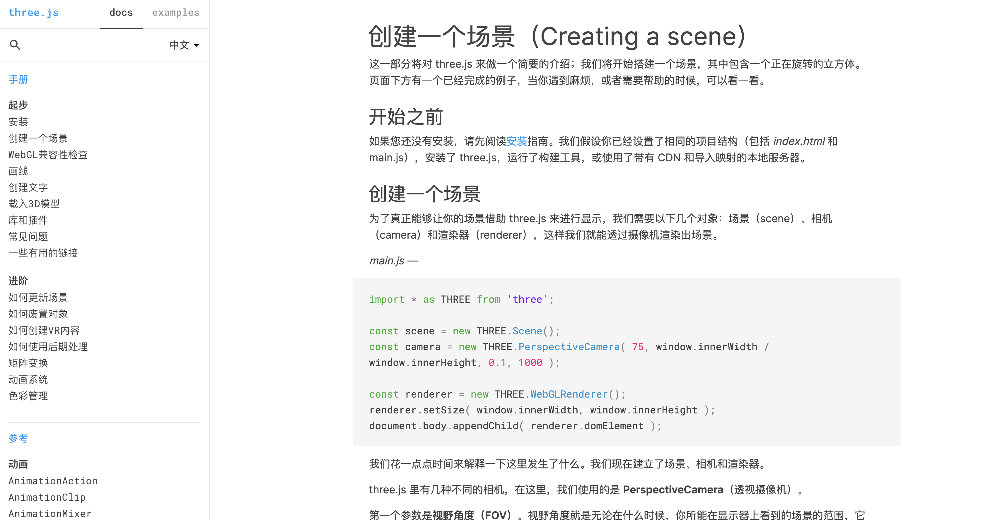
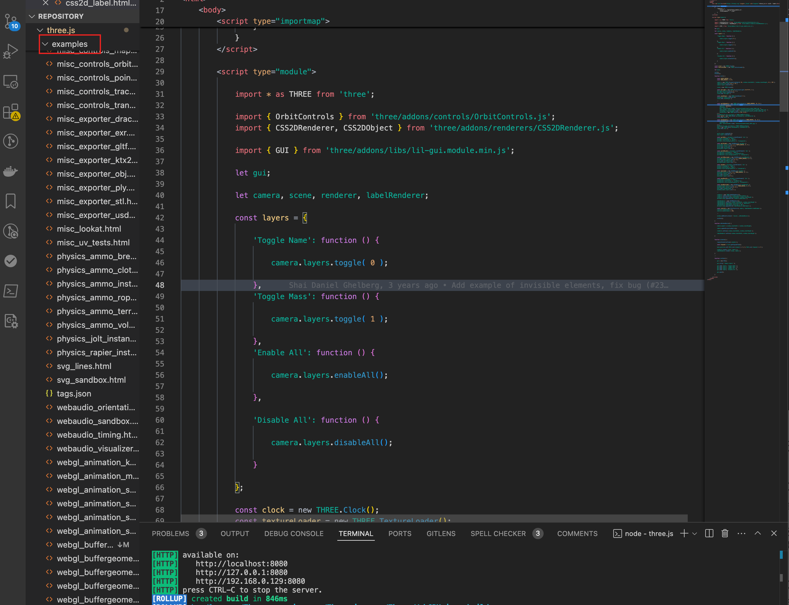
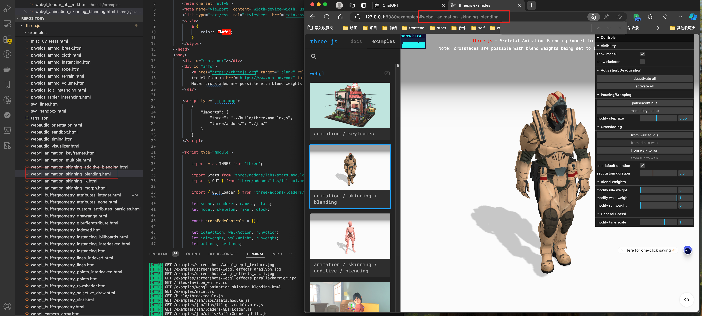
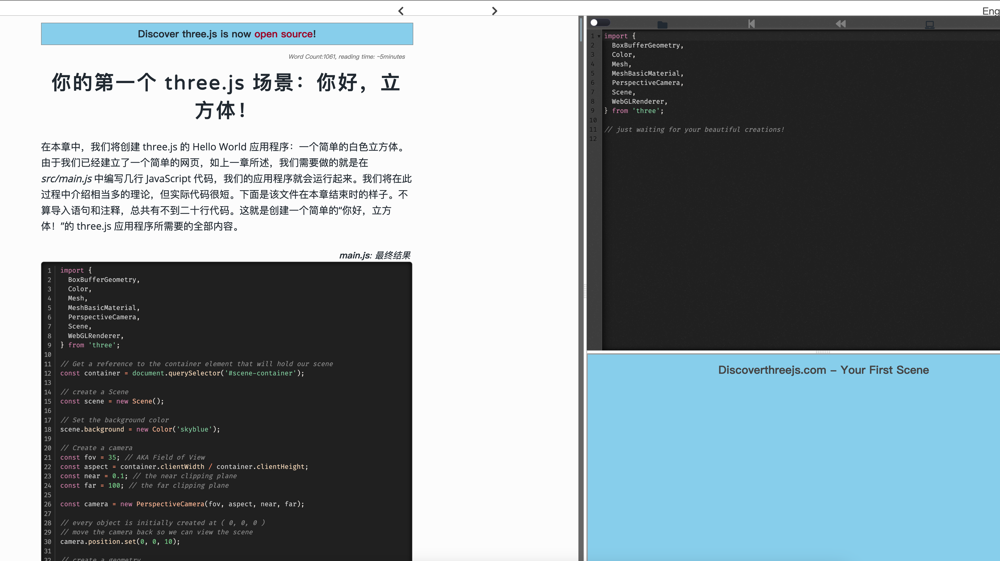

Three.js教程/入门/什么是 web 图形学

# 什么是 web 图形学

最近在学图形学的东西,感觉打开了一个新世界。这几年的前端工作给我的一个感受就是,做着前端的东西,但是好像离前端很远。

图形学虽然在浏览器上显示内容,但是实际上它是一个独立的领域,它有自己的理论和技术,这些技术和前端的技术有很多的交集,但是也有很多的不同。

如果一开始钻入图形学的话,可能会有很多的概念和技术需要学习,这样可能会让人望而生畏。但是如果一开始我们学习 Three.js 的话,可能会让我们的学习更加的轻松。

它是一个基于 WebGL 的 3D JavaScript 库,它使你可以在浏览器中创建 3D 图形。使用它可以实现很多的效果,而且实现起来也不是很复杂。等打好了兴趣,再去学习图形学的理论知识,可能会更加的轻松。

本系列的教程是基于 Three.js 的 0.170.0 版本,所以文章后面的案例代码都是基于这个版本的。
关于 170 版本可以访问 fork 仓库 [https://github.com/calmound/three.js-170](https://github.com/calmound/three.js-170)

## 怎么开始学习 Three.js

1. 官方文档
   [https://threejs.org/docs/index.html#manual/zh/introduction/Creating-a-scene](https://threejs.org/docs/index.html#manual/zh/introduction/Creating-a-scene)
   目前官方文档也有中文版
   
   而且他也有丰富的案例
   

对于这个项目,我们也可以本地去执行,进入他的代码仓库或者我上面的 fork 仓库,然后执行,进行 git clone

```bash
git clone https://github.com/calmound/three.js-170.git
```

之后执行

```text
npm install
npm run dev
```

启动服务后,我们访问 [http://localhost:8080](http://localhost:8080) 就可以看到官方的文档了


之后,我们打开项目,查看 examples 文件夹,里面有很多的案例,我们可以通过这些案例来学习 Three.js



大家也可以看 url 的最后的路径名称,其实就是对应的案例文件的名字。



通过官网的案例大家可以找到自己想要的案例,然后去看源码,这样会更加的直观。

2. [https://discoverthreejs.com/book/introduction/](https://discoverthreejs.com/book/introduction/)
   这是一个关于 threejs 入门的书籍,他不是简简单单就用文字描述,每个章节都有对应的案例。这个网站是交互式的,跟着他的介绍一边看一边写代码。
   通过这个网站,首先减少了我们前期搭建环境的时间,而且他还有正确的代码对比。

比如,


上面图是其中的一个章节,他的页面分为三个部分,左侧是教程,右侧上半区域是代码编辑区,右侧下半部分是预览区域。在右侧写入的代码,可以实时的在下半部分看到效果。

当我点击左上角的按钮之后,能够显示出完整的正确的代码,这样很容易一目了然,看到自己的代码和正确的代码的区别。



官网的案例比较适合当作字典查漏补缺,它配合官网的 API,有助于我们对于 API 的理解。但是第二个网站对于入门来说更加友好,更加容易上手。
