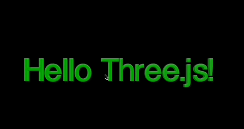
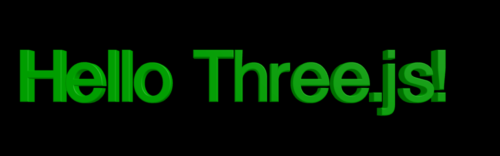

Three.js教程

入门

字体

# Three.js 字体



�?Three.js 中，我们可以通过 `FontLoader` 加载字体，并结合 `TextGeometry` 创建 3D 文本。加载字体是因为字体文件包含了字体的几何信息，例如字体的形状、大小、粗细等，�?`TextGeometry` 则是根据字体信息生成 3D 文本的几何体�?

在下面，我们将分别讲解加载字体和创建文本这两部分内容，并结合参数说明，让你对每一步都有深入理解�?

## **加载字体和创�?3D 文本**[](#加载字体和创�?3d-文本)

Three.js 使用 `FontLoader` 来加载字体文件（格式�?`.json`），通过加载后的字体对象结合 `TextGeometry` 创建文本几何体�?

#### **加载字体：FontLoader**[](#加载字体fontloader)

以下是使�?`FontLoader` 加载字体的代码：

```javascript
const fontLoader = new THREE.FontLoader();
 
// 加载字体文件（路径需要正确）
fontLoader.load("/path/to/font.json", (font) => {
  console.log("字体加载成功", font);
 
  // 使用加载的字体创�?3D 文本几何�?
  const textGeometry = new THREE.TextGeometry("Hello Three.js!", {
    font: font, // 必须提供加载后的字体对象
    size: 1, // 字体大小
    height: 0.5, // 字体厚度
    curveSegments: 12, // 曲线分段数，值越大越平滑
    bevelEnabled: true, // 是否启用斜角
    bevelThickness: 0.03, // 斜角厚度
    bevelSize: 0.02, // 斜角大小
    bevelSegments: 5, // 斜角分段�?
  });
 
  // 创建材质和网�?
  const textMaterial = new THREE.MeshStandardMaterial({ color: 0xff6347 });
  const textMesh = new THREE.Mesh(textGeometry, textMaterial);
 
  // 设置文本位置
  textMesh.position.set(-5, 2, 0);
 
  // 添加到场�?
  scene.add(textMesh);
});
```

#### **TextGeometry 参数解析**[](#textgeometry-参数解析)

�?`TextGeometry` 的构造函数中，我们需要传入两个参数：文本字符串和配置对象�?

##### **参数 1：文本字符串**[](#参数-1文本字符�?

+   表示需要显示的文本内容，例�?`'Hello Three.js!'`�?

##### **参数 2：配置对�?*[](#参数-2配置对象)

配置对象是一�?JSON，用于定义文本的样式和几何细节。以下是主要字段的详细说明：

| 参数名称 | 类型 | 默认�?| 描述 |
| --- | --- | --- | --- |
| `font` | `THREE.Font` | 必须提供 | 加载的字体对象，通过 `FontLoader` 加载后传入�?|
| `size` | `number` | 100 | 字体大小，值越大，文本越大�?|
| `height` | `number` | 50 | 字体厚度，用于创�?3D 效果�?|
| `curveSegments` | `number` | 12 | 曲线分段数，值越大，曲线部分（如圆形字母）越平滑�?|
| `bevelEnabled` | `boolean` | `false` | 是否启用斜角�?|
| `bevelThickness` | `number` | 10 | 斜角的厚度，仅在启用斜角时有效�?|
| `bevelSize` | `number` | 8 | 斜角的大小，表示斜角距离文本边缘的距离�?|
| `bevelSegments` | `number` | 3 | 斜角的分段数，值越大斜角部分越平滑�?|

Three.js �?`FontLoader` 仅支�?`.json` 格式的字体文件。如果是 `.ttf` 或其他格式，可以使用工具（如 Facetype.js）将其转换为 `.json`�?

## 例子[](#例子)

示例中，我们将创建一�?3D 文本效果，包含以下特性：

+   使用 `TextGeometry` 创建立体文字
+   添加斜角效果使文字边缘更加平�?
+   使用 `MeshPhongMaterial` 材质实现高光效果
+   通过环境光和方向光打造立体感
+   实现文本自动居中显示
+   支持通过鼠标交互旋转和缩放场�?

效果如下�?



让我们先看看创建 3D 文本的关键步骤：

1.  **加载字体**

```javascript
const fontLoader = new FontLoader();
fontLoader.load("https://threejs.org/examples/fonts/helvetiker_regular.typeface.json", (font) => {
  // 加载完成后的回调函数
});
```

2.  **创建文本几何�?*

```javascript
const textGeometry = new TextGeometry("Hello Three.js!", {
  font: font,
  size: 1, // 字体大小
  height: 0.2, // 文字厚度
  curveSegments: 12, // 曲线分段�?
  bevelEnabled: true, // 启用斜角
  bevelThickness: 0.03,
  bevelSize: 0.02,
  bevelSegments: 5,
});
```

3.  **创建材质**

```javascript
const textMaterial = new THREE.MeshPhongMaterial({
  color: 0x00ff00, // 绿色材质
  specular: 0x555555, // 高光颜色
  shininess: 30, // 高光强度
});
 
const textMesh = new THREE.Mesh(textGeometry, textMaterial);
```

4.  **文本居中处理**

```javascript
textGeometry.computeBoundingBox();
const centerOffset = -0.5 * (textGeometry.boundingBox.max.x - textGeometry.boundingBox.min.x);
textMesh.position.x = centerOffset;
```

下面是完整代�?

```javascript
import * as THREE from "three";
import { OrbitControls } from "three/examples/jsm/controls/OrbitControls";
import { FontLoader } from "three/examples/jsm/loaders/FontLoader";
import { TextGeometry } from "three/examples/jsm/geometries/TextGeometry";
 
// 创建场景
const scene = new THREE.Scene();
scene.background = new THREE.Color(0x000000);
 
// 创建相机
const camera = new THREE.PerspectiveCamera(75, window.innerWidth / window.innerHeight, 0.1, 1000);
camera.position.z = 10;
 
// 创建渲染�?
const renderer = new THREE.WebGLRenderer({ antialias: true });
renderer.setSize(window.innerWidth, window.innerHeight);
document.body.appendChild(renderer.domElement);
 
// 添加轨道控制�?
const controls = new OrbitControls(camera, renderer.domElement);
controls.enableDamping = true;
 
// 添加灯光
const ambientLight = new THREE.AmbientLight(0xffffff, 0.5);
scene.add(ambientLight);
 
const directionalLight = new THREE.DirectionalLight(0xffffff, 1);
directionalLight.position.set(5, 5, 5);
scene.add(directionalLight);
 
// 加载字体
const fontLoader = new FontLoader();
 
fontLoader.load("https://threejs.org/examples/fonts/helvetiker_regular.typeface.json", (font) => {
  // 创建文本几何�?
  const textGeometry = new TextGeometry("Hello Three.js!", {
    font: font,
    size: 1, // 字体大小
    height: 0.2, // 文字厚度
    curveSegments: 12, // 曲线分段�?
    bevelEnabled: true, // 启用斜角
    bevelThickness: 0.03, // 斜角深度
    bevelSize: 0.02, // 斜角大小
    bevelOffset: 0, // 斜角偏移
    bevelSegments: 5, // 斜角分段�?
  });
 
  // 创建材质
  const textMaterial = new THREE.MeshPhongMaterial({
    color: 0x00ff00, // 绿色材质
    specular: 0x555555, // 高光颜色
    shininess: 30, // 高光强度
  });
 
  // 创建网格
  const textMesh = new THREE.Mesh(textGeometry, textMaterial);
 
  // 居中文本
  textGeometry.computeBoundingBox();
  const centerOffset = -0.5 * (textGeometry.boundingBox.max.x - textGeometry.boundingBox.min.x);
  textMesh.position.x = centerOffset;
 
  scene.add(textMesh);
});
 
// 动画循环
function animate() {
  requestAnimationFrame(animate);
  controls.update();
  renderer.render(scene, camera);
}
 
// 处理窗口大小变化
window.addEventListener("resize", () => {
  camera.aspect = window.innerWidth / window.innerHeight;
  camera.updateProjectionMatrix();
  renderer.setSize(window.innerWidth, window.innerHeight);
});
 
animate();
```


## 代码[](#代码)

#### github[](#github)

[https://github.com/calmound/threejs-demo/tree/main/font (opens in a new tab)](https://github.com/calmound/threejs-demo/tree/main/font)

#### gitee[](#gitee)

[https://gitee.com/calmound/threejs-demo/tree/main/font (opens in a new tab)](https://gitee.com/calmound/threejs-demo/tree/main/font)

[模型](/concepts/basic/model "模型")[贴图材质](/concepts/basic/texture "贴图材质")