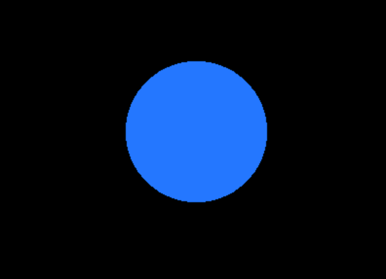
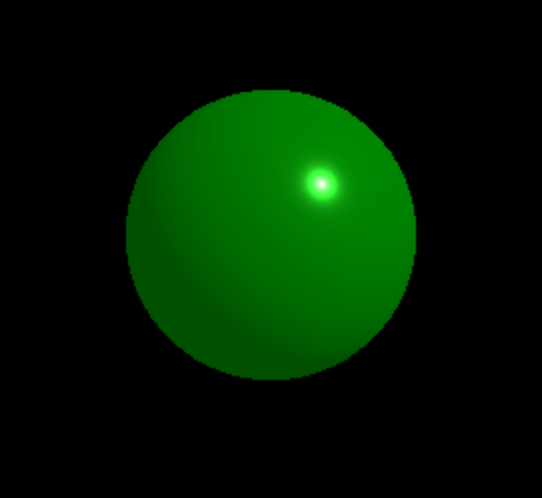
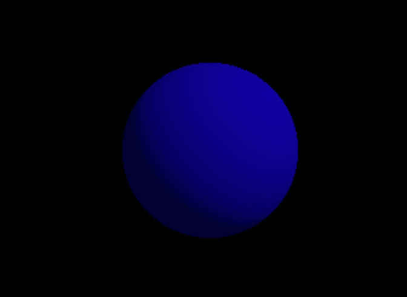
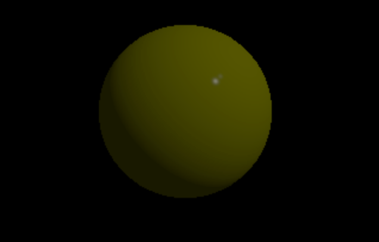
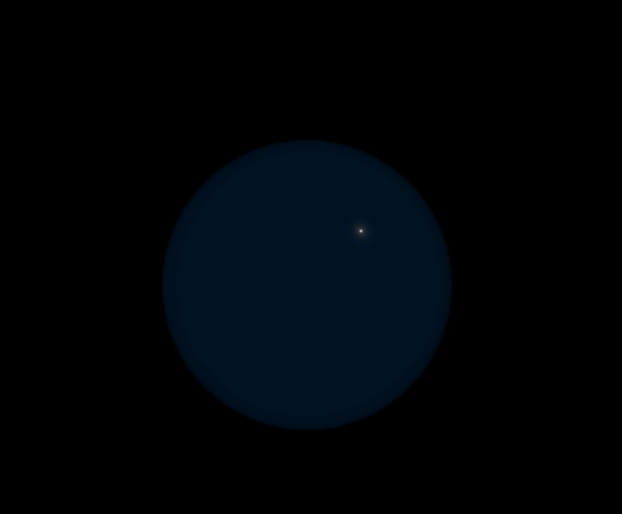
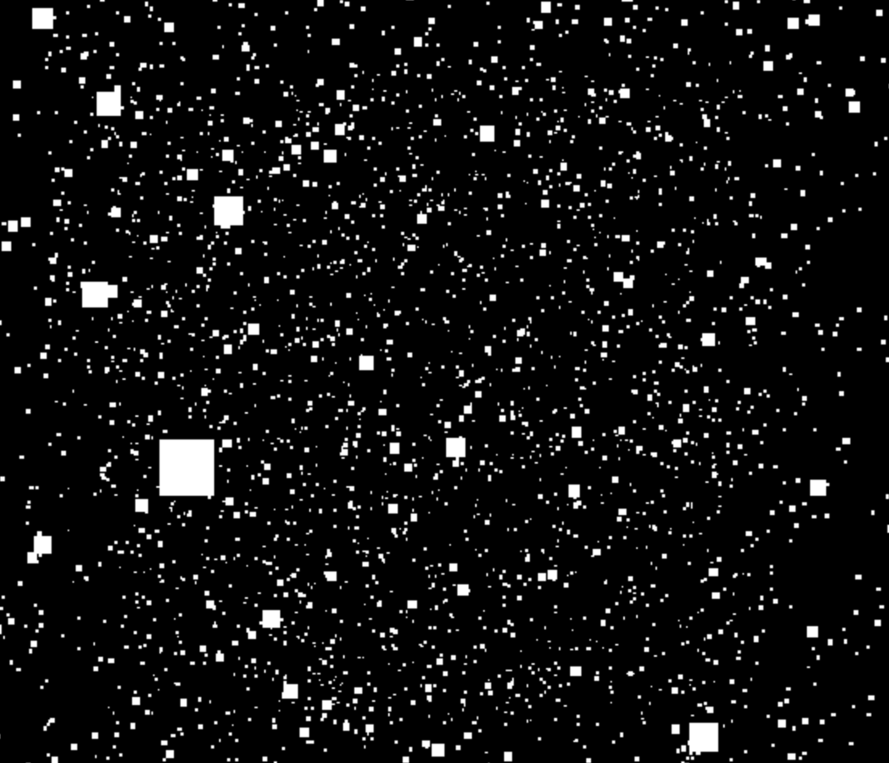
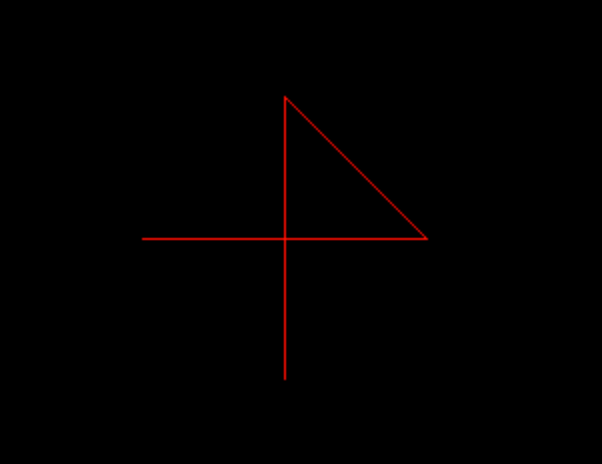
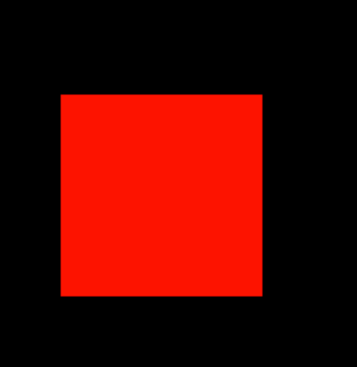

Three.js教程

入门

贴图材质

# Three.js 贴图材质详解

Three.js 是一个强大的 3D JavaScript 库，它为开发者提供了丰富的工具来创建和渲染逼真的三维场景。在这些工具中，材质是一个非常重要的组成部分。材质定义了物体表面的外观特性，例如颜色、光泽、透明度、纹理等。本文将深入探讨 Three.js 中的材质，帮助你全面了解如何通过材质增强你的 3D 场景�?

## 一、什么是材质？[](#一什么是材质)

材质是一个对象，用于定义 3D 模型表面的视觉属性。它控制了光线与模型表面的交互方式。材质可以模拟多种真实世界的表面特性，例如金属的反光、木材的纹理或玻璃的透明度�?

�?Three.js 中，材质通常与几何体（`Geometry`）和网格（`Mesh`）结合使用，最终形成可见的 3D 对象�?

## 二、Three.js 中的材质分类[](#二threejs-中的材质分类)

Three.js 提供了多种材质，每种材质都适用于特定的渲染需求。以下是一些常见的材质�?

### 1\. **MeshBasicMaterial**[](#1-meshbasicmaterial)

`MeshBasicMaterial` 是最简单的材质，它不受光照影响，颜色和纹理直接显示在物体表面。这种材质非常适合显示纯色物体或简单的图案，例�?2D 精灵�?

```javascript
const material = new THREE.MeshBasicMaterial({
  color: 0xff0000, // 红色
});
const cube = new THREE.Mesh(geometry, material);
```



适用场景�?

+   无需光照的简单场�?
+   UI 元素、标记等

### 2\. **MeshStandardMaterial**[](#2-meshstandardmaterial)

`MeshStandardMaterial` 是基于物理的材质，支持金属度和粗糙度参数，用于创建高度真实的效果。它需要环境光照或直接光源才能展现其完整的效果�?

```javascript
const material = new THREE.MeshStandardMaterial({
  color: 0x00ff00, // 绿色
  metalness: 0.5, // 金属�?
  roughness: 0.2, // 粗糙�?
});
const sphere = new THREE.Mesh(geometry, material);
```

 适用场景�?

+   物理上真实的渲染
+   现代游戏或高质量的场�?

### 3\. **MeshLambertMaterial**[](#3-meshlambertmaterial)

`MeshLambertMaterial` 是一种受光照影响的材质，基于 Lambert 漫反射模型。它的计算成本较低，但不支持高光反射效果�?

```javascript
const material = new THREE.MeshLambertMaterial({
  color: 0x0000ff, // 蓝色
});
const sphere = new THREE.Mesh(geometry, material);
```

 适用场景�?

+   简单的光照效果
+   对性能要求较高的应�?

### 4\. **MeshPhongMaterial**[](#4-meshphongmaterial)

`MeshPhongMaterial` 是一种支持高光反射的材质，基�?Phong 着色模型。它可以产生更复杂的光影效果，例如镜面反射�?

```javascript
const material = new THREE.MeshPhongMaterial({
  color: 0xffff00, // 黄色
  shininess: 100, // 高光强度
});
const sphere = new THREE.Mesh(geometry, material);
```

 适用场景�?

+   需要镜面反射的物体（如金属或水面）

### 5\. **MeshPhysicalMaterial**[](#5-meshphysicalmaterial)

`MeshPhysicalMaterial` �?`MeshStandardMaterial` 的扩展，增加了更多物理属性，例如透明度和清晰度。适合渲染玻璃或液体等复杂材料�?

```javascript
const material = new THREE.MeshPhysicalMaterial({
  color: 0xffffff, // 白色
  transmission: 0.9, // 透光�?
  roughness: 0.1, // 粗糙�?
});
const sphere = new THREE.Mesh(geometry, material);
```

 适用场景�?

+   高精度的 PBR 渲染
+   透明或半透明物体

### 6\. **PointsMaterial**[](#6-pointsmaterial)

`PointsMaterial` 用于渲染点云（Point Cloud），定义点的大小和颜色�?

```javascript
// 创建粒子几何�?
 
const particlesGeometry = new THREE.BufferGeometry();
 
const particlesCount = 5000;
 
const positions = new Float32Array(particlesCount * 3); // 每个粒子有x、y、z三个坐标
 
for (let i = 0; i < particlesCount * 3; i++) {
  positions[i] = (Math.random() - 0.5) * 10; // 生成随机位置
}
 
particlesGeometry.setAttribute(
  "position",
 
  new THREE.BufferAttribute(positions, 3)
);
 
// 创建 PointsMaterial 材质
 
const particlesMaterial = new THREE.PointsMaterial({
  color: 0xffffff, // 白色
 
  size: 0.05, // 粒子大小
});
 
// 创建粒子系统
 
const particles = new THREE.Points(particlesGeometry, particlesMaterial);
 
scene.add(particles);
```

 适用场景�?

+   粒子系统
+   点云渲染

### 7\. **LineBasicMaterial**[](#7-linebasicmaterial)

`LineBasicMaterial` 用于渲染线条，颜色可以定义，但不受光照影响�?

```javascript
const material = new THREE.LineBasicMaterial({
  color: 0x00ffff, // 青色
});
const line = new THREE.Line(geometry, material);
```

 适用场景�?

+   网格�?
+   简单几何边�?

### 8\. **ShaderMaterial**[](#8-shadermaterial)

`ShaderMaterial` 允许开发者使用自定义�?GLSL 着色器，提供最大的灵活性。通过它，可以实现独特的视觉效果�?

```javascript
const material = new THREE.ShaderMaterial({
  vertexShader: `
    void main() {
      gl_Position = projectionMatrix * modelViewMatrix * vec4(position, 1.0);
    }
  `,
  fragmentShader: `
    void main() {
      gl_FragColor = vec4(1.0, 0.0, 0.0, 1.0); // 红色
    }
  `,
});
```

 适用场景�?

+   高度定制的渲染需�?
+   非传统材质效�?

## 三、材质的关键属性[](#三材质的关键属�?

每种材质都有一些通用属性，以下是常见的关键属性：

### 1\. **颜色（color�?*[](#1-颜色color)

材质的基本颜色，使用十六进制值或 `Color` 对象�?

```javascript
material.color.set(0xff0000); // 设置为红�?
```

### 2\. **透明度（opacity �?transparent�?*[](#2-透明度opacity-�?transparent)

控制材质是否透明及其透明度�?

```javascript
material.transparent = true;
material.opacity = 0.5; // 半透明
```

### 3\. **纹理（map�?*[](#3-纹理map)

为材质添加纹理。纹理可以用作颜色贴图、法线贴图、环境贴图等�?

```javascript
const texture = new THREE.TextureLoader().load("path/to/texture.jpg");
material.map = texture;
```

### 4\. **法线贴图（normalMap�?*[](#4-法线贴图normalmap)

增加表面细节的纹理，使光影效果更加真实�?

```javascript
material.normalMap = new THREE.TextureLoader().load("path/to/normalMap.jpg");
```

### 5\. **环境光遮蔽（aoMap�?*[](#5-环境光遮蔽aomap)

通过遮挡阴影的纹理增强物体的立体感�?

* * *

## 四、材质的高级用法[](#四材质的高级用法)

### 1\. 动态更改材质[](#1-动态更改材�?

你可以在运行时动态修改材质的属性，创造交互效果�?

```javascript
mesh.material.color.set(0x00ff00); // 修改颜色 mesh.material.wireframe = true;   // 启用线框模式
```

### 2\. 多重材质[](#2-多重材质)

一个物体可以使用多种材质，例如为几何体的不同面设置不同的材质�?

```javascript
const materials = [new THREE.MeshBasicMaterial({ color: 0xff0000 }), new THREE.MeshBasicMaterial({ color: 0x00ff00 })];
const cube = new THREE.Mesh(geometry, materials);
```

* * *

## 五、性能优化建议[](#五性能优化建议)

1.  **减少材质数量**：尽量复用材质，避免创建过多的材质实例�?
2.  **使用纹理压缩**：通过压缩纹理减少显存占用�?
3.  **降低分辨�?*：对于次要物体，使用低分辨率纹理�?
4.  **简化光照计�?*：在性能敏感的应用中，选择 `MeshBasicMaterial` �?`MeshLambertMaterial`�?

* * *

## 六、总结[](#六总结)

Three.js 提供的丰富材质库使得开发者可以创建各种逼真的效果。从简单的 `MeshBasicMaterial` 到高度自定义�?`ShaderMaterial`，材质为 3D 场景的构建提供了无限可能。在开发过程中，了解不同材质的特性，合理选择和优化材质，可以显著提升渲染效率和视觉效果�?

通过对材质的深刻理解，你将能够充分发�?Three.js 的潜力，创造令人惊叹的三维体验�?

[字体](/concepts/basic/text "字体")[阴影效果](/concepts/basic/shadow "阴影效果")