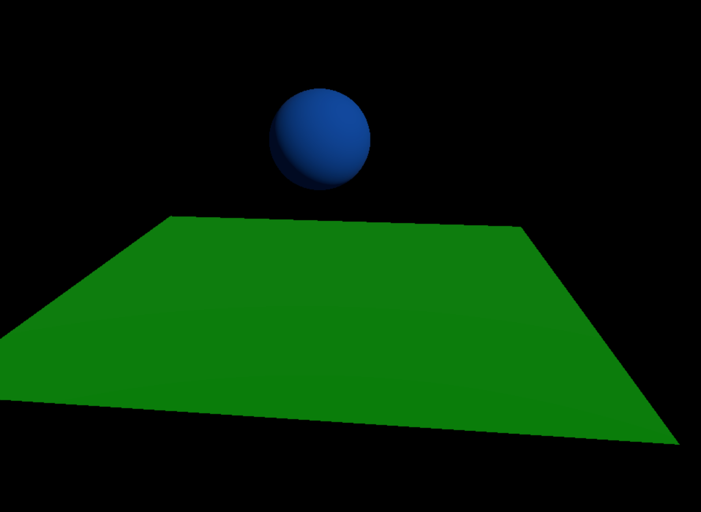
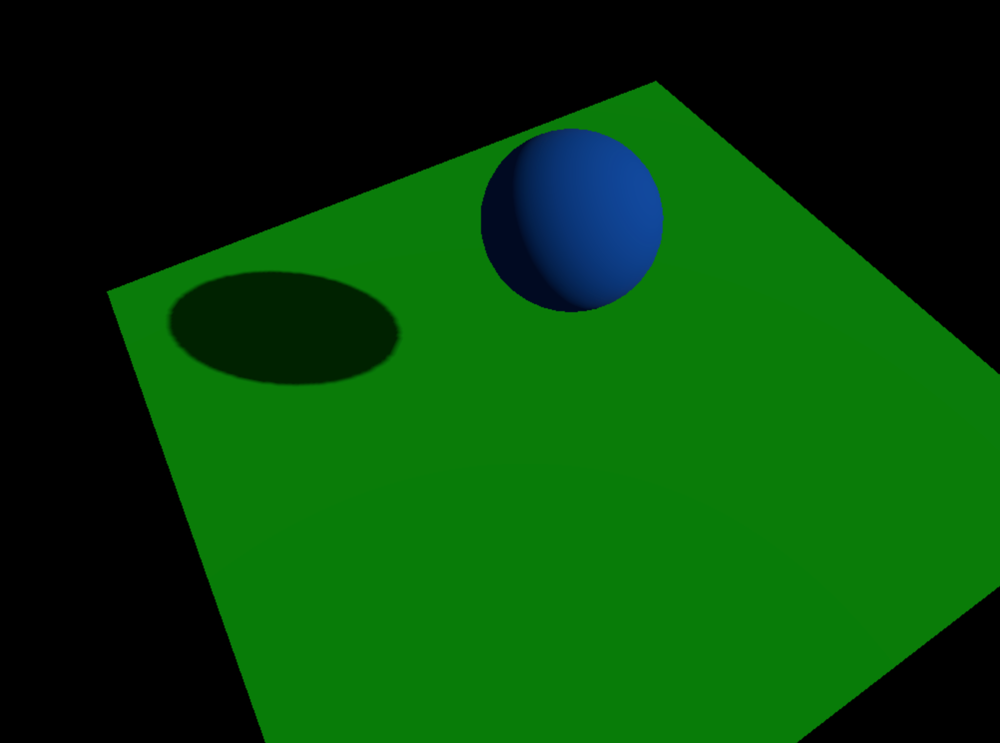

Three.js教程

入门

阴影效果

# Three.js 阴影效果详解

�?3D 图形渲染中，阴影是非常重要的一部分，它能够显著提高场景的真实感和深度感。Three.js 作为一个强大的 3D 渲染库，提供了多种阴影实现方式，适应不同的需求和性能要求。本文将详细介绍如何�?Three.js 中实现阴影，并探讨常见的阴影类型及其应用�?

## 阴影的重要性[](#阴影的重要�?

阴影�?3D 场景中的作用不仅限于增强视觉效果，它还帮助观察者理解物体之间的空间关系。没有阴影的场景往往显得非常平面和不自然。阴影能够：

+   **增强深度�?*：通过阴影的变化，能够让场景中的物体显得更加立体�?
+   **提高真实�?*：真实世界中的阴影是不可忽视的一部分，模拟阴影能够让场景看起来更像现实�?
+   **优化视觉层次**：阴影有助于区分前景和背景，使得场景中的物体层次更加分明�?

## 准备[](#准备)

我们先准备一个球体，一个平面和一个光源，用于演示阴影的效果�?

```javascript
import * as THREE from "three";
import { OrbitControls } from "three/examples/jsm/controls/OrbitControls.js";
 
// 创建场景
const scene = new THREE.Scene();
 
// 创建相机
const camera = new THREE.PerspectiveCamera(75, window.innerWidth / window.innerHeight, 0.1, 1000);
camera.position.z = 5;
 
// 创建渲染�?
const renderer = new THREE.WebGLRenderer();
renderer.setSize(window.innerWidth, window.innerHeight);
document.body.appendChild(renderer.domElement);
 
// 创建光源（平行光，模拟阳光）
const directionalLight = new THREE.DirectionalLight(0xffffff, 1);
directionalLight.position.set(5, 5, 5);
scene.add(directionalLight);
 
// 增加环境�?
const ambientLight = new THREE.AmbientLight(0x404040); // 环境�?
scene.add(ambientLight);
 
// 创建球体
const sphereGeometry = new THREE.SphereGeometry(1, 32, 32);
const sphereMaterial = new THREE.MeshStandardMaterial({ color: 0x0077ff });
const sphere = new THREE.Mesh(sphereGeometry, sphereMaterial);
sphere.position.y = 1; // 设置球体位置
scene.add(sphere);
 
// 创建地面
const planeGeometry = new THREE.PlaneGeometry(10, 10);
const planeMaterial = new THREE.MeshStandardMaterial({ color: 0x00ff00 });
const plane = new THREE.Mesh(planeGeometry, planeMaterial);
plane.rotation.x = -Math.PI / 2; // 使平面水�?
plane.position.y = -2; // 设置平面位置
scene.add(plane);
 
// 增加控制�?
const controls = new OrbitControls(camera, renderer.domElement);
controls.enableDamping = true; // 启用阻尼效果
 
// 渲染循环
function animate() {
  requestAnimationFrame(animate);
  controls.update(); // 更新控制�?
  renderer.render(scene, camera);
}
 
animate();
```



## 增加阴影步骤[](#增加阴影步骤)

要在 Three.js 中实现阴影效果，通常需要以下几个步骤：

### 物体投射阴影（Casting Shadows）[](#物体投射阴影casting-shadows)

投射阴影的物体会将自己的影像投射到其他物体上，这样可以模拟光源照射下物体的阴影效果。为了使物体能够投射阴影，我们需要对物体的材质和光源进行特殊的配置�?

我们需要给球体增加投射阴影的属性：

```javascript
// 使物体投射阴�?
sphere.castShadow = true;
```

### 地面接收阴影（Receiving Shadows）[](#地面接收阴影receiving-shadows)

接收阴影的物体则会被其他物体的阴影遮挡，模拟物体与地面或其他物体之间的光照变化。通常，这样的物体是放置在地面或其他静态表面上的�?

给平面增加接收阴影的属性：

```javascript
// 使平面接收阴�?
plane.receiveShadow = true;
```

### 设置光源与阴影[](#设置光源与阴�?

为了实现阴影效果，除了设置物体本身的阴影属性，我们还需要对光源进行配置。Three.js 支持几种不同类型的光源，如点光源、平行光源和聚光灯等。通常，我们使�?*平行光源**（`THREE.DirectionalLight`）来模拟阳光等投射阴影的光源�?

例如，配置一个平行光源并启用阴影�?

```javascript
// 启用光源投射阴影
directionalLight.castShadow = true;
```

### 调整阴影质量[](#调整阴影质量)

我们还需要给渲染器开启阴影功能，并调整阴影的质量参数，以获得更好的阴影效果。对于高质量的阴影，我们通常需要增加阴影的分辨率和柔化阴影边缘�?

可以通过以下方式调整�?

```javascript
renderer.shadowMap.enabled = true;
renderer.shadowMap.type = THREE.PCFSoftShadowMap; // 使用软阴影类�?
 
// 调整阴影分辨�?
directionalLight.shadow.mapSize.width = 1024; // 阴影贴图的宽�?
directionalLight.shadow.mapSize.height = 1024; // 阴影贴图的高�?
 
// 调整阴影的近裁剪面和远裁剪面
directionalLight.shadow.camera.near = 0.1;
directionalLight.shadow.camera.far = 100;
```



至此，我们已经成功实现了阴影效果。上面的四个步骤是实现阴影效果的基本步骤，我们需要分别给物体、接收阴影的物体、光源和渲染器设置相应的属性，才能获得理想的阴影效果�?

## 常见的阴影问题与优化[](#常见的阴影问题与优化)

### 阴影锯齿[](#阴影锯齿)

在低分辨率的阴影贴图下，阴影的边缘可能会出现锯齿现象，尤其是在使用硬阴影时。为了解决这个问题，可以通过增加阴影贴图的分辨率或使用软阴影来减轻这一问题�?

### 阴影质量的性能问题[](#阴影质量的性能问题)

阴影虽然能大大提升场景的真实感，但在某些情况下，阴影的计算会对性能产生较大影响。尤其是在复杂的场景中，启用阴影可能会导致帧率下降。为了提高性能，可以考虑以下措施�?

+   降低阴影贴图的分辨率�?
+   使用简化的阴影类型，如 `THREE.ShadowMaterial` �?`THREE.MeshBasicMaterial` 来减少计算量�?
+   限制阴影影响的物体数量，尽量让静态物体不产生阴影�?

### 阴影的方向问题[](#阴影的方向问�?

有时，阴影的方向可能看起来不自然或不符合预期。通过调整光源的方向和阴影相机的裁剪面，通常可以解决这个问题。确保光源的方向与场景中物体的布局相符�?

## 总结[](#总结)

通过 Three.js 的阴影功能，我们可以�?3D 场景添加更加真实和细腻的视觉效果。无论是简单的物体投射阴影，还是复杂的接收阴影效果，都可以通过调整光源、物体属性以及阴影质量来实现。在开发过程中，合理优化阴影的质量与性能，能够让我们的场景既具备高质量的视觉效果，又能保证较好的运行效率�?

[贴图材质](/concepts/basic/texture "贴图材质")[EffectComposer选中效果](/concepts/basic/select "EffectComposer选中效果")