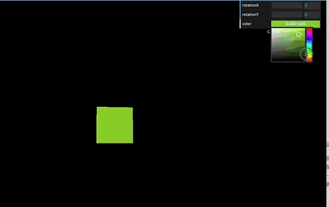

Three.js教程

入门

Gui调试界面

# 创建交互�?GUI 调试界面

## 简介[](#简�?

�?3D 图形编程中，交互式图形用户界面（GUI）是一个非常重要的组成部分。它不仅能帮助开发者调试和优化 3D 场景，也能增强用户体验。在 Three.js 中，GUI 库通常用于实时调整 3D 图形的参数，比如几何体的属性、光照的强度和颜色等。本教程将带你了解如何创建一个可调节�?GUI 界面，调�?3D 对象的参数，并实时查看结果�?

## GUI �?API 介绍[](#gui-�?api-介绍)

Three.js �?GUI 通常是通过 **dat.GUI** 库实现的，它是一个功能强大的 JavaScript GUI 框架，允许开发者轻松创建按钮、滑块、复选框等界面元素，并能实时控制 Three.js 中的对象。dat.GUI 的常�?API 包括�?

+   `gui.add(object, property, min, max)`：将一个属性添加到 GUI 面板中，可以设置滑块的最小值和最大值�?
+   `gui.addColor(object, property)`：为一个颜色属性添加颜色选择器�?
+   `gui.addFolder(name)`：将一组相关控件分组在一个文件夹中，便于管理�?
+   `gui.open()` / `gui.close()`：控�?GUI 面板的显示与隐藏�?

# 创建调整立方体属性的 GUI

### 创建立方体[](#创建立方�?

关于如何创建立方体的教程在之前的文章中已经多次介绍了，大家直接看这篇文章即可�?[https://threejs3d.com/concepts/basic/box (opens in a new tab)](https://threejs3d.com/concepts/basic/box)

### 引入 GUI 库[](#引入-gui-�?

接下来，我们将引�?**dat.GUI** 库并为立方体的颜色和旋转角度添加控制界面。首先，确保你已经在项目中安装了 `dat.gui` 库�?

```text
npm install dat.gui
```

接着在代码中导入并创建一�?GUI 实例�?

```javascript
import * as dat from "dat.gui";
const gui = new dat.GUI();
```

### 准备控制参数的对象[](#准备控制参数的对�?

为了通过 GUI 控制立方体的属性，我们需要定义一个“控制对象”，用于保存所有需要调试的参数�?

```javascript
const cubeParams = {
  rotationX: cube.rotation.x, // 控制立方体X轴旋�?
  rotationY: cube.rotation.y, // 控制立方体Y轴旋�?
  color: cube.material.color.getHex(), // 控制立方体颜�?
};
```

1.  **`rotationX` �?`rotationY`**�?
    +   它们的值初始为 `cube.rotation.x` �?`cube.rotation.y`，表示立方体�?X 轴和 Y 轴的旋转角度�?
    +   GUI 控件将通过绑定这些参数，实时修改立方体的旋转状态�?
2.  **`color`**�?
    +   使用 `cube.material.color.getHex()` 获取立方体的颜色值（十六进制）�?
    +   通过 GUI 的颜色选择器，用户可以动态修改颜色�?

通过这个对象，我们将 3D 对象的可控属性抽象出来，方便后续操作�?

### 为控制参数添�?GUI 控件[](#为控制参数添�?gui-控件)

使用 `gui.add()` �?`gui.addColor()` 方法为这些属性添�?GUI 控件�?

```javascript
// 添加旋转角度控制滑块
gui.add(cubeParams, "rotationX", 0, Math.PI * 2).onChange((value) => {
  cube.rotation.x = value;
});
gui.add(cubeParams, "rotationY", 0, Math.PI * 2).onChange((value) => {
  cube.rotation.y = value;
});
 
// 添加颜色选择�?
gui.addColor(cubeParams, "color").onChange((value) => {
  cube.material.color.setHex(value);
});
```

1.  **`gui.add(cubeParams, 'rotationX', 0, Math.PI * 2)`**�?
    
    +   第一个参数是目标对象（`cubeParams`）�?
    +   第二个参数是目标属性名（`rotationX`）�?
    +   第三个和第四个参数是滑块的最小值和最大值，表示 X 轴旋转角度范围�?
    +   **`onChange` 的作�?*�?
        +   `onChange` 是一个回调函数，在滑块值变化时触发�?
        +   在这里，我们更新 `cube.rotation.x` 的值，使得滑块能实时控制立方体的旋转�?
2.  **`gui.addColor(cubeParams, 'color')`**�?
    
    +   创建颜色选择器，绑定 `cubeParams.color`�?
    +   **`onChange` 的作�?*�?
        +   当用户在颜色选择器中选择新颜色时，回调函数会被调用�?
        +   使用 `cube.material.color.setHex(value)` 实时更新立方体的颜色�?

到此，你会看�?GUI 界面中有两个滑块和一个颜色选择器：

+   滑动滑块，立方体会相应旋转�?
+   调整颜色选择器，立方体的颜色会即时变化�?

## 代码[](#代码)

#### github[](#github)

[https://github.com/calmound/threejs-demo/tree/main/gui (opens in a new tab)](https://github.com/calmound/threejs-demo/tree/main/gui)

#### gitee[](#gitee)

[https://gitee.com/calmound/threejs-demo/tree/main/gui (opens in a new tab)](https://gitee.com/calmound/threejs-demo/tree/main/gui)

[EffectComposer选中效果](/concepts/basic/select "EffectComposer选中效果")[React 安装和配置](/concepts/basic/react "React 安装和配�?)