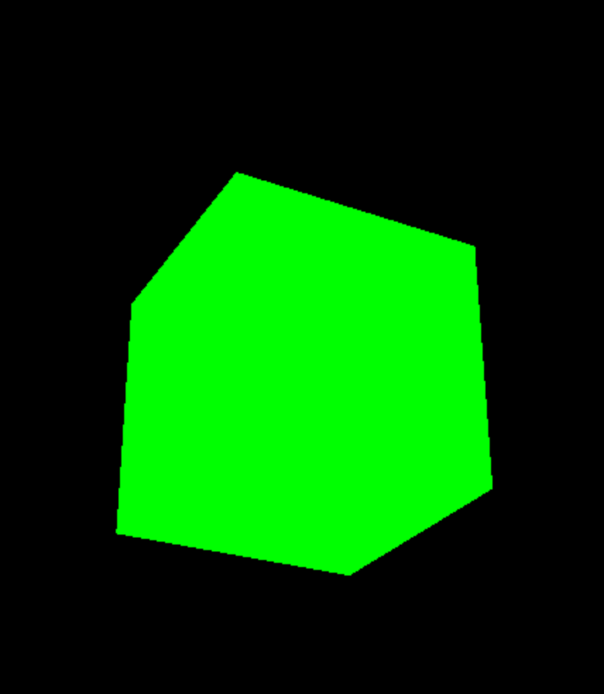

Three.js教程

入门

React 安装和配�?

# React 安装和配�?Three.js

**React �?Three.js 的结�?* ：通过 React 管理组件化结构和应用逻辑，利�?Three.js 实现 3D 图形的渲染与交互。使用这种方法，我们可以在保持代码清晰和结构化的同时，实现令人惊叹的 3D 效果�?

在本文中，我们将以一个简单的示例为基础，详细讲解如何在 React 项目中集�?Three.js，并创建一个动态的 3D 场景�?

本文介绍使用最原始�?three，如果想了解 react-three-fiber 可以参考这篇文章：[https://mp.weixin.qq.com/s/y0gsws7DqvbT\_iZRasenkA?token=1707814885&lang=zh\_CN (opens in a new tab)](https://mp.weixin.qq.com/s/y0gsws7DqvbT_iZRasenkA?token=1707814885&lang=zh_CN)

## 安装依赖并设置项目[](#安装依赖并设置项�?

使用 Vite 初始化项目，并安�?Three.js�?

```bash
# 创建项目
npm create vite threejs-react-demo --template react
 
# 进入项目目录
cd threejs-react-app
 
# 安装 Three.js
npm install three
```

## 项目目录结构[](#项目目录结构)

我们将创建以下目录结构：

```text
src/
├── components/       # 存放 React 组件
�?  ├── ThreeScene.jsx # Three.js 场景组件
├── App.jsx           # 入口文件
└── main.jsx          # React 渲染入口
```

## 创建 Three.js 场景[](#创建-threejs-场景)

#### 1\. 创建 `ThreeScene.jsx`[](#1-创建-threescenejsx)

```javascript
import React, { useEffect, useRef } from "react";
import * as THREE from "three";
 
const ThreeScene = () => {
  const containerRef = useRef(null);
 
  useEffect(() => {
    // 获取容器元素
    const container = containerRef.current;
 
    // 创建场景
    const scene = new THREE.Scene();
 
    // 创建相机
    const camera = new THREE.PerspectiveCamera(75, container.clientWidth / container.clientHeight, 0.1, 1000);
    camera.position.z = 5;
 
    // 创建渲染�?
    const renderer = new THREE.WebGLRenderer();
    renderer.setSize(container.clientWidth, container.clientHeight);
    container.appendChild(renderer.domElement);
 
    // 添加一个立方体
    const geometry = new THREE.BoxGeometry();
    const material = new THREE.MeshBasicMaterial({ color: 0x00ff00 });
    const cube = new THREE.Mesh(geometry, material);
    scene.add(cube);
 
    // 动画函数
    const animate = () => {
      requestAnimationFrame(animate);
 
      // 旋转立方�?
      cube.rotation.x += 0.01;
      cube.rotation.y += 0.01;
 
      renderer.render(scene, camera);
    };
 
    animate();
 
    // 窗口尺寸调整
    const handleResize = () => {
      camera.aspect = container.clientWidth / container.clientHeight;
      camera.updateProjectionMatrix();
      renderer.setSize(container.clientWidth, container.clientHeight);
    };
 
    window.addEventListener("resize", handleResize);
 
    // 清理
    return () => {
      window.removeEventListener("resize", handleResize);
      container.removeChild(renderer.domElement);
    };
  }, []);
 
  return <div ref={containerRef} style={{ width: "100%", height: "100vh" }} />;
};
 
export default ThreeScene;
```

#### 2\. 修改 `App.jsx`[](#2-修改-appjsx)

�?`ThreeScene` 组件引入应用中�?

```javascript
import React from "react";
import ThreeScene from "./components/ThreeScene";
 
function App() {
  return (
    <div>
      <h1 style={{ textAlign: "center" }}>React + Three.js 示例</h1>
      <ThreeScene />
    </div>
  );
}
 
export default App;
```

## 运行项目[](#运行项目)

运行以下命令启动开发服务器�?

```javascript
npm run dev
```

打开浏览器访�?`http://localhost:5173`，你将看到一个旋转的绿色立方体�?



在本文中，我们将以一个简单的示例为基础，详细讲解如何在 React 项目中集�?Three.js，并创建一个动态的 3D 场景。无论你是刚接触 3D 开发，还是已有一定经验，相信都能从中有所收获�?

[Gui调试界面](/concepts/basic/gui "Gui调试界面")[Shape 创建形状](/concepts/basic/shape "Shape 创建形状")