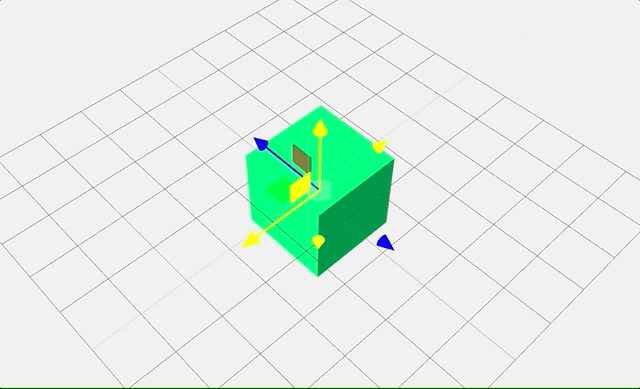
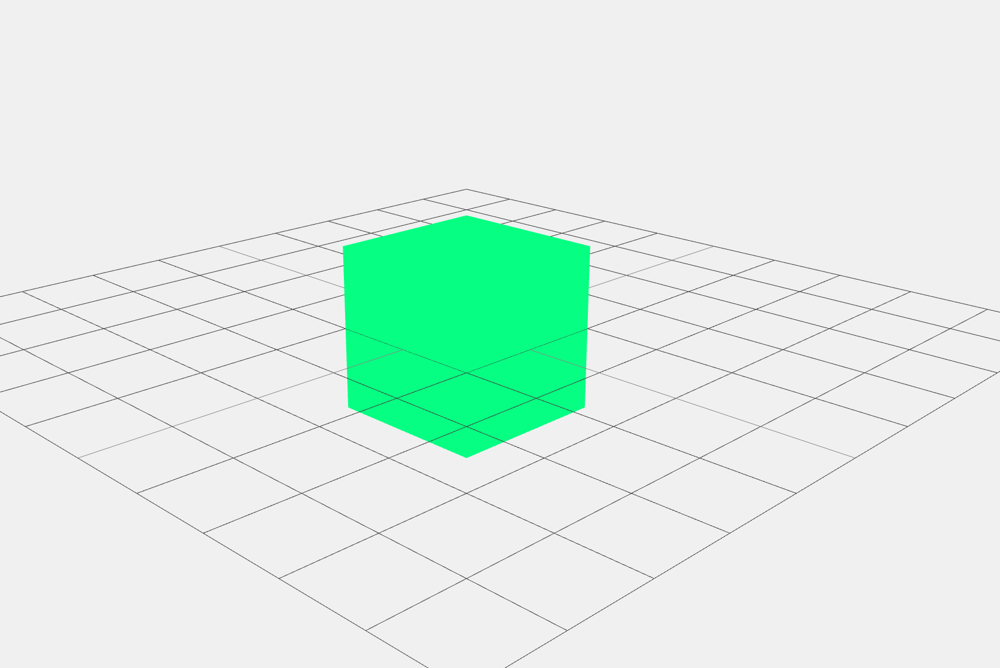

Three.js教程

入门

TransformControls平移

# 使用 TransformControls 实现立方体平�?

今天，我们来学习下`TransformControls`,通过它我们可以轻松实现对于某个物体的鼠标拖拽，先来看下效果：



## 一、环境搭建[](#一环境搭建)

我们先要创建一个立方体，增加点灯光作为案例的基础�?

```javascript
import * as THREE from "three";
import { TransformControls } from "three/examples/jsm/controls/TransformControls.js";
import { OrbitControls } from "three/examples/jsm/controls/OrbitControls.js";
import "./style.css";
 
// 创建渲染器并设置像素比和尺寸
const renderer = new THREE.WebGLRenderer({ antialias: true });
renderer.setPixelRatio(window.devicePixelRatio);
renderer.setSize(window.innerWidth, window.innerHeight);
document.body.appendChild(renderer.domElement);
 
// 创建场景与相�?
const scene = new THREE.Scene();
scene.background = new THREE.Color(0xf0f0f0);
 
const camera = new THREE.PerspectiveCamera(50, window.innerWidth / window.innerHeight, 0.01, 30000);
camera.position.set(5, 2.5, 5);
 
// 添加辅助网格与灯�?
scene.add(new THREE.GridHelper(5, 10, 0x888888, 0x444444));
scene.add(new THREE.AmbientLight(0xffffff));
 
const light = new THREE.DirectionalLight(0xffffff, 4);
light.position.set(1, 1, 1);
scene.add(light);
```

上面这段代码主要完成了三件事�?*渲染�?*用于将场景绘制到页面上；**场景**则是所有物体和灯光的容器；**相机**决定了可视范围和观察角度。它把背景色设置�?0xf0f0f0，并借助 `GridHelper` 网格作为地面参考。为了给物体提供最基本的照明，我们添加了环境光和方向光，环境光能保证模型不至于全暗，方向光模拟了类似太阳光的照射方向�?



* * *

## 二、TransformControls：交互式变换控制器[](#二transformcontrols交互式变换控制器)

接着创建并配置了 OrbitControls �?TransformControls 两种控制器。OrbitControls 使我们可以拖拽旋转、滚轮缩放场景视角，TransformControls 则能直接对场景中的物体进行平移、旋转或缩放操作。它们之间会有交互冲突，所以需要额外的事件监听来做切换�?

```javascript
// 轨道控制器（OrbitControls�?
const orbit = new OrbitControls(camera, renderer.domElement);
orbit.update();
 
// 变换控制器（TransformControls�?
const control = new TransformControls(camera, renderer.domElement);
 
// 当TransformControls处于“拖拽”中时，禁止OrbitControls；否则开�?
control.addEventListener("dragging-changed", (event) => {
  orbit.enabled = !event.value;
});
```

这段代码有几个关键点�?

1.  **OrbitControls** 让相机可跟随鼠标进行旋转、平移和缩放，让用户在三维空间中以“观察者”视角自由查看场景。它通过 `update()` 方法来刷新内部状态，确保相机位置与交互保持同步�?
2.  **TransformControls** 会在物体上生成可视化的变换控件，类似 3D 软件中的 Gizmo。它可以对目标网格进行移动、旋转和缩放，具体模式可通过 `control.setMode('translate' | 'rotate' | 'scale')` 来切换�?
3.  因为用户在拖�?TransformControls 时，也可能会无意移动相机。所�?`dragging-changed` 事件中的 `orbit.enabled = !event.value;` 就能在“开始拖拽”时禁用 OrbitControls，避免冲突；“停止拖拽”后恢复相机操作�?
4.  这种事件响应模式体现�?Three.js 的“事件驱动”特性，可以根据使用场景来配置或叠加多个控制器，而不会产生难以调和的矛盾�?
5.  在大型项目中，TransformControls 常常被用于编辑器模式或关节系统的调试，因为它直观且易于上手，配合 OrbitControls 也能给使用者带来类似专�?3D 软件的操作体验�?

* * *

## 三、将网格添加到场景并附着 TransformControls[](#三将网格添加到场景并附着-transformcontrols)

在有了控制器之后，我们需要一个实际的场景对象来进行变换，这里就选用了一个简单的立方体网格（Mesh）。接下来，我们会�?TransformControls 关联到这个立方体上，从而实现对它的操作�?

```javascript
// 创建一个立方体网格
const mesh = new THREE.Mesh(
  new THREE.BoxGeometry(), // 默认1x1x1的立方体
  new THREE.MeshLambertMaterial({ color: 0x00ff7f }) // Lambert材质，能与光源有基本的明暗效�?
);
scene.add(mesh);
 
// 将变换控制器附着到网�?
control.attach(mesh);
scene.add(control.getHelper()); // 添加辅助可视化，让你看到三轴
```

在这里，我们需要特别注意以下几点：

1.  **立方体网格（Mesh�?* �?`BoxGeometry` �?`MeshLambertMaterial` 组成。`BoxGeometry()` 默认生成一�?1×1×1 的正方体。`MeshLambertMaterial` 在方向光下能够呈现出更立体的明暗变化，�?`color: 0x00FF7F` 则指定了一个带有青绿色调的外观�?
2.  **scene.add(mesh)** 是让该立方体真正“出现在”三维世界里，否则它只是一个内存对象，不会被渲染�?
3.  **TransformControls.attach(mesh)** 告诉控制器要操作哪个对象。这样当我们拖拽 Gizmo（箭头或环形），就会改变这个网格本身的位置信息或旋转、缩放数据�?
4.  `scene.add(control.getHelper())` 可以额外显示辅助线条，让我们能看�?TransformControls 的三轴。如果不加这个辅助，操作时依然可�?Gizmo，但辅助器会让操作精度更高，尤其在复杂场景里�?
5.  这种操作方式广泛应用�?Three.js 的编辑器或者自定义场景管理系统中。无论是可视化建筑模型，还是拖拽某个 VR/AR 对象，都可以借助此组件来完成实时编辑�?

* * *

## 四、渲染与事件响应（重点）[](#四渲染与事件响应重点)

有了控制器和网格，接下来我们就需要一个渲染循环或事件驱动的渲染逻辑，来让场景在浏览器中随时更新。因为这段示例没有动画，只要在控制器发生改变时重绘即可�?

```javascript
function render() {
  renderer.render(scene, camera);
}
 
// 任何相机或网格位置的变化都需要触发重�?
orbit.addEventListener("change", render);
control.addEventListener("change", render);
render(); // 初始渲染
```

以下是对这段代码的详细剖析：

1.  `function render() { renderer.render(scene, camera); }` 是一个基础的渲染函数。它告诉渲染器将场景和相机所看到的内容绘制到网页�?Canvas 中�?
2.  我们并没有使用常见的 `requestAnimationFrame(animate)` 循环，而是选择了事件触发。当 **OrbitControls** 的相机发生旋转或缩放时，会触�?`change` 事件；当 **TransformControls** 拖拽网格时，同样会触�?`change` 事件。这些事件发生时，我们调�?`render()` 来更新画面�?
3.  这种做法适合场景中没有持续动画，仅在交互时才需要刷新画面，可以节省 GPU 开销。若场景中有动画或物理模拟，就需要结�?`requestAnimationFrame` 做实时刷新�?
4.  `orbit.addEventListener('change', render)` �?`control.addEventListener('change', render)` 分别监听各自的控制器变动，让代码结构更清晰，也便于后期扩展或维护�?
5.  `render()` 在最后被主动调用一次，以便初次加载时就能看到场景内容。否则在大多数环境下，只有当事件触发后才会渲染，会导致用户进入页面时一片空白�?


[Shape 创建形状](/concepts/basic/shape "Shape 创建形状")[uniapp搭建Three.js环境](/concepts/basic/uniapp "uniapp搭建Three.js环境")