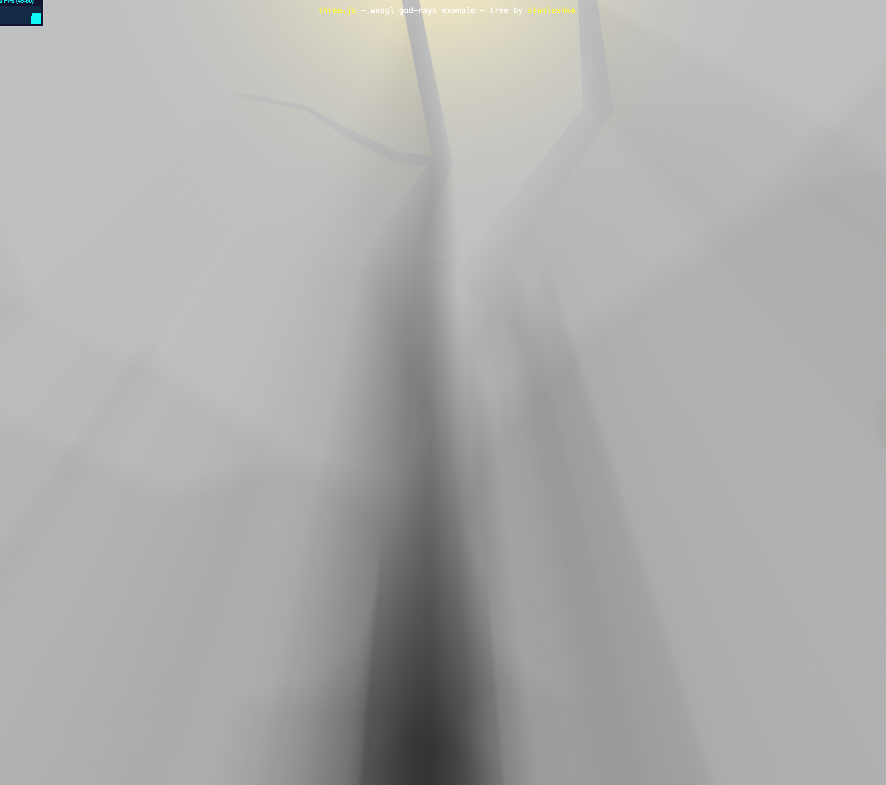
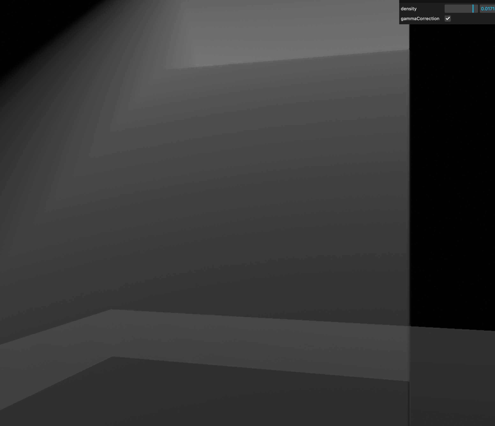

Three.js教程

入门

体积�?

# 体积�?

�?Three.js 中实现“体积光（Volumetric Light）”效果，可以�?3D 场景增添逼真的光照氛围，让观众仿佛置身于尘埃飞舞、光束穿透环境的场景之中�?

体积光（Volumetric Light）或称“体积照明”，指在渲染中表现出光线在空气或其它介质（比如雾、烟、微尘）中散射、吸收等现象，从而使光线看上去具有真实的体积感或束状效果（俗称“上帝光”、“耶稣光”或“God Rays”）�?

在现实世界里，当光线穿过多尘空气或雾霾时，你会看到一道道光束在半透明介质中散射的现象，这就是体积光�?

在计算机图形学中，体积光的实现往往依赖于一些特殊的渲染技术和后期处理算法，帮助我们模拟光线通过体积介质时的衰减或散射等特性�?

常见的实现方式有基于体素（Voxel-based）的方法，也有利用屏幕后处理（Screen-space Post Processing）的方式�?

不管是哪种，核心思路都是模拟或近似光线和介质交互的结果，让观众“看见”光线的路径与存在�?

## 常见的体积光实现原理[](#常见的体积光实现原理)

### 1\. 基于体素（Voxel-based�?光线跟踪（Ray Marching）[](#1-基于体素voxel-based光线跟踪ray-marching)

+   **体素（Voxel�?*：将空间拆分成体素立方格子，通过跟踪光线在这些体素格子中的传播路径，计算光线能量在每个立方格子内被吸收或散射的程度，再将结果组合渲染出光线的“体积”部分�?
+   **光线跟踪（Ray Marching�?*：通过在屏幕空间或世界空间中对光线进行迭代采样，每步都计算体积介质对光线的影响（散射、衰减、吸收等），最后综合得出体积光强度�?这种方法精确度高、真实性也强，但通常需要大量的计算和复杂的算法优化，适合于离线渲染（电影级别或离线渲染器），对于实时需求（如浏览器端的 3D 互动）可能要求较高的性能预算�?

### 2\. 屏幕后处理（Screen-space Post Processing）[](#2-屏幕后处理screen-space-post-processing)

对于在浏览器端使�?Three.js 的场景，常用的“体积光”或“GodRay”效果多是以后期处理的方式实现。主要思路是：

1.  首先将光源（或发光体）及场景中的物体渲染到一个缓冲（Render Target）上�?
2.  在后期阶段，通过“径向模糊（Radial Blur）”或“径向散射（Radial Scattering）”处理，模拟光线在空气中的散射效果�?
3.  再叠加回最终屏幕中，形成带有光束感、散射感的图像�?

我看了下官方实现的案例，代码�?[https://threejs.org/examples/webgl\_postprocessing\_godrays.html (opens in a new tab)](https://threejs.org/examples/webgl_postprocessing_godrays.html) ，效果如�?

它没�?`EffectComposer` 做封装，而是手动管理多个 FBO（Frame Buffer Object�? RenderTarget。感觉代码比较繁琐，当然它的自由度比较高，调试起来更加灵活一些，它可以针对特�?Pass 使用不同大小的缓冲贴图，节约性能�?

## 案例[](#案例)

官方的案例我感觉对于初学者来说理解实现起来，理解的成本太高了，经过一番搜索，发现了另外的库`three-good-godrays` �?`postprocessing` 。它的实现代码和上面介绍屏幕后处理的文字看起来比较相近的�?

所以我们以这两个库做一个案例演示，我们在场景顶部模拟了天窗，然后光线从顶部天窗照射进来房间里面。先来看一下效�?  再来看下视频效果�?

### 依赖安装[](#依赖安装)

```bash
npm install three postprocessing three-good-godrays
```

+   `three`：Three.js 核心库�?
+   `postprocessing`：现代化后期处理系统，替代旧�?`EffectComposer`�?
+   `three-good-godrays`：用于创建高质量体积光的扩展插件�?

### 2、依赖引入[](#2依赖引入)

```js
import * as THREE from "three";
import { EffectComposer, RenderPass } from "postprocessing";
import { GodraysPass } from "three-good-godrays";
import { GUI } from "three/examples/jsm/libs/lil-gui.module.min.js";
```

### 3�?场景初始化[](#3-场景初始�?

初始化渲染器、相机和基本场景，为后续构建 3D 空间与光照做准备�?

```js
const renderer = new THREE.WebGLRenderer({ antialias: true });
renderer.setSize(window.innerWidth, window.innerHeight);
renderer.shadowMap.enabled = true;
renderer.shadowMap.type = THREE.PCFSoftShadowMap;
 
const scene = new THREE.Scene();
scene.background = new THREE.Color(0x000000);
 
const camera = new THREE.PerspectiveCamera(45, window.innerWidth / window.innerHeight, 0.1, 100);
camera.position.set(5, 4, 15);
camera.lookAt(0, 4, -2);
 
document.body.appendChild(renderer.domElement);
```

说明�?

+   使用抗锯齿渲染器�?
+   开启阴影以配合体积光；
+   相机视角调整为斜向观察窗户和光束方向�?
+   黑色背景提高光束对比度�?

### 4、房屋天窗场景模拟[](#4房屋天窗场景模拟)

构建一个简化版“室内场景”，包括窗框、栏杆、地面和墙壁，提供结构用于投射光线�?

```js
// 窗户�?
const frame = new THREE.Mesh(new THREE.BoxGeometry(10, 10, 1), new THREE.MeshStandardMaterial({ color: 0x555555 }));
frame.position.set(0, 5, -6);
frame.castShadow = true;
scene.add(frame);
 
// 栏杆（制造遮挡）
for (let i = -3; i <= 3; i += 1.5) {
  const barMesh = new THREE.Mesh(new THREE.BoxGeometry(0.6, 8, 1), frame.material);
  barMesh.position.set(i, 4, -6);
  barMesh.castShadow = true;
  scene.add(barMesh);
}
 
// 地板
const floor = new THREE.Mesh(new THREE.PlaneGeometry(20, 20), new THREE.MeshStandardMaterial({ color: 0x222222 }));
floor.rotation.x = -Math.PI / 2;
floor.position.y = -1;
floor.receiveShadow = true;
scene.add(floor);
 
// 墙面（后墙与左墙�?
const wallMaterial = new THREE.MeshStandardMaterial({ color: 0x111111 });
 
const wallBack = new THREE.Mesh(new THREE.PlaneGeometry(20, 15), wallMaterial);
wallBack.position.set(0, 5, -10);
scene.add(wallBack);
 
const wallLeft = new THREE.Mesh(new THREE.PlaneGeometry(20, 15), wallMaterial);
wallLeft.position.set(-10, 5, 0);
wallLeft.rotation.y = Math.PI / 2;
scene.add(wallLeft);
```

说明�?

+   光线只能从窗户位置射入，形成束状�?
+   栏杆阻挡部分光线，制造体积感�?
+   深色地面和墙面让光束更突出�?

### 5、创建灯光[](#5创建灯光)

设置方向光模拟自然阳光，并启用阴影，使体积光能根据遮挡物表现真实散射效果�?

```js
const light = new THREE.DirectionalLight(0xffffff, 2);
light.position.set(0, 12, -10);
light.target.position.set(0, 4, 0);
light.castShadow = true;
scene.add(light);
scene.add(light.target);
 
light.shadow.mapSize.set(2048, 2048);
light.shadow.camera.near = 0.5;
light.shadow.camera.far = 50;
```

说明�?

+   方向光从斜上方向照入�?
+   设置 `castShadow` 启动投影�?
+   光源信息会传�?GodraysPass 用于计算屏幕空间散射�?

### 6、增�?GUI 调试[](#6增加-gui-调试)

通过 lil-gui 创建交互界面，让用户能动态调节体积光参数并实时看到效果变化�?

```js
let params = {
  density: 0.01,
  gammaCorrection: true,
};
 
const gui = new GUI();
gui.add(params, "density", 0.0001, 0.02, 0.0001).onChange(updateGodrays);
gui.add(params, "gammaCorrection").onChange(updateGodrays);
```

说明�?

+   `density` 控制光线散射密度�?
+   `gammaCorrection` 提升对比度表现；
+   参数变化后会触发重建 GodraysPass�?

### 7、开始体积光[](#7开始体积光)

创建后期处理器和体积�?Pass，控制渲染流程并将最终效果输出到屏幕�?

```js
const composer = new EffectComposer(renderer);
composer.addPass(new RenderPass(scene, camera));
 
let godraysPass = new GodraysPass(light, camera, {
  density: params.density,
  gammaCorrection: params.gammaCorrection,
});
godraysPass.renderToScreen = true;
composer.addPass(godraysPass);
```

当参数变化时动态重建：

```js
function updateGodrays() {
  composer.removePass(godraysPass);
  godraysPass = new GodraysPass(light, camera, {
    density: params.density,
    gammaCorrection: params.gammaCorrection,
  });
  godraysPass.renderToScreen = true;
  composer.addPass(godraysPass);
}
```

启动渲染循环�?

```js
function animate() {
  requestAnimationFrame(animate);
  composer.render();
}
animate();
```

处理自适应�?

```js
window.addEventListener("resize", () => {
  camera.aspect = window.innerWidth / window.innerHeight;
  camera.updateProjectionMatrix();
  renderer.setSize(window.innerWidth, window.innerHeight);
  composer.setSize(window.innerWidth, window.innerHeight);
});
```

说明�?

+   使用 `EffectComposer` 构建后期管线�?
+   `RenderPass` 渲染基础场景�?
+   `GodraysPass` 添加体积光后期效果；
+   自适应窗口尺寸，确保在不同设备下显示正常�?

## 代码[](#代码)

[https://github.com/calmound/threejs-demo/tree/main/raycaster (opens in a new tab)](https://github.com/calmound/threejs-demo/tree/main/raycaster)

[Vue3 安装和配置](/concepts/basic/vue "Vue3 安装和配�?)[在Three.js中用shader](/concepts/basic/shader "在Three.js中用shader")