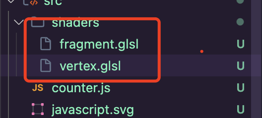
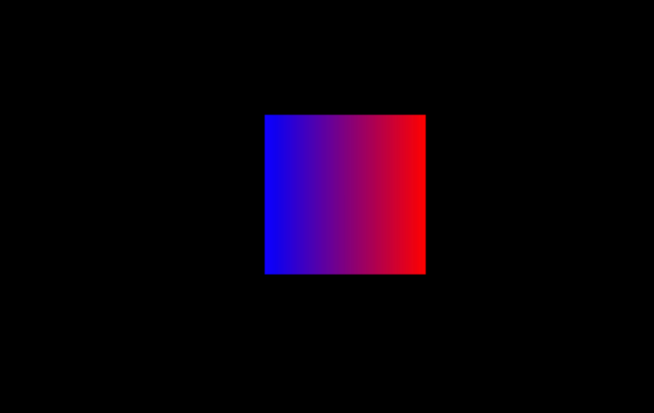
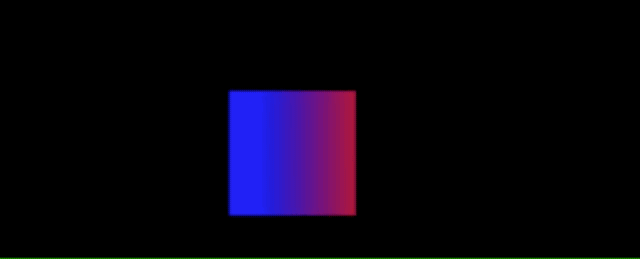

Three.js教程

入门

在Three.js中用shader

# 如何�?Three.js 中使�?Shader

这篇教程将带你了解在 Three.js 中使用自定义 Shader（着色器）的基础流程�?

## 1\. 什么是 Shader[](#1-什么是-shader)

+   **Shader（着色器�?* 是运行在 GPU 上的一个小程序，用来对图形的顶点和像素进行自定义的处理�?
+   �?WebGL（以�?Three.js）中，常见的着色器分为两种�?
    1.  **顶点着色器（Vertex Shader�?*：负责处理每个顶点的坐标变换、计算法线等顶点相关的信息�?
    2.  **片元着色器（Fragment Shader，或称像素着色器�?*：负责确定每个像素最终的颜色、透明度等效果�?

�?Three.js 中，如果想要完全掌控物体外观和渲染细节，就需要使�?`ShaderMaterial` 并编写自己的顶点着色器和片元着色器�?

## 2\. Three.js 中使�?Shader 的基本流程[](#2-threejs-中使�?shader-的基本流�?

1.  **编写顶点着色器（vertexShader）和片元着色器（fragmentShader�?*
    
    +   使用 GLSL 语言编写，存放在字符串中或单独的文件里�?
    +   在顶点着色器中，你需要至少计算出顶点在屏幕上的位置（`gl_Position`）�?
    +   在片元着色器中，你需要至少为每个像素设置一个颜色（`gl_FragColor`）�?
2.  **创建 `ShaderMaterial` 并将着色器传入**
    
    ```js
    const material = new THREE.ShaderMaterial({
      vertexShader: myVertexShader,
      fragmentShader: myFragmentShader,
      uniforms: {
        // 需要传入着色器的参数可以在这里定义
      },
    });
    ```
    
3.  **�?`ShaderMaterial` 应用于几何体（Geometry/Mesh）并将其添加到场�?*
    
    ```js
    const geometry = new THREE.BoxGeometry(1, 1, 1); // 例如立方�?
    const cube = new THREE.Mesh(geometry, material);
    scene.add(cube);
    ```
    
4.  **在渲染循环中更新 uniforms 或其他状�?*（如果需要动态效果）
    
    ```js
    function animate() {
      requestAnimationFrame(animate);
      // ... 更新逻辑 ...
      renderer.render(scene, camera);
    }
    animate();
    ```
    

## 3\. 一个简单的示例：渐变颜色[](#3-一个简单的示例渐变颜色)

下面我们来实现一个简单的示例：使用自定义 Shader 让一个平面从左到右呈现渐变色�?

### 3.1 基本场景搭建[](#31-基本场景搭建)

首先，准备好一个最基本�?Three.js 场景，一般的步骤包括�?

1.  新建场景（Scene）�?
2.  新建透视摄像机（PerspectiveCamera）�?
3.  新建渲染器（WebGLRenderer）�?
4.  将渲染器挂载到页面中�?
5.  设置渲染循环�?

示例代码（可省略一些基础配置）：

```js
// 1. 新建场景
const scene = new THREE.Scene();
 
// 2. 新建摄像�?
const camera = new THREE.PerspectiveCamera(
  75, // 视角角度
  window.innerWidth / window.innerHeight, // 纵横�?
  0.1, // 最近面
  1000 // 最远面
);
camera.position.z = 5; // 拉远摄像�?
 
// 3. 新建渲染�?
const renderer = new THREE.WebGLRenderer({ antialias: true });
renderer.setSize(window.innerWidth, window.innerHeight);
document.body.appendChild(renderer.domElement);
 
// 4. 监听窗口大小变化（可选）
window.addEventListener("resize", () => {
  camera.aspect = window.innerWidth / window.innerHeight;
  camera.updateProjectionMatrix();
  renderer.setSize(window.innerWidth, window.innerHeight);
});
 
// 5. 渲染循环
function animate() {
  requestAnimationFrame(animate);
  renderer.render(scene, camera);
}
animate();
```

### 3.2 编写顶点着色器[](#32-编写顶点着色器)

我们的顶点着色器需要完成的工作�?

+   接收每个顶点的坐标（`position`）�?
+   对坐标进�?MVP（模�?视图-投影）变换�?
+   将最终结果赋值给内置变量 `gl_Position`�?
+   另外可以计算和传递一些自定义信息给片元着色器，这个示例中我们传�?x 坐标用于计算渐变�?

示例顶点着色器（GLSL）：

```glsl
// myVertexShader.glsl
varying float vXPos;
 
void main() {
  // Three.js 自动提供�?position 变量
  // 这里将其乘以模型视图投影矩阵得到裁剪空间位置
  gl_Position = projectionMatrix * modelViewMatrix * vec4(position, 1.0);
 
  // 传递顶点的 x 坐标给片元着色器
  vXPos = position.x;
}
```

说明�?

1.  `varying float vXPos;` 是一个顶�?-> 片元的可变变量，用于传递数值到片元着色器�?
2.  `position`，`projectionMatrix`，`modelViewMatrix` 等是 Three.js 默认传入的内置变�?矩阵�?

### 3.3 编写片元着色器[](#33-编写片元着色器)

我们的片元着色器需要做的工作：

+   接收顶点着色器传递来�?`vXPos`�?
+   根据 `vXPos` 计算颜色�?
+   将颜色赋值给 `gl_FragColor`�?

示例片元着色器（GLSL）：

```glsl
// myFragmentShader.glsl
// 从顶点着色器接收变量
varying float vXPos;
 
void main() {
  // �?x 坐标映射�?[0,1] 范围的示例，假设 x 坐标区间 [-1,1]
  // 为简单起见，这里假设平面 Geometry �?x 的范围是 [-1,1]
  float t = (vXPos + 1.0) * 0.5;
 
  // 通过 t 在两种颜色之间做线性插�?
  // 比如由蓝�?0, 0, 1)过渡到红�?1, 0, 0)
  vec3 color = mix(vec3(0.0, 0.0, 1.0), vec3(1.0, 0.0, 0.0), t);
 
  // 赋值给 gl_FragColor
  gl_FragColor = vec4(color, 1.0);
}
```

> 在真实项目中，如�?x 坐标范围并非 \[-1,1\]，就需要根据你的几何体实际范围来进行归一化�?

### 3.4 使用 `ShaderMaterial`[](#34-使用-shadermaterial)

现在我们就可以将着色器字符串或文件内容传给 `ShaderMaterial` 并创建一个网格�?

```js
// 将我们写好的着色器源码以字符串的形式定义或引入
const myVertexShader = `
  varying float vXPos;
  void main() {
    gl_Position = projectionMatrix * modelViewMatrix * vec4(position, 1.0);
    vXPos = position.x;
  }
`;
 
const myFragmentShader = `
  varying float vXPos;
  void main() {
    float t = (vXPos + 1.0) * 0.5;
    vec3 color = mix(vec3(0.0, 0.0, 1.0), vec3(1.0, 0.0, 0.0), t);
    gl_FragColor = vec4(color, 1.0);
  }
`;
 
// 创建 ShaderMaterial
const material = new THREE.ShaderMaterial({
  vertexShader: myVertexShader,
  fragmentShader: myFragmentShader,
});
 
// 创建一个平面几何体
const geometry = new THREE.PlaneGeometry(2, 2); // x 范围大约�?[-1, 1]
const plane = new THREE.Mesh(geometry, material);
scene.add(plane);
```

#### shader 引用[](#shader-引用)

大部分场景下,我们会创�?`vertext.glsl` �?`fragment.glsl` 用来放置 glsl 的代码，然后�?js 文件中进�?import 使用



```javascript
import vertexShader from "./shaders/vertex.glsl";
import fragmentShader from "./shaders/fragment.glsl";
 
const material = new THREE.ShaderMaterial({
  vertexShader,
  fragmentShader,
});
```

在这个示例中，你会看到平面左侧呈蓝色，向右渐变到红色。如果你想要让渐变方向竖直显示，可以�?`position.y` 来做插值�?

## 4\. 传�?Uniforms[](#4-传�?uniforms)

在稍微复杂一点的效果里，我们经常需要在 JS 代码中实时更新一些参数给着色器，这时就会用�?**uniforms**。它可以理解为着色器中不可变（相对于 varying �?attribute 而言）的全局变量，但可以通过 JS 修改它的值（渲染时生效）�?

例子：我们让时间不断变化，从而让颜色随时间波动�?

1.  �?material 中定义一�?`uniforms`�?
    
    ```js
    const material = new THREE.ShaderMaterial({
      vertexShader: myVertexShader,
      fragmentShader: myFragmentShader,
      uniforms: {
        uTime: { value: 0.0 },
      },
    });
    ```
    
2.  在着色器中声�?uniform，并使用它：
    
    ```glsl
    // 顶点或片元着色器
    uniform float uTime;
    ```
    
3.  �?JS 的渲染循环中修改�?
    
    ```js
    let startTime = Date.now();
    function animate() {
      requestAnimationFrame(animate);
      let elapsed = (Date.now() - startTime) * 0.001; // 转换成秒
      material.uniforms.uTime.value = elapsed;
     
      renderer.render(scene, camera);
    }
    animate();
    ```
    
4.  在着色器（通常在片元着色器）中结合 `uTime` 做动画：
    
    ```glsl
    // 片元着色器示例
    uniform float uTime;
    varying float vXPos;
     
    void main() {
      float t = (vXPos + 1.0) * 0.5 + sin(uTime) * 0.25;
      vec3 color = mix(vec3(0.0, 0.0, 1.0), vec3(1.0, 0.0, 0.0), t);
      gl_FragColor = vec4(color, 1.0);
    }
    ```
    

这样，颜色就会随着 `uTime` 的变化而产生动态波动�?

## 6\. 总结 & 提示[](#6-总结--提示)

1.  **ShaderMaterial** 对于需要高度可定制化的场景非常有用，但如果只是想简单调节颜色、纹理等，Three.js 本身提供了诸�?`MeshBasicMaterial`, `MeshStandardMaterial` 等现成材质，可以先了解和使用它们�?
2.  **uniforms** 可以传递多种数据类型给着色器：`float`, `vec2`, `vec3`, `vec4`, `sampler2D`（纹理）等�?
3.  **varying** 在顶点着色器中声明并赋值，用于传递给片元着色器做插值�?
4.  **attributes**（顶点属性）�?Three.js 中通常由几何体的数据自动管理，常见的如 `position`, `normal`, `uv` 等�?

## 代码[](#代码)

#### github[](#github)

[https://github.com/calmound/threejs-demo/tree/main/shader (opens in a new tab)](https://github.com/calmound/threejs-demo/tree/main/shader)

#### gitee[](#gitee)

[https://gitee.com/calmound/threejs-demo/tree/main/shader (opens in a new tab)](https://gitee.com/calmound/threejs-demo/tree/main/shader)

[体积光](/concepts/basic/godray "体积�?)[实现描边发光效果](/concepts/basic/effect "实现描边发光效果")