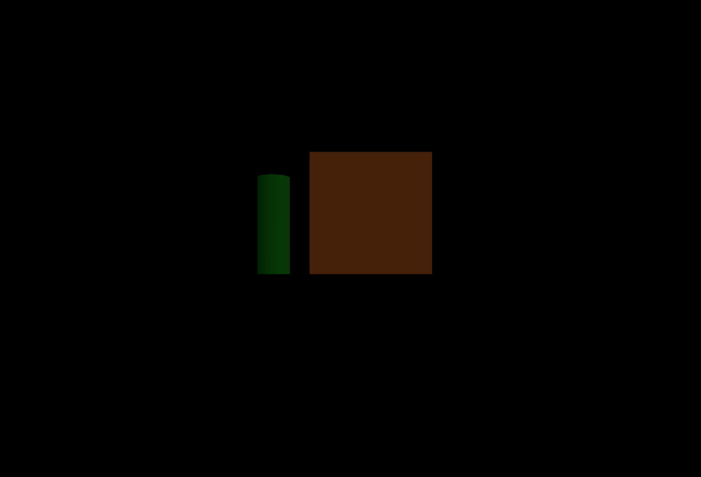
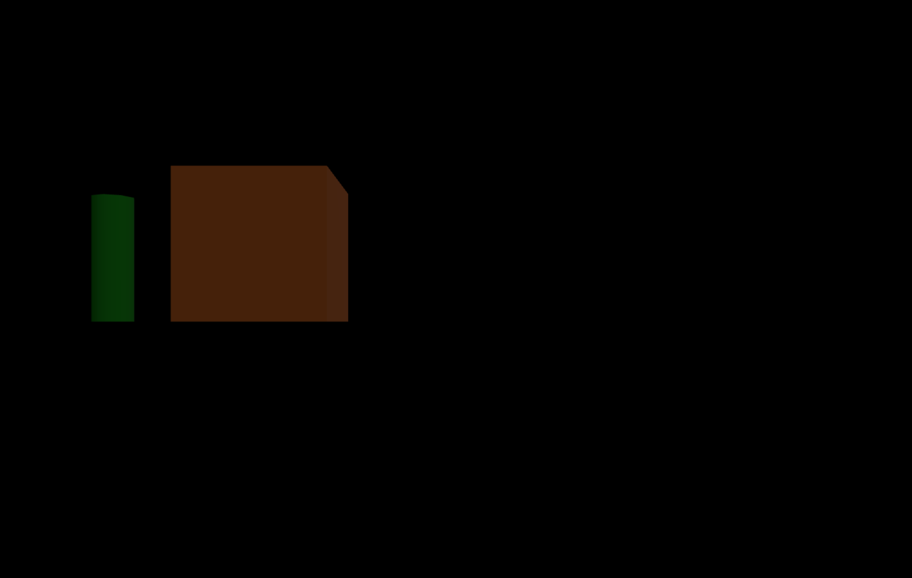

Three.js教程

入门

对象分组

# Three.js 对象分组

## 概念与原理[](#概念与原�?

�?Three.js 中，所有可见或不可见的 3D 对象都继承自 `Object3D`。换句话说，`Mesh`、`Light`、`Camera`、`Scene` 等等，都是基�?`Object3D` 做了不同功能的扩展。`Group` 也是这样一个基�?`Object3D` 的类，但它的主要角色�?*当作“容器�?*，用�?*批量管理**多个 3D 对象�?

### `Group` �?`Object3D`、`Scene` 的关系[](#group-�?object3dscene-的关�?

+   **`Object3D`**  
    这是 Three.js 中最基础�?3D 对象类型，它提供位置 (`position`)、旋�?(`rotation`)、缩�?(`scale`) 等属性，以及管理子节点的能力�?
+   **`Scene`**  
    也是继承�?`Object3D` 的一种特殊对象，一般作为我�?3D 世界�?*根节�?*。它除了具备 `Object3D` 的常用属性外，还可以管理背景、雾效、全局灯光等全局场景设置�?
+   **`Group`**  
    �?`Scene` 一样，`Group` 同样继承�?`Object3D`。不同的是，`Group` 主要用来把一批对象放在一起，方便**统一移动、旋转、缩�?*等操作。它本身并没有像 `Scene` 那样的场景全局配置功能，更像一个“可移动的小容器”�?

### 为什么需�?`Group`？[](#为什么需�?group)

+   **分组管理**  
    当你在场景里需要同时控制多个对象（例如移动一整个房屋组、一个机器人各个部件、或者建筑群），就可以先把它们都加进同一�?`Group`，然后只需要操作这�?`Group`，就能让所有子对象一起移动或旋转�?
+   **层级结构清晰**  
    通过 `Group` 做层级嵌套，可以让场景结构更有条理，查找或管理也更方便。想隐藏一整组对象或做动画时，只要�?`Group` 操作即可，无需一个个处理�?
+   **减少代码耦合**  
    如果没有 `Group`，你可能得分别移动场景中的每个单独对象，或者把相关逻辑写在不同地方。用 `Group` 统一管理后，可以将逻辑收拢到一个“容器”对象里，简化后期维护�?

简而言之，**把若干对象归纳到同一个父节点，然后可以通过操作这个父节点来批量管理�?*

## 常见方法与属性[](#常见方法与属�?

### `add(object)` �?`remove(object)`[](#addobject-�?removeobject)

+   **`add(object)`**：将任意 `Object3D` 子类实例（`Mesh`、`Light`、`Camera`、`Group`等）添加到当�?`Group`�?
+   **`remove(object)`**：从当前 `Group` 中移除已经存在的子对象�?

```javascript
// 创建一个Group和一个简单的网格对象
const group = new THREE.Group();
const geometry = new THREE.BoxGeometry(1, 1, 1);
const material = new THREE.MeshStandardMaterial({ color: 0xff0000 });
const boxMesh = new THREE.Mesh(geometry, material);
 
// 使用 add() 将网格添加到 group �?
group.add(boxMesh);
console.log(group.children.length); // 输出 1
 
// 使用 remove() 将网格从 group 中移�?
group.remove(boxMesh);
console.log(group.children.length); // 输出 0
```

通过 `add()` 可以批量挂载多个子对象；`remove()` 则适用于动态场景中对对象进行移除操作。如果频繁增删子对象，需要注意性能问题，必要时可以使用隐藏（`visible = false`）代替移除操作�?

### `children`[](#children)

`Group`（或 `Object3D`）下所有子对象的只读数组，常用于遍历和批量管理�?

```javascript
// 假设 group 中已添加多个网格对象
group.children.forEach((child, index) => {
  // 可以判断 child 的类型，或统一修改属�?
  if (child instanceof THREE.Mesh) {
    child.material.color.set(0x00ff00); // 全部改为绿色
    console.log(`子对象索引：${index}`, child);
  }
});
```

`children` 数组可以让你批量处理所有子对象，例如统一修改材质、可见性等。也可用于查找特定子对象进行后续操作

### `position`、`rotation`、`scale`[](#positionrotationscale)

+   **`position`**：表�?`Group` 在三维空间的坐标（`Vector3` 类型），影响子对象的整体位置�?
+   **`rotation`**：表�?`Group` 的旋转角度（`Euler` 类型），父节点的旋转会叠加到子节点的世界坐标中�?
+   **`scale`**：表�?`Group` 的缩放系数（`Vector3` 类型），对子节点的显示尺寸也有直接影响�?

```javascript
// 创建一�?Group 并添加多个子对象
const groupTransform = new THREE.Group();
scene.add(groupTransform);
 
const sphere = new THREE.Mesh(
  new THREE.SphereGeometry(0.5, 32, 32),
  new THREE.MeshStandardMaterial({ color: 0x0000ff })
);
const cone = new THREE.Mesh(new THREE.ConeGeometry(0.5, 1, 16), new THREE.MeshStandardMaterial({ color: 0xffff00 }));
 
// 加入 Group
groupTransform.add(sphere);
groupTransform.add(cone);
 
// 统一设置位置：向 X 方向平移 3 个单�?
groupTransform.position.set(3, 0, 0);
 
// 统一旋转：绕 Z 轴旋�?45 度（π/4�?
groupTransform.rotation.z = Math.PI / 4;
 
// 统一缩放：在 X、Y、Z 方向均放�?1.5 �?
groupTransform.scale.set(1.5, 1.5, 1.5);
```

+   修改 `groupTransform.position` 会带动所有子对象同步移动�?
+   修改 `groupTransform.rotation` 会整体旋转整个组（包括所有子对象）；
+   `scale` 的数值越大，子对象被放大的比例越高；通常 `1` 为原始大小；在动画中还可结合缓动函数实现平滑缩放效果�?

## 例子[](#例子)

最后，我们在通过一个完整的例子，来看下 group 效果�?

我们在创建一个简单的场景，包含立方体和圆柱体，然后将它们放在一�?`Group` 中，再将这个 `Group` 放置在场景中心偏左的区域�?

```javascript
import * as THREE from "three";
import "./style.css";
 
function initScene() {
  // 1. 创建场景、相机、渲染器
  const scene = new THREE.Scene();
  const camera = new THREE.PerspectiveCamera(
    60, // FOV: 视场角度
    window.innerWidth / window.innerHeight, // 宽高�?
    0.1, // 近截�?
    1000 // 远截�?
  );
  camera.position.set(0, 0, 20); // 将相机放在稍微高一点，往后一点的位置
 
  const renderer = new THREE.WebGLRenderer({ antialias: true });
  renderer.setSize(window.innerWidth, window.innerHeight);
  document.body.appendChild(renderer.domElement);
 
  // 2. 添加一个基础光源
  const ambientLight = new THREE.AmbientLight(0xffffff, 0.4);
  scene.add(ambientLight);
 
  const directionalLight = new THREE.DirectionalLight(0xffffff, 0.8);
  directionalLight.position.set(10, 20, 10);
  scene.add(directionalLight);
 
  // 3. 创建一些简单对象，用以模拟建筑和树�?
  const geometryHouse = new THREE.BoxGeometry(4, 4, 4);
  const materialHouse = new THREE.MeshStandardMaterial({ color: 0x8b4513 });
  const house = new THREE.Mesh(geometryHouse, materialHouse);
  house.position.set(0, 2, 0); // 让房子底部对准地�?
 
  const geometryTree = new THREE.CylinderGeometry(0.5, 0.5, 3, 8);
  const materialTree = new THREE.MeshStandardMaterial({ color: 0x006400 });
  const tree = new THREE.Mesh(geometryTree, materialTree);
  tree.position.set(-3, 1.5, 3);
 
  // 4. 创建 Group，并将这些对象加入其�?
  const group = new THREE.Group();
  group.add(house);
  group.add(tree);
 
  // // �?group 整体放置在场景中心偏左的区域
  // group.position.set(-5, 0, 0);
 
  // 5. 添加到场�?
  scene.add(group);
 
  // 6. 动画循环
  function animate() {
    requestAnimationFrame(animate);
 
    renderer.render(scene, camera);
  }
 
  animate();
}
 
initScene();
```

通过上面的代码，我们可以在画面中间看到一个立方体和圆柱， 他们现在在画面中心�?

现在，我们将上面的代码中�?`group.position.set(-5, 0, 0);` 注释掉，然后再次运行代码，我们可以看到，立方体和圆柱体现在在画面中心偏左的区域�?

## 注意事项[](#注意事项)

+   **滥用嵌套层级**  
    虽然通过 `Group` 可以轻松实现层级嵌套，但如果层级过深，会让场景树结构变得复杂，也会增加计算开销（因为每一层都会有自己的世界矩阵计算）。建议保持合理的层级深度�?
+   **频繁增删子对�?*  
    如果在运行时非常频繁地调�?`add()` �?`remove()` 来增删子对象，可能会带来性能抖动。此时可考虑对象池等机制，在不需要渲染某对象时将其隐藏或移出摄像机视野，而不是直接移除�?
+   **批量操作**  
    如果需要对一组子对象执行相同的操作（如更改材质、切换可见性），可以先把它们组织到一�?`Group` 里，再统一�?`Group` 的属性，或者遍�?`Group.children` 进行批量处理。避免单独处理每个对象，降低代码复杂度�?

## 总结[](#总结)

`Group` 是在 Three.js 中对多个对象进行统一管理、变换和渲染的强大工具，也是场景层级树结构的重要一环。通过使用 `Group`�?

+   可以对一批对象进行批量操作（整体移动、旋转、缩放、可见性切换等）；
+   可以通过嵌套结构来实现更加复杂、灵活的分层动画或交互逻辑�?
+   可以在大型项目中清晰地拆分和管理场景模块，提升可维护性和可扩展性�?

在更为高级的场景中，`Group` 也常与以下功能配合使用：

+   **骨骼动画**：在蒙皮网格（`SkinnedMesh`）的骨骼系统中，每个骨骼节点本质上也类似一个层级结构，`Group` 思想与之相通�?
+   **粒子系统**：可将粒子发射器或粒子集合归类到一�?`Group` 中，便于整体启用或禁用�?
+   **复杂交互**：在做多人协同或多视角切换时，可能需要对不同子树进行可见性管理或者位置同步，这些也离不开 `Group` 带来的层级与批量优势�?

## 代码[](#代码)

#### github[](#github)

[https://github.com/calmound/threejs-demo/tree/main/group (opens in a new tab)](https://github.com/calmound/threejs-demo/tree/main/group)

#### gitee[](#gitee)

[https://gitee.com/calmound/threejs-demo/tree/main/group (opens in a new tab)](https://gitee.com/calmound/threejs-demo/tree/main/group)

[实现描边发光效果](/concepts/basic/effect "实现描边发光效果")[物理渲染](/concepts/basic/pbr "物理渲染")