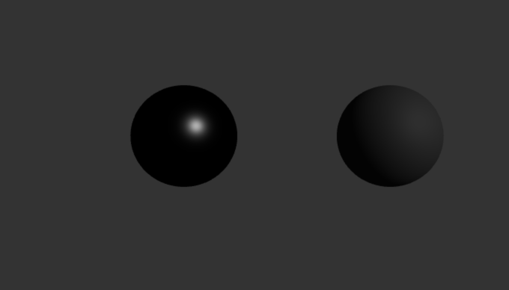
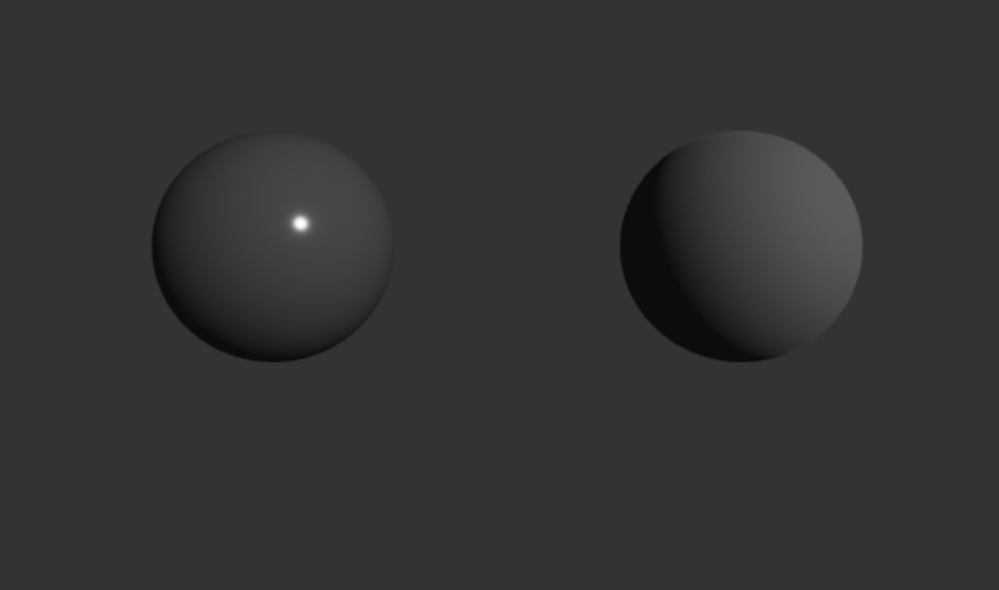
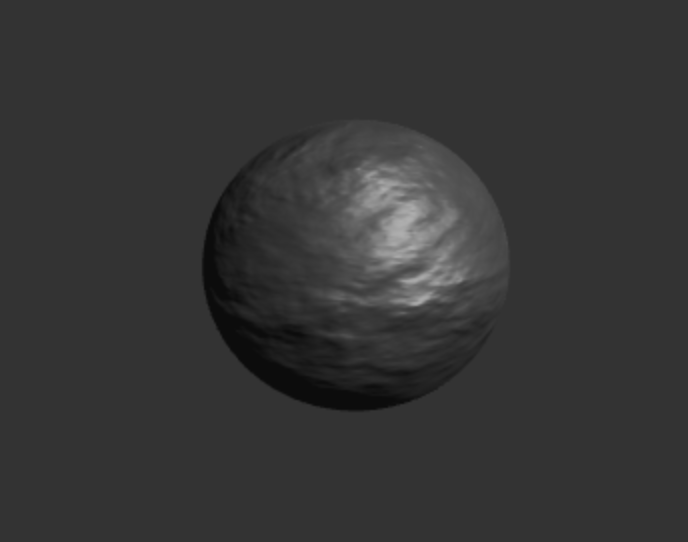
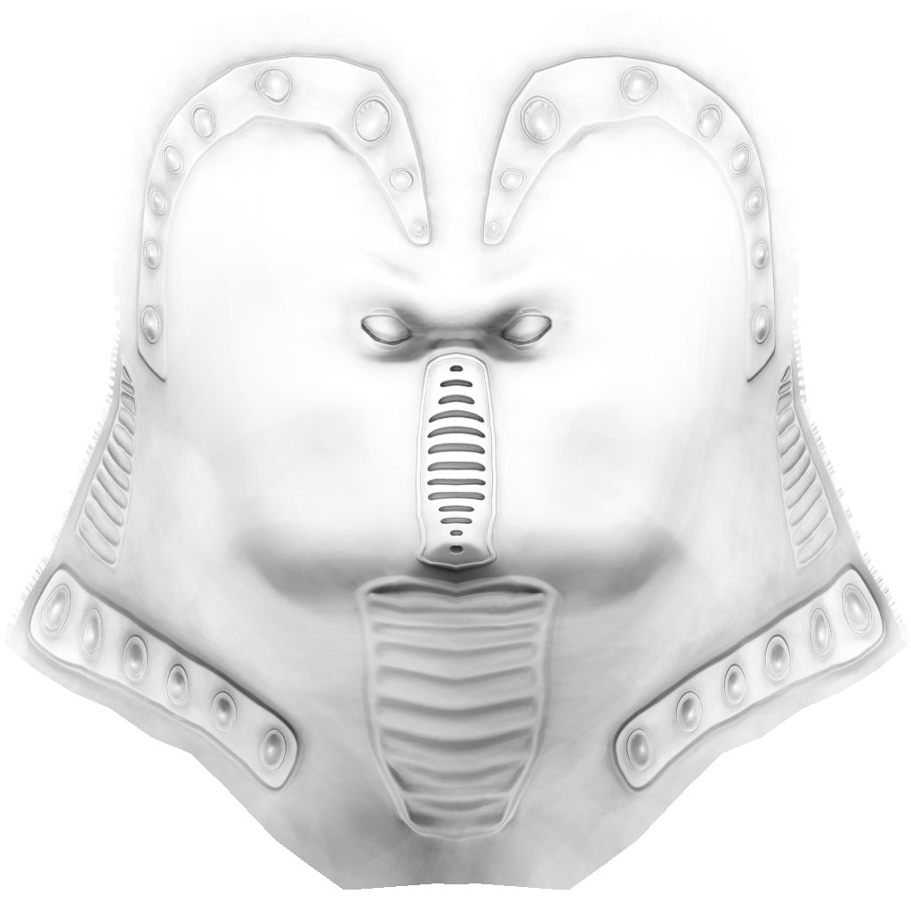
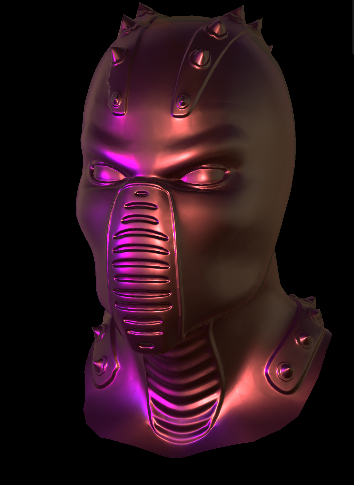
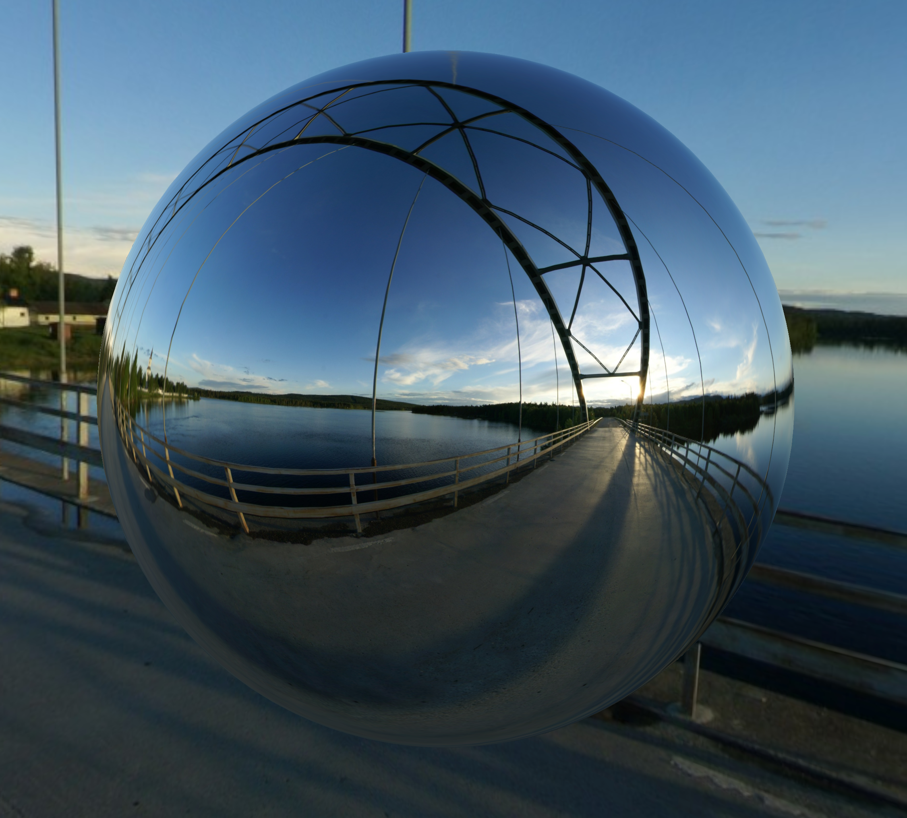

Three.js教程

入门

物理渲染

# 物理渲染

## 简介[](#简�?

PBR（Physically Based Rendering）是基于物理的渲染技术，旨在通过模拟光与物体相互作用的真实物理原理来实现更加真实的图像效果。它采用了物理学中关于光照和表面材料的原理，使得渲染结果在不同的光照条件下更加一致，能够获得更真实的效果。Three.js 也提供了 PBR 渲染的支持，通常是通过`MeshStandardMaterial`和`MeshPhysicalMaterial`来实现�?

## 核心要素[](#核心要素)

### 金属度（Metalness）[](#金属度metalness)

定义物体表面是否为金属。金属表面与非金属表面在光照反射的方式上有显著不同。对于金属，反射颜色和物体表面颜色一致，而非金属则反射环境光，且颜色由材料本身决定�?

```javascript
const materialMetal = new THREE.MeshStandardMaterial({
  color: 0x555555, // 非金属颜�?
  metalness: 1, // 设为1表示金属表面
  roughness: 0.3, // 设置粗糙�?
});
 
const materialNonMetal = new THREE.MeshStandardMaterial({
  color: 0x555555, // 非金属颜�?
  metalness: 0, // 设为0表示非金属表�?
  roughness: 0.7, // 设置粗糙�?
});
 
const geometry = new THREE.SphereGeometry(1, 32, 32);
 
const sphereMetal = new THREE.Mesh(geometry, materialMetal);
sphereMetal.position.x = -2;
 
const sphereNonMetal = new THREE.Mesh(geometry, materialNonMetal);
sphereNonMetal.position.x = 2;
 
scene.add(sphereMetal, sphereNonMetal);
```

 金属材质的球体反射更强，而非金属材质的球体表面反射较弱且偏向于显示本身颜色�?

### 粗糙度（Roughness）[](#粗糙度roughness)

定义表面的粗糙程度，影响光线的散射。粗糙度越高，反射越模糊，表面越显得不光滑�?

```javascript
const materialSmooth = new THREE.MeshStandardMaterial({
  color: 0xaaaaaa,
  metalness: 0.5,
  roughness: 0.1, // 表面较平�?
});
 
const materialRough = new THREE.MeshStandardMaterial({
  color: 0xaaaaaa,
  metalness: 0.5,
  roughness: 0.9, // 表面粗糙
});
 
const sphereSmooth = new THREE.Mesh(geometry, materialSmooth);
sphereSmooth.position.x = -2;
 
const sphereRough = new THREE.Mesh(geometry, materialRough);
sphereRough.position.x = 2;
 
scene.add(sphereSmooth, sphereRough);
```

光滑的球体反射较为清晰，而粗糙的球体反射较为模糊�?

### 法线贴图（Normal Map）[](#法线贴图normal-map)

用来模拟物体表面的小细节，比如凹凸感，使得渲染结果看起来更加精细。通过它可以模拟复杂的细节，而不需要增加更多的几何体�?

```javascript
const normalMap = textureLoader.load(
  "https://threejs.org/examples/textures/waternormals.jpg"
); // 加载法线贴图
const materialWithNormal = new THREE.MeshStandardMaterial({
  color: 0xaaaaaa,
  normalMap: normalMap, // 添加法线贴图
  roughness: 0.5,
  metalness: 0.5,
});
 
const sphereWithNormal = new THREE.Mesh(geometry, materialWithNormal);
scene.add(sphereWithNormal);
```

 法线贴图让球体表面呈现出细小的凹凸感，增加了细节，使其看起来更加真实�?

### 环境光遮蔽（Ambient Occlusion, AO）[](#环境光遮蔽ambient-occlusion-ao)

模拟物体表面阴影的效果，特别是在接缝、角落等位置，能让物体看起来更加立体�?

我们使用官网的案例介�?[https://threejs.org/examples/?q=materials#webgl\_materials\_displacementmap!\[ (opens in a new tab)](https://threejs.org/examples/?q=materials#webgl_materials_displacementmap!%5B)\](./image/ao.jpg) ao 贴图如下  效果如下  AO 贴图使球体在阴影区域看起来更加深邃，增加了物体的真实感。增强模型的细节，使得光影效果更加真�?

### 反射（Reflection）[](#反射reflection)

PBR 通常依赖于环境贴图（如立方体贴图、球面反射贴图等）来表现物体表面的反射效果。通过反射，物体表面的细节可以更加丰富�?

```javascript
const envMap = new THREE.CubeTextureLoader().load([
  "path/to/posx.jpg",
  "path/to/negx.jpg",
  "path/to/posy.jpg",
  "path/to/negy.jpg",
  "path/to/posz.jpg",
  "path/to/negz.jpg",
]);
 
const materialWithReflection = new THREE.MeshStandardMaterial({
  color: 0xaaaaaa,
  metalness: 1, // 完全金属表面
  roughness: 0.1,
  envMap: envMap, // 添加环境贴图
});
 
const sphereWithReflection = new THREE.Mesh(geometry, materialWithReflection);
scene.add(sphereWithReflection);
```



金属球体表面能够反射环境贴图中的景象，产生镜面反射效果�?

[对象分组](/concepts/basic/group "对象分组")[辅助对象](/concepts/basic/helper "辅助对象")