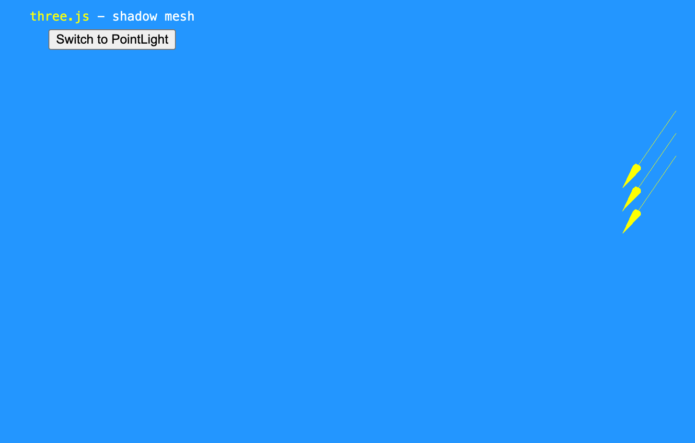
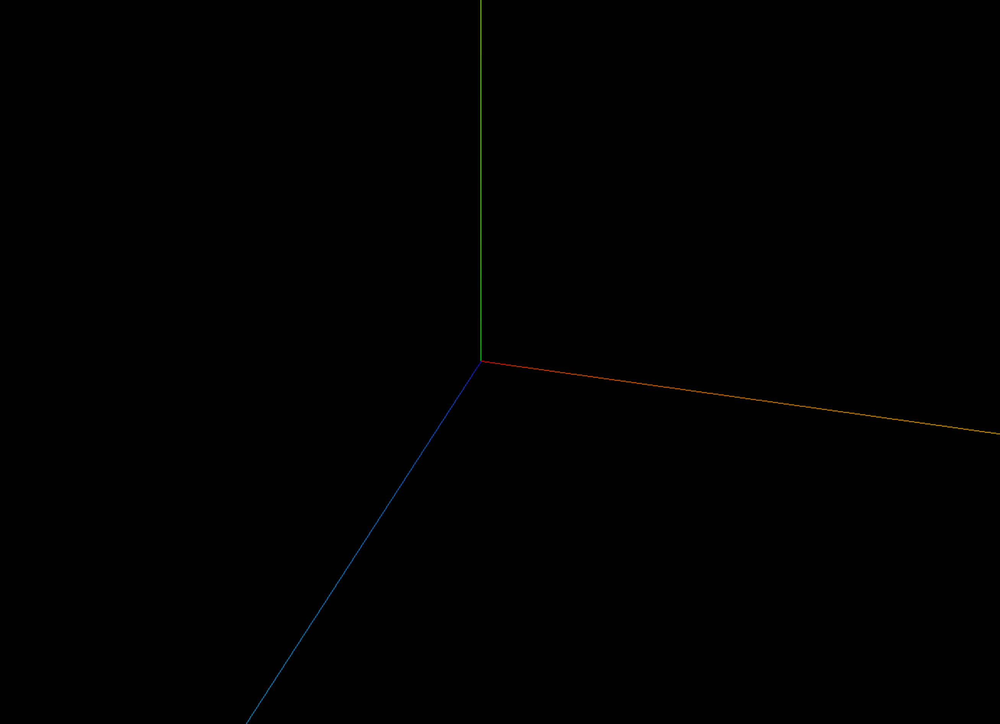
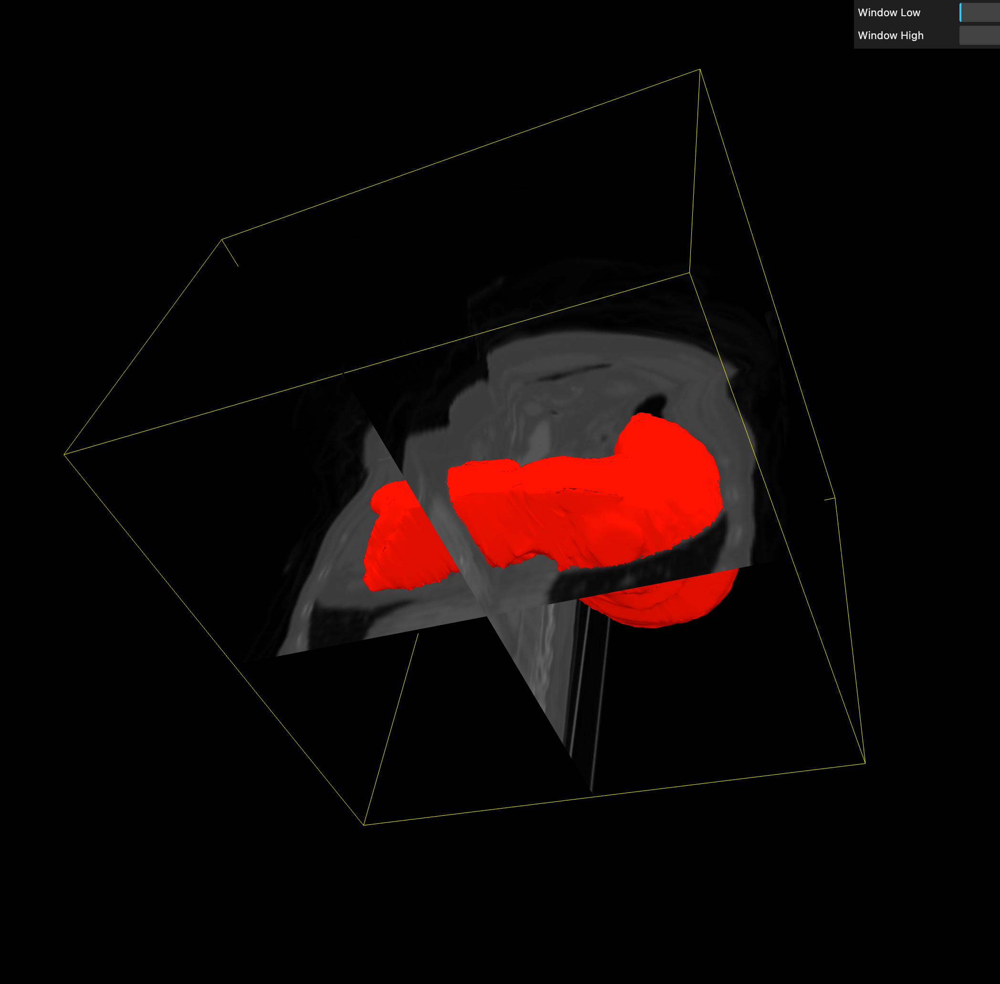
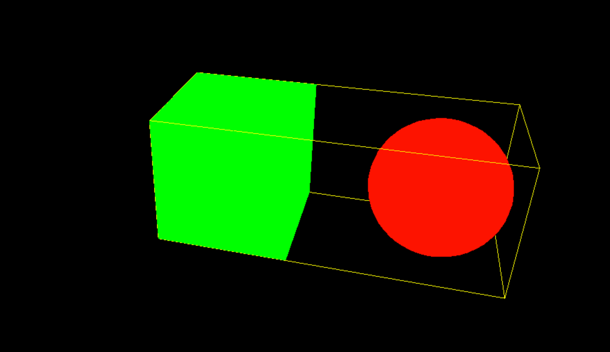
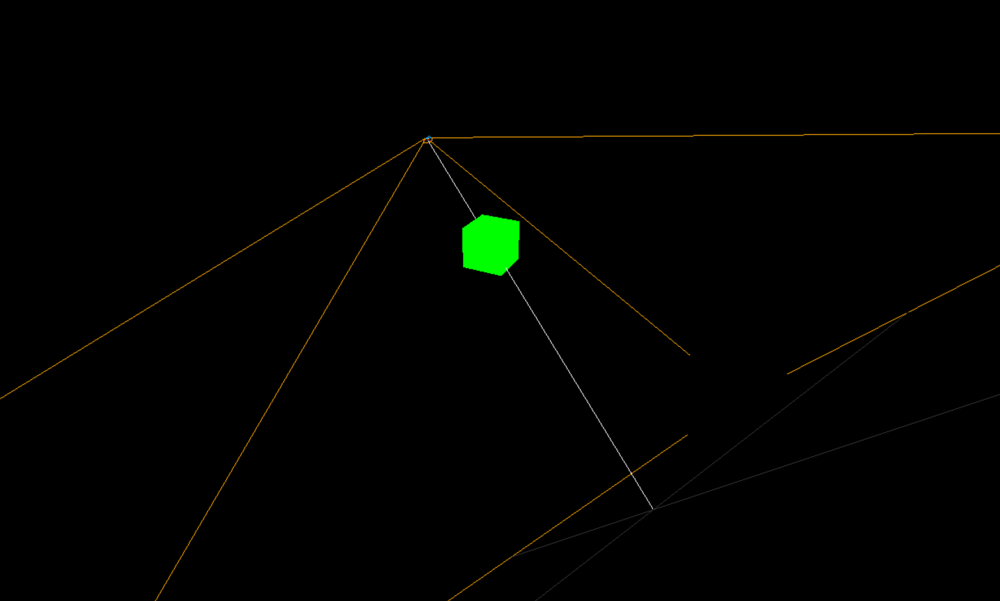

Three.js教程

入门

辅助对象

# Three.js 的辅助对�?

�?Three.js 中，辅助对象（Helpers）是非常有用的工具，它们帮助开发者在调试 3D 场景时更直观地理解对象的布局、方向和空间关系。本文将介绍 Three.js 提供的几种主要辅助对象，并演示它们的使用方式�?

辅助对象�?Three.js 提供的一些用于可视化 3D 场景元素的工具。它们通常不会在最终渲染的场景中出现，而是作为开发和调试的参考�?

这篇文章，我们来介绍�?ArrowHelper 、AxesHelper 、BoxHelper 、Box3Helper、CameraHelper�?

## ArrowHelper[](#arrowhelper)

用于�?3D 场景中显示一个箭头，通常用于可视化方向向量，帮助调试坐标方向、法线、速度向量等�?

```javascript
import * as THREE from "three";
// 创建场景
const scene = new THREE.Scene();
// 定义箭头的方向（必须归一化）
const direction = new THREE.Vector3(1, 1, 0).normalize();
// 定义箭头的起�?
const origin = new THREE.Vector3(0, 0, 0);
// 定义箭头长度
const length = 2;
// 定义箭头颜色
const color = 0xffff00; // 黄色
// 创建箭头助手
const arrowHelper = new THREE.ArrowHelper(direction, origin, length, color);
// 添加到场�?
scene.add(arrowHelper);
```

### 参数[](#参数)

**ArrowHelper(dir : [Vector3 (opens in a new tab)](https://threejs.org/docs/index.html#api/zh/math/Vector3), origin : [Vector3 (opens in a new tab)](https://threejs.org/docs/index.html#api/zh/math/Vector3), length : Number, hex : Number, headLength : Number, headWidth : Number )**

+   dir: 基于箭头原点的方�? 必须为单位向�?
+   origin: 箭头的原�?
+   length: 箭头的长�? 默认�?1.
+   hex: 定义�?16 进制颜色�? 默认�?0xffff00.
+   headLengt: **箭头头部的长�?*，默认值为 `0.2 * length`
+   headWidth : **箭头头部的宽�?*，默认值为 `0.2 * headLength`

## AxesHelper[](#axeshelper)

`AxesHelper` 用于�?3D 场景中可视化坐标轴，帮助开发者更直观地理解物体的方向和旋转状态。通常用于调试 `Three.js` 场景中的坐标系�?

红色代表 X �? 绿色代表 Y �? 蓝色代表 Z �? 

```javascript
const axesHelper = new THREE.AxesHelper(5);
scene.add(axesHelper);
```

### 参数[](#参数-1)

**AxesHelper( size : Number )**

+   size:  (可选的) 表示代表轴的线段长度. 默认�? `1`.

## BoxHelper[](#boxhelper)

`BoxHelper` 用于**�?3D 场景中可视化物体的包围盒 (Bounding Box)**，通常用于调试和检测物体的边界�?



```javascript
// 创建 BoxHelper，并添加到场�?
const boxHelper = new THREE.BoxHelper(cube, 0xff0000); // 红色边框
scene.add(boxHelper);
```

### 参数[](#参数-2)

**BoxHelper( object : [Object3D (opens in a new tab)](https://threejs.org/docs/index.html#api/zh/core/Object3D), color : [Color (opens in a new tab)](https://threejs.org/docs/index.html#api/zh/math/Color) )**

+   object�?(可选的) 被展示世界轴心对齐的包围盒的对象.
+   color �?可选的) 线框盒子�?16 进制颜色�? 默认�?0xffff00.

## Box3Helper[](#box3helper)

`Box3Helper` 用于**可视�?`Box3`（轴对齐包围盒，AABB，Axis-Aligned Bounding Box�?*�? 
通常用于**调试模型边界**�?*碰撞检�?*�?*计算物体包围范围**等场景�?

**`BoxHelper`** 适用�?*单个 `Mesh` �?`Group`**，会自动计算物体的包围盒，但不会用于碰撞检测；�?**`Box3Helper`** 适用�?*手动定义 `Box3` 包围�?*，可以计算多个对象的整体边界，并支持碰撞检测。若需简单可视化 `Mesh` 的边界，�?`BoxHelper`；若需手动设定范围或合并多个物体的边界，用 `Box3Helper`�?



```javascript
// 创建立方�?
const group = new THREE.Group();
 
// 立方�?
const cube = new THREE.Mesh(new THREE.BoxGeometry(2, 2, 2), new THREE.MeshBasicMaterial({ color: 0x00ff00 }));
group.add(cube);
 
// 球体
const sphere = new THREE.Mesh(new THREE.SphereGeometry(1), new THREE.MeshBasicMaterial({ color: 0xff0000 }));
sphere.position.set(3, 0, 0); // 移动球体
group.add(sphere);
 
// 计算整个 Group 的包围盒
const groupBox = new THREE.Box3().setFromObject(group);
const box3Helper = new THREE.Box3Helper(groupBox, 0xffff00);
scene.add(box3Helper);
scene.add(group);
```

## 参数[](#参数-3)

**Box3Helper( box : [Box3 (opens in a new tab)](https://threejs.org/docs/index.html#api/zh/math/Box3), color : [Color (opens in a new tab)](https://threejs.org/docs/index.html#api/zh/math/Color) )**

+   box：被模拟�?3 维包围盒.
+   color�?(可选的) 线框盒子的颜�? 默认�?0xffff00.

## CameraHelper[](#camerahelper)

`CameraHelper` 会在 `3D` 场景�?*绘制摄像机的视锥�?*，用来表示摄像机�?*视野范围**�?*近平面、远平面**等信息�? 
**适用于：**

+   **调试相机位置、方�?*
+   **查看相机视锥体是否正确覆盖目�?*
+   **检�?`shadowCamera`（阴影相机）是否对物体完全照�?*



为了演示效果，我们需要创建两个摄像机，一个用来创�?helper，一个用来观�?helper�?

+   创建 `mainCamera` 作为观察相机
+   �?`targetCamera` 旋转移动
+   添加 `cube` 作为参考物�?

```javascript
import * as THREE from "three";
 
// 创建渲染�?
const renderer = new THREE.WebGLRenderer();
renderer.setSize(window.innerWidth, window.innerHeight);
document.body.appendChild(renderer.domElement);
 
// 创建场景
const scene = new THREE.Scene();
 
//  创建主摄像机（用于观�?CameraHelper�?
const mainCamera = new THREE.PerspectiveCamera(75, window.innerWidth / window.innerHeight, 0.1, 20);
mainCamera.position.set(5, 5, 10);
mainCamera.lookAt(0, 0, 0);
scene.add(mainCamera);
 
//  创建需要被观察的摄像机
const targetCamera = new THREE.PerspectiveCamera(75, window.innerWidth / window.innerHeight, 0.1, 10);
targetCamera.position.set(2, 2, 5);
scene.add(targetCamera);
 
//  可视�?targetCamera
const cameraHelper = new THREE.CameraHelper(targetCamera);
scene.add(cameraHelper);
 
//  添加一个立方体方便参�?
const cube = new THREE.Mesh(new THREE.BoxGeometry(1, 1, 1), new THREE.MeshBasicMaterial({ color: 0x00ff00 }));
scene.add(cube);
 
// 添加环境光，让场景更清晰
const light = new THREE.AmbientLight(0xffffff, 1);
scene.add(light);
 
//  动画循环
function animate() {
  requestAnimationFrame(animate);
 
  // 让被观察的相机（targetCamera）旋转，以观�?CameraHelper 变化
  targetCamera.position.x = Math.sin(Date.now() * 0.001) * 3;
  targetCamera.position.z = Math.cos(Date.now() * 0.001) * 3;
  targetCamera.lookAt(0, 0, 0);
 
  // 更新 CameraHelper
  cameraHelper.update();
 
  // 渲染场景，使�?mainCamera 作为主相�?
  renderer.render(scene, mainCamera);
}
animate();
```

### 参数[](#参数-4)

**CameraHelper( camera : [Camera (opens in a new tab)](https://threejs.org/docs/index.html#api/zh/cameras/Camera) )**

+   camera：被模拟的相�?

[物理渲染](/concepts/basic/pbr "物理渲染")[gl-matrix](/concepts/advance/glmatrix "gl-matrix")