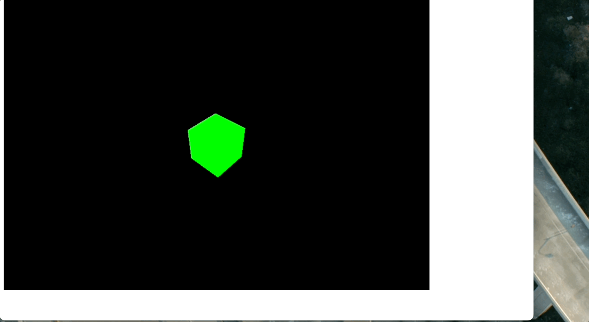
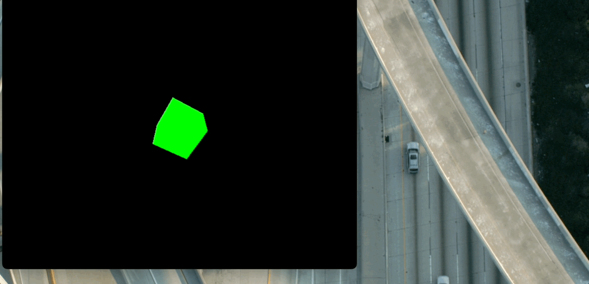

Three.js教程

入门

画布自适应

# 画布自适应

在使�?Three.js 时，画布自适应屏幕大小对于提供良好的用户体验非常重要。无论是全屏渲染还是嵌入式场景，都需要确�?Three.js 渲染的画布随着窗口大小的变化动态调整�?

我们先来看下，没有自适应的效�?

可以看到，我将浏览器放大缩小，都不会让里面的立方体根据浏览器的大小进行调整。下面，我来介绍一下如何让立方体根据浏览器的大小进行调整�?

### 设置基本场景[](#设置基本场景)

首先，我们需要创建一个基本的 Three.js 场景，包括渲染器、相机和一个简单的几何体�?

```javascript
import * as THREE from "three";
 
// 创建场景
const scene = new THREE.Scene();
 
// 创建相机
const camera = new THREE.PerspectiveCamera(
  75, // 视场�?
  window.innerWidth / window.innerHeight, // 宽高�?
  0.1, // 近截�?
  1000 // 远截�?
);
camera.position.z = 5;
 
// 创建渲染�?
const renderer = new THREE.WebGLRenderer();
renderer.setSize(window.innerWidth, window.innerHeight); // 设置初始渲染尺寸
document.body.appendChild(renderer.domElement);
 
// 添加几何�?
const geometry = new THREE.BoxGeometry();
const material = new THREE.MeshBasicMaterial({ color: 0x00ff00 });
const cube = new THREE.Mesh(geometry, material);
scene.add(cube);
 
// 渲染函数
function animate() {
  requestAnimationFrame(animate);
  cube.rotation.x += 0.01;
  cube.rotation.y += 0.01;
  renderer.render(scene, camera);
}
animate();
```

此时，一个基本的 Three.js 场景已经搭建完成�?

### 实现窗口大小变化监听[](#实现窗口大小变化监听)

为了让画布自适应，我们需要监听窗口的大小变化事件，然后动态更新渲染器的尺寸和相机的宽高比�?

核心代码�?

```javascript
// 监听窗口大小变化
window.addEventListener("resize", () => {
  // 更新渲染器尺�?
  renderer.setSize(window.innerWidth, window.innerHeight);
 
  // 更新相机宽高�?
  camera.aspect = window.innerWidth / window.innerHeight;
  camera.updateProjectionMatrix(); // 必须调用此方法更新相机矩�?
});
```

在上面的代码中：

+   renderer.setSize() 动态调整渲染器的大小�?
+   camera.aspect 更新相机的宽高比�?
+   camera.updateProjectionMatrix() 重新计算投影矩阵，确保视图正确�?

### 全屏自适应的优化建议[](#全屏自适应的优化建�?

当需要实现全屏效果时，可以直接设置渲染器的尺寸为窗口大小，同时将 CSS 样式设置为全屏：

```css
body {
  margin: 0;
  overflow: hidden;
}
canvas {
  display: block;
}
```

### 处理高分辨率屏幕[](#处理高分辨率屏幕)

为了在高分辨率屏幕（�?Retina 显示屏）上渲染清晰的图像，我们可以调整设备像素比�?

```javascript
renderer.setPixelRatio(window.devicePixelRatio); // 根据设备像素比设置渲染器
renderer.setSize(window.innerWidth, window.innerHeight);
```



### 完整代码示例[](#完整代码示例)

以下是完整的自适应代码�?

```javascript
import * as THREE from "three";
 
const scene = new THREE.Scene();
const camera = new THREE.PerspectiveCamera(75, window.innerWidth / window.innerHeight, 0.1, 1000);
camera.position.z = 5;
 
const renderer = new THREE.WebGLRenderer();
renderer.setPixelRatio(window.devicePixelRatio);
renderer.setSize(window.innerWidth, window.innerHeight);
document.body.appendChild(renderer.domElement);
 
const geometry = new THREE.BoxGeometry();
const material = new THREE.MeshBasicMaterial({ color: 0x00ff00 });
const cube = new THREE.Mesh(geometry, material);
scene.add(cube);
 
window.addEventListener("resize", () => {
  renderer.setSize(window.innerWidth, window.innerHeight);
  camera.aspect = window.innerWidth / window.innerHeight;
  camera.updateProjectionMatrix();
});
 
function animate() {
  requestAnimationFrame(animate);
  cube.rotation.x += 0.01;
  cube.rotation.y += 0.01;
  renderer.render(scene, camera);
}
animate();
```

总结 通过监听窗口大小变化事件，并调整渲染器和相机的参数，我们可以轻松实现 Three.js 画布自适应功能。结合设备像素比的优化，这种实现方式能够适配多种屏幕分辨率，为用户提供流畅的视觉体验�?

[灯光](/concepts/basic/light "灯光")[三维坐标系](/concepts/basic/xyz "三维坐标�?)